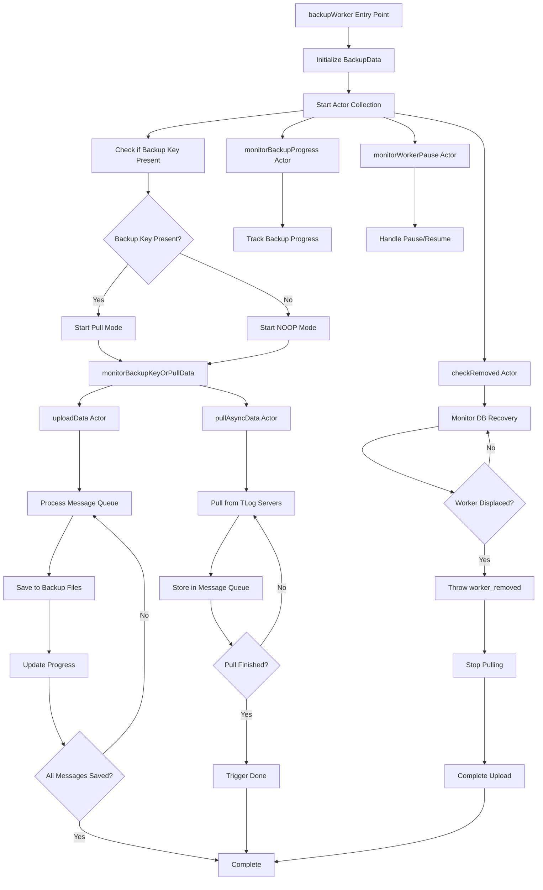
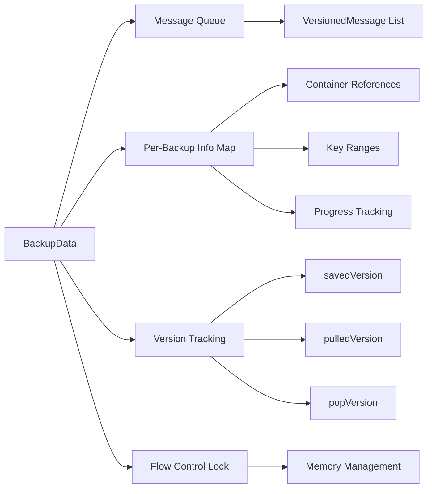
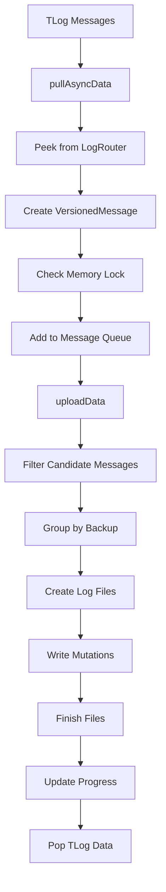
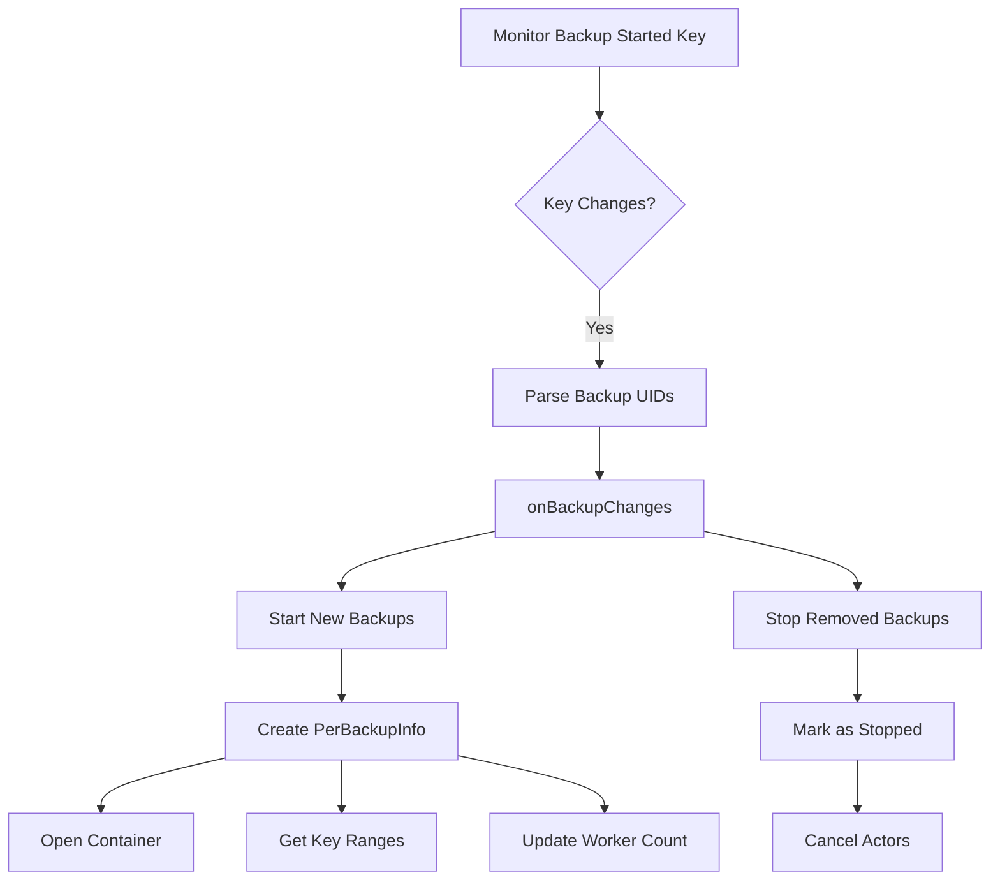
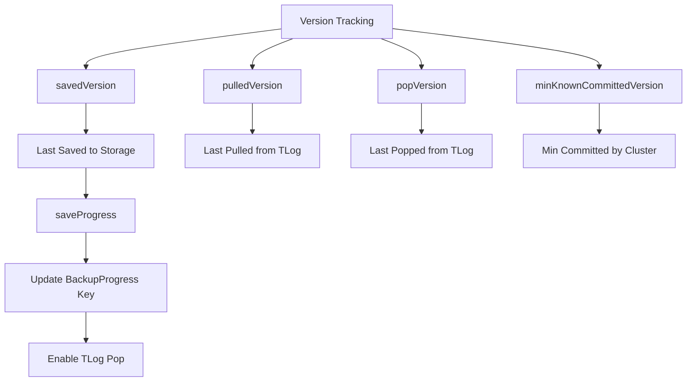
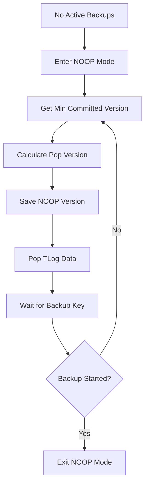
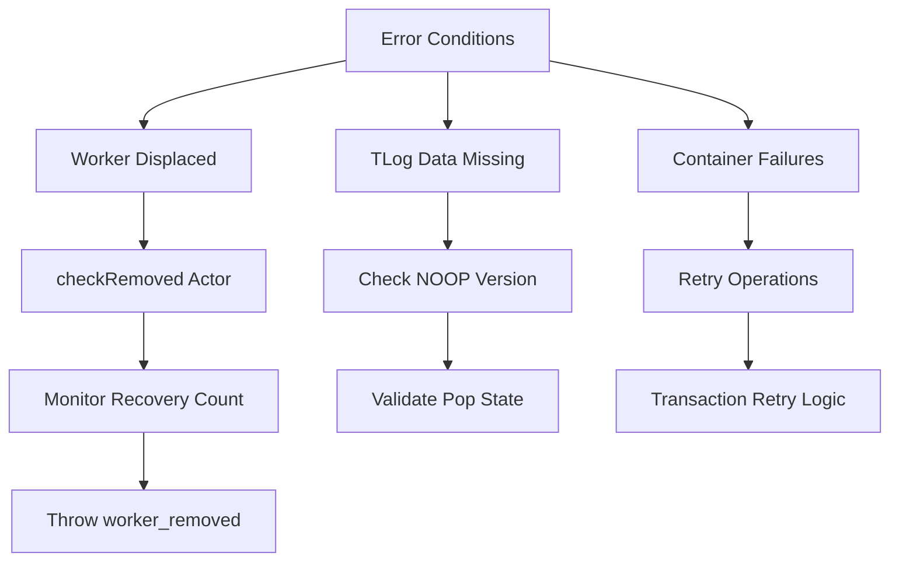
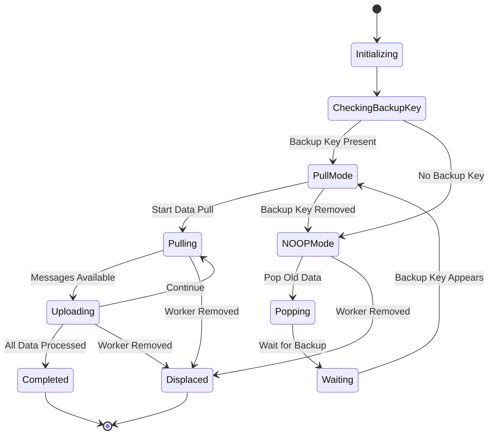

# BackupWorker.actor.cpp Flow Diagram

## Overview
The BackupWorker is responsible for pulling mutation logs from TLog servers and uploading them to backup storage containers. It operates in different modes (pulling vs NOOP) and manages multiple concurrent backup jobs.

## Main Flow Diagram

## Detailed Component Breakdown

### 1. BackupData Structure

### 2. Message Processing Flow

### 3. Backup Management Flow

### 4. Version Management and Progress Tracking

### 5. NOOP Mode Flow

### 6. Error Handling and Recovery

## Key Actor Interactions

### Main Actors:
1. **[`backupWorker()`](fdbserver/BackupWorker.actor.cpp:1232)** - Entry point and coordinator
2. **[`pullAsyncData()`](fdbserver/BackupWorker.actor.cpp:1030)** - Pulls data from TLog servers
3. **[`uploadData()`](fdbserver/BackupWorker.actor.cpp:931)** - Processes and uploads mutations
4. **[`monitorBackupKeyOrPullData()`](fdbserver/BackupWorker.actor.cpp:1133)** - Switches between pull/NOOP modes
5. **[`monitorBackupProgress()`](fdbserver/BackupWorker.actor.cpp:669)** - Tracks overall backup progress
6. **[`checkRemoved()`](fdbserver/BackupWorker.actor.cpp:1188)** - Monitors for worker displacement

### Data Structures:
1. **[`BackupData`](fdbserver/BackupWorker.actor.cpp:124)** - Main state container
2. **[`VersionedMessage`](fdbserver/BackupWorker.actor.cpp:45)** - Individual mutation message
3. **[`PerBackupInfo`](fdbserver/BackupWorker.actor.cpp:147)** - Per-backup state and containers

## State Transitions

## Memory Management

The BackupWorker uses a [`FlowLock`](fdbserver/BackupWorker.actor.cpp:145) to manage memory usage:
- Messages are held in memory until uploaded
- Lock prevents excessive memory consumption
- Memory is released after successful upload
- Backpressure applied when memory limit reached

## Concurrency Model

Multiple actors run concurrently:
- **Data Flow**: Pull → Queue → Upload pipeline
- **Monitoring**: Progress tracking, pause/resume, displacement detection
- **Management**: Backup lifecycle, version coordination
- **Error Handling**: Recovery, retry logic, cleanup

This architecture ensures reliable, efficient backup operations while handling various failure scenarios and operational requirements.