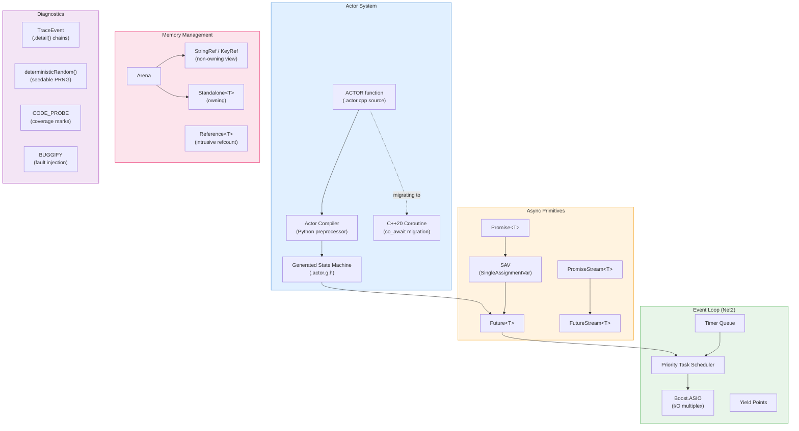
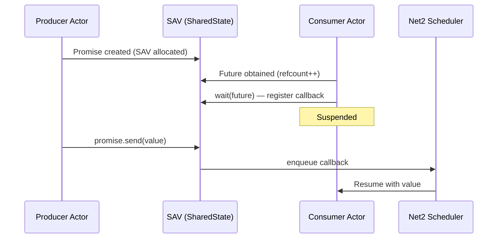

# Flow Runtime — Internal Architecture

```mermaid
graph TB
    subgraph ActorSystem["Actor System"]
        Actor["ACTOR function\n(.actor.cpp source)"]
        Compiler["Actor Compiler\n(Python preprocessor)"]
        StateMachine["Generated State Machine\n(.actor.g.h)"]
        Coro["C++20 Coroutine\n(co_await migration)"]
    end

    subgraph AsyncPrimitives["Async Primitives"]
        Promise["Promise&lt;T&gt;"]
        Future["Future&lt;T&gt;"]
        SAV["SAV\n(SingleAssignmentVar)"]
        PS["PromiseStream&lt;T&gt;"]
        FS["FutureStream&lt;T&gt;"]
    end

    subgraph EventLoop["Event Loop (Net2)"]
        Scheduler["Priority Task Scheduler"]
        ASIO["Boost.ASIO\n(I/O multiplex)"]
        Timers["Timer Queue"]
        Yields["Yield Points"]
    end

    subgraph Memory["Memory Management"]
        Arena["Arena"]
        StringRef["StringRef / KeyRef\n(non-owning view)"]
        Standalone["Standalone&lt;T&gt;\n(owning)"]
        RefCounted["Reference&lt;T&gt;\n(intrusive refcount)"]
    end

    subgraph Diagnostics["Diagnostics"]
        Trace["TraceEvent\n(.detail() chains)"]
        DRandom["deterministicRandom()\n(seedable PRNG)"]
        CodeProbe["CODE_PROBE\n(coverage marks)"]
        Buggify["BUGGIFY\n(fault injection)"]
    end

    Actor --> Compiler --> StateMachine
    Actor -.->|migrating to| Coro
    StateMachine --> Future
    Promise --> SAV --> Future
    PS --> FS

    Future --> Scheduler
    Timers --> Scheduler
    Scheduler --> ASIO

    Arena --> StringRef
    Arena --> Standalone

    style ActorSystem fill:#e1f0ff,stroke:#4a90d9
    style AsyncPrimitives fill:#fff3e0,stroke:#f5a623
    style EventLoop fill:#e8f5e9,stroke:#4caf50
    style Memory fill:#fce4ec,stroke:#e91e63
    style Diagnostics fill:#f3e5f5,stroke:#9c27b0
```
## Future/Promise Lifecycle

```mermaid
sequenceDiagram
    participant Producer as Producer Actor
    participant SAV as SAV (SharedState)
    participant Consumer as Consumer Actor
    participant Scheduler as Net2 Scheduler

    Producer->>SAV: Promise created (SAV allocated)
    Consumer->>SAV: Future obtained (refcount++)
    Consumer->>SAV: wait(future) — register callback
    Note over Consumer: Suspended
    Producer->>SAV: promise.send(value)
    SAV->>Scheduler: enqueue callback
    Scheduler->>Consumer: Resume with value
```
