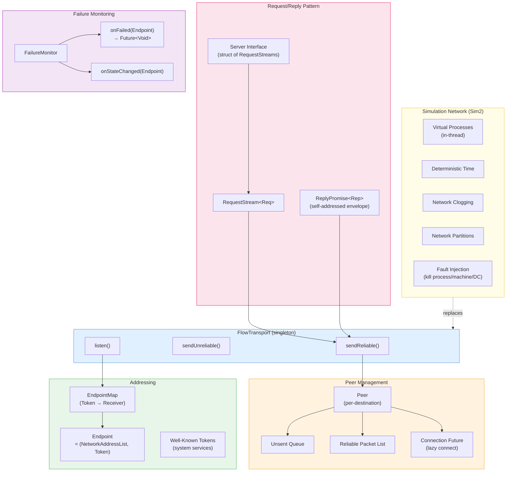
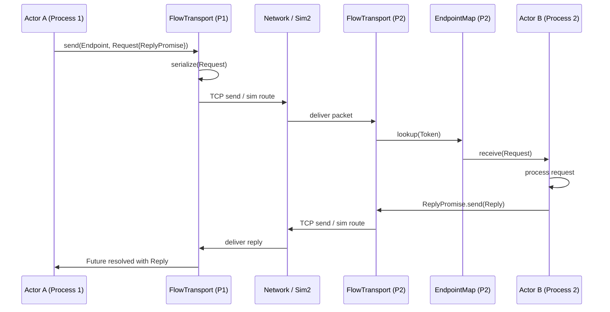
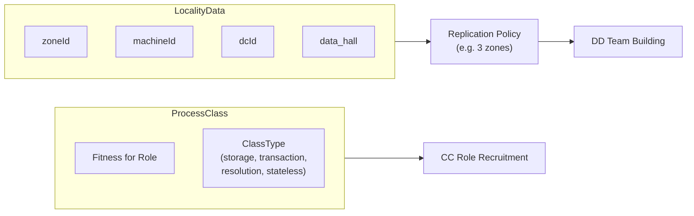

# RPC & Transport — Internal Architecture

```mermaid
graph TB
    subgraph Transport["FlowTransport (singleton)"]
        SendR["sendReliable()"]
        SendU["sendUnreliable()"]
        Listen["listen()"]
    end

    subgraph Peers["Peer Management"]
        Peer["Peer\n(per-destination)"]
        UnsentQ["Unsent Queue"]
        ReliableQ["Reliable Packet List"]
        ConnFuture["Connection Future\n(lazy connect)"]
    end

    subgraph Addressing["Addressing"]
        Endpoint["Endpoint\n= (NetworkAddressList, Token)"]
        EndpointMap["EndpointMap\n(Token → Receiver)"]
        WellKnown["Well-Known Tokens\n(system services)"]
    end

    subgraph RequestReply["Request/Reply Pattern"]
        ReqStream["RequestStream&lt;Req&gt;"]
        RP["ReplyPromise&lt;Rep&gt;\n(self-addressed envelope)"]
        Interface["Server Interface\n(struct of RequestStreams)"]
    end

    subgraph Monitoring["Failure Monitoring"]
        FM["FailureMonitor"]
        OnFailed["onFailed(Endpoint)\n→ Future&lt;Void&gt;"]
        OnStateChange["onStateChanged(Endpoint)"]
    end

    subgraph SimNetwork["Simulation Network (Sim2)"]
        VirtProcess["Virtual Processes\n(in-thread)"]
        VirtTime["Deterministic Time"]
        Clogging["Network Clogging"]
        Partitions["Network Partitions"]
        FaultInj["Fault Injection\n(kill process/machine/DC)"]
    end

    Interface --> ReqStream
    ReqStream --> SendR
    SendR --> Peer --> UnsentQ
    Peer --> ReliableQ
    Peer --> ConnFuture

    Listen --> EndpointMap --> Endpoint
    RP --> SendR

    FM --> OnFailed
    FM --> OnStateChange

    SimNetwork -.->|replaces| Transport

    style Transport fill:#e1f0ff,stroke:#4a90d9
    style Peers fill:#fff3e0,stroke:#f5a623
    style Addressing fill:#e8f5e9,stroke:#4caf50
    style RequestReply fill:#fce4ec,stroke:#e91e63
    style Monitoring fill:#f3e5f5,stroke:#9c27b0
    style SimNetwork fill:#fffde7,stroke:#fbc02d
```

## Message Flow Between Processes

```mermaid
sequenceDiagram
    participant A as Actor A (Process 1)
    participant FT1 as FlowTransport (P1)
    participant Net as Network / Sim2
    participant FT2 as FlowTransport (P2)
    participant EM as EndpointMap (P2)
    participant B as Actor B (Process 2)

    A->>FT1: send(Endpoint, Request{ReplyPromise})
    FT1->>FT1: serialize(Request)
    FT1->>Net: TCP send / sim route
    Net->>FT2: deliver packet
    FT2->>EM: lookup(Token)
    EM->>B: receive(Request)
    B->>B: process request
    B->>FT2: ReplyPromise.send(Reply)
    FT2->>Net: TCP send / sim route
    Net->>FT1: deliver reply
    FT1->>A: Future resolved with Reply
```

## Locality & Placement

```mermaid
graph LR
    subgraph LocalityData
        Zone["zoneId"]
        Machine["machineId"]
        DC["dcId"]
        DataHall["data_hall"]
    end

    subgraph ProcessClass
        Fitness["Fitness for Role"]
        ClassType["ClassType\n(storage, transaction,\nresolution, stateless)"]
    end

    LocalityData --> ReplicationPolicy["Replication Policy\n(e.g. 3 zones)"]
    ProcessClass --> Recruitment["CC Role Recruitment"]
    ReplicationPolicy --> TeamBuilding["DD Team Building"]
```
