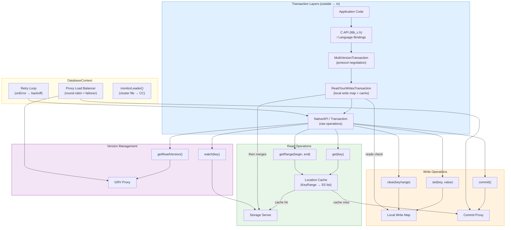
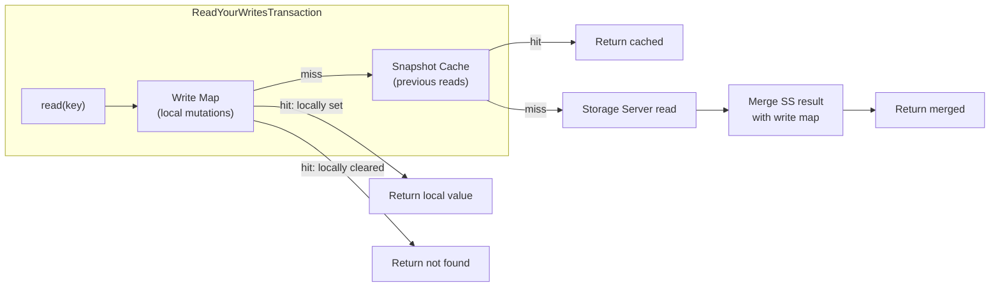
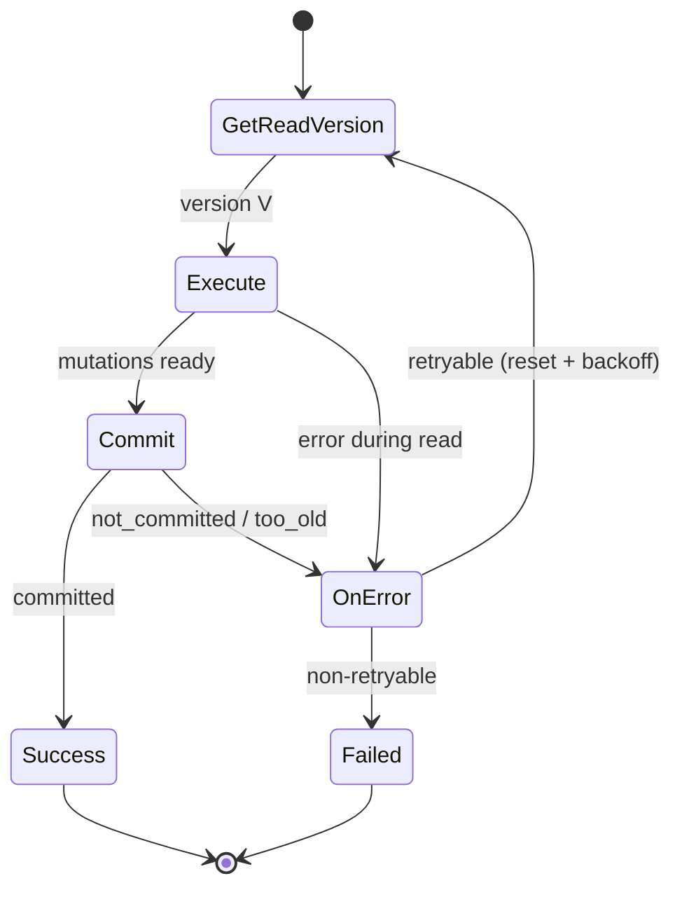

# Client Library — Internal Architecture

```mermaid
graph TB
    subgraph Layers["Transaction Layers (outside → in)"]
        App["Application Code"]
        CAPI["C API (fdb_c.h)\n/ Language Bindings"]
        MV["MultiVersionTransaction\n(protocol negotiation)"]
        RYW["ReadYourWritesTransaction\n(local write map + cache)"]
        Native["NativeAPI / Transaction\n(raw operations)"]
    end

    subgraph ReadPath["Read Operations"]
        Get["get(key)"]
        GetRange["getRange(begin, end)"]
        LocCache["Location Cache\n(KeyRange → SS list)"]
        SS["Storage Server"]
    end

    subgraph WritePath["Write Operations"]
        Set["set(key, value)"]
        Clear["clear(key/range)"]
        WriteMap["Local Write Map"]
        Commit["commit()"]
        CP["Commit Proxy"]
    end

    subgraph VersionMgmt["Version Management"]
        GRV["getReadVersion()"]
        GRVProxy["GRV Proxy"]
        Watch["watch(key)"]
    end

    subgraph Context["DatabaseContext"]
        ProxyLB["Proxy Load Balancer\n(round-robin + failover)"]
        RetryLoop["Retry Loop\n(onError → backoff)"]
        MonLeader["monitorLeader()\n(cluster file → CC)"]
    end

    App --> CAPI --> MV --> RYW --> Native

    Native --> Get
    Native --> GetRange
    Get --> LocCache
    GetRange --> LocCache
    LocCache -->|cache hit| SS
    LocCache -->|cache miss| CP

    Native --> Set --> WriteMap
    Native --> Clear --> WriteMap
    Native --> Commit --> CP

    RYW -->|reads check| WriteMap
    RYW -->|then merges| SS

    Native --> GRV --> GRVProxy
    Native --> Watch --> SS

    ProxyLB --> CP
    ProxyLB --> GRVProxy
    RetryLoop --> Native

    style Layers fill:#e1f0ff,stroke:#4a90d9
    style ReadPath fill:#e8f5e9,stroke:#4caf50
    style WritePath fill:#fff3e0,stroke:#f5a623
    style VersionMgmt fill:#f3e5f5,stroke:#9c27b0
    style Context fill:#fffde7,stroke:#fbc02d
```

## Read-Your-Writes Merge

```mermaid
graph LR
    subgraph RYW["ReadYourWritesTransaction"]
        Read["read(key)"]
        WM["Write Map\n(local mutations)"]
        SC["Snapshot Cache\n(previous reads)"]
    end

    Read --> WM
    WM -->|hit: locally set| Result["Return local value"]
    WM -->|hit: locally cleared| Cleared["Return not found"]
    WM -->|miss| SC
    SC -->|hit| Result2["Return cached"]
    SC -->|miss| SS["Storage Server read"]
    SS --> Merge["Merge SS result\nwith write map"]
    Merge --> Result3["Return merged"]
```

## Transaction Retry Loop

```mermaid
stateDiagram-v2
    [*] --> GetReadVersion
    GetReadVersion --> Execute: version V
    Execute --> Commit: mutations ready
    Commit --> Success: committed
    Commit --> OnError: not_committed / too_old
    Execute --> OnError: error during read
    OnError --> GetReadVersion: retryable (reset + backoff)
    OnError --> Failed: non-retryable
    Success --> [*]
    Failed --> [*]
```
