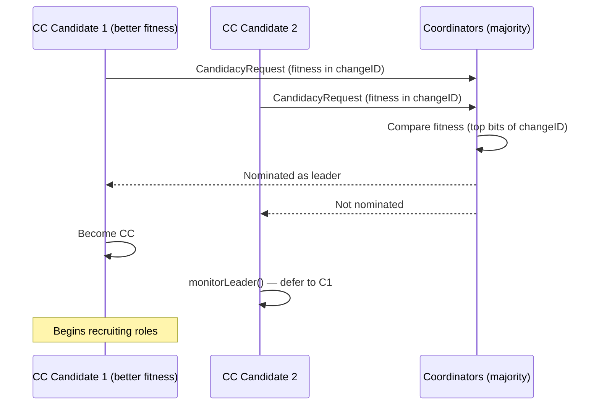
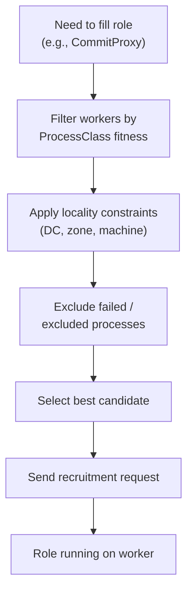
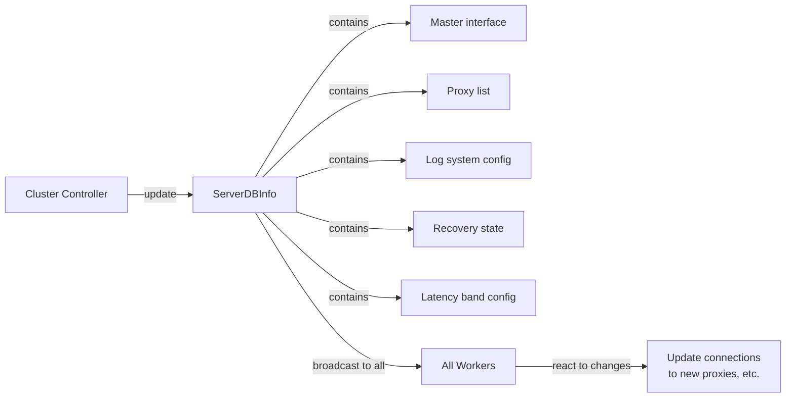

# Cluster Controller & Coordination — Internal Architecture

```mermaid
graph TB
    subgraph Election["Leader Election"]
        Coord1["Coordinator 1"]
        Coord2["Coordinator 2"]
        Coord3["Coordinator 3"]
        GenReg["Generation Register\n(monotonic gen numbers)"]
        Cand["CC Candidates\n(CandidacyRequest)"]
    end

    subgraph CC["Cluster Controller"]
        WorkerPool["Worker Registry\n(ProcessClass + Locality)"]
        Recruit["Role Recruitment"]
        Monitor["Health Monitoring"]
        ServerDBInfo["ServerDBInfo\n(cluster-wide broadcast)"]
    end

    subgraph Roles["Recruited Roles"]
        Master["Master / Sequencer"]
        CPr["Commit Proxies"]
        GRVPr["GRV Proxies"]
        Resolvers["Resolvers"]
        TLogs["TLogs"]
        DDist["Data Distributor"]
        RK["Ratekeeper"]
        CS["Consistency Scan"]
    end

    subgraph Workers["Worker Processes"]
        W1["Worker 1\n(transaction class)"]
        W2["Worker 2\n(storage class)"]
        W3["Worker 3\n(stateless class)"]
        Wn["Worker N"]
    end

    Cand --> Coord1
    Cand --> Coord2
    Cand --> Coord3
    Coord1 --> GenReg
    Coord2 --> GenReg
    Coord3 --> GenReg
    GenReg -->|majority agrees| CC

    W1 -->|registrationClient()| WorkerPool
    W2 -->|registrationClient()| WorkerPool
    W3 -->|registrationClient()| WorkerPool
    Wn -->|registrationClient()| WorkerPool
    WorkerPool --> Recruit
    Recruit -->|fitness + locality| Roles

    Monitor -->|process failure| Recruit
    CC --> ServerDBInfo -->|broadcast| Workers

    style Election fill:#f3e5f5,stroke:#9c27b0
    style CC fill:#e1f0ff,stroke:#4a90d9
    style Roles fill:#fff3e0,stroke:#f5a623
    style Workers fill:#e8f5e9,stroke:#4caf50
```

## Leader Election Protocol



## Role Recruitment Decision



## ServerDBInfo Broadcast


