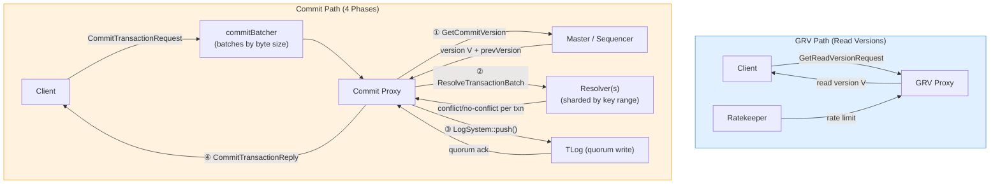
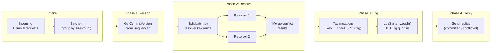
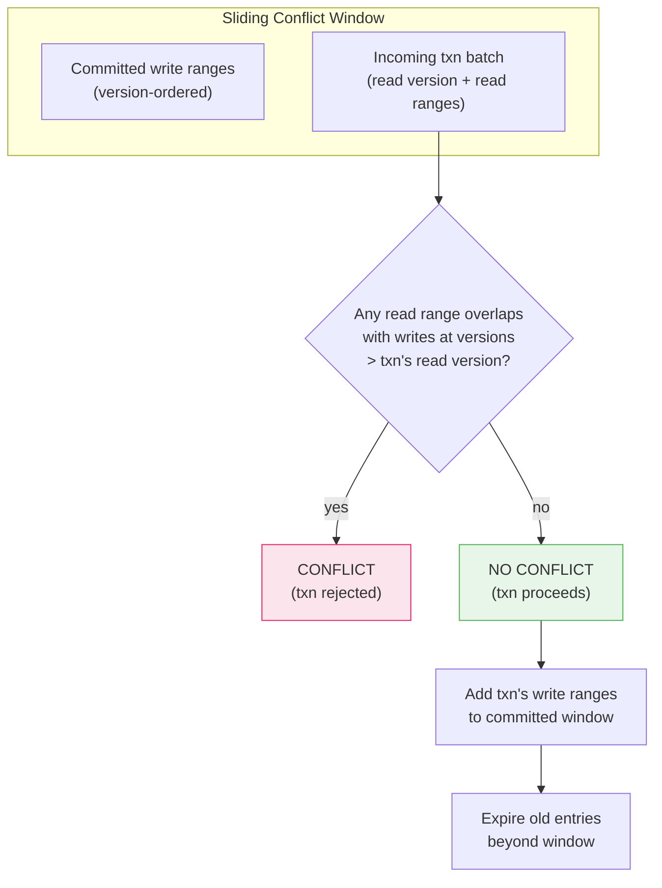
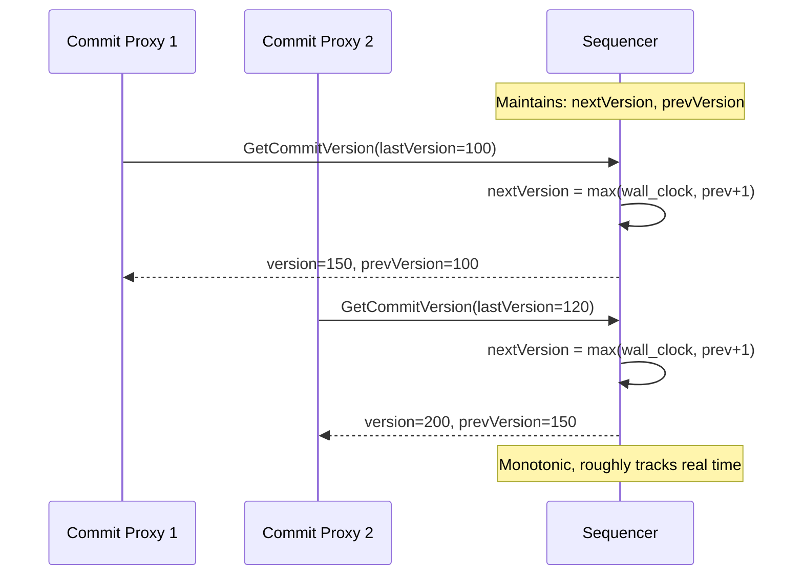

# Transaction Commit Pipeline — Internal Architecture

```mermaid
graph TB
    subgraph GRVPath["GRV Path (Read Versions)"]
        Client1["Client"]
        GRVProxy["GRV Proxy"]
        RK["Ratekeeper"]
    end

    subgraph CommitPath["Commit Path (4 Phases)"]
        Client2["Client"]
        Batcher["commitBatcher\n(batches by byte size)"]
        CP["Commit Proxy"]
        Seq["Master / Sequencer"]
        Res["Resolver(s)\n(sharded by key range)"]
        TLog["TLog (quorum write)"]
    end

    Client1 -- "GetReadVersionRequest" --> GRVProxy
    RK -- "rate limit" --> GRVProxy
    GRVProxy -- "read version V" --> Client1

    Client2 -- "CommitTransactionRequest" --> Batcher --> CP
    CP -- "① GetCommitVersion" --> Seq
    Seq -- "version V + prevVersion" --> CP
    CP -- "② ResolveTransactionBatch" --> Res
    Res -- "conflict/no-conflict per txn" --> CP
    CP -- "③ LogSystem::push()" --> TLog
    TLog -- "quorum ack" --> CP
    CP -- "④ CommitTransactionReply" --> Client2

    style GRVPath fill:#e1f0ff,stroke:#4a90d9
    style CommitPath fill:#fff3e0,stroke:#f5a623
```

## Commit Proxy: Batch Processing Pipeline

```mermaid
graph LR
    subgraph Intake["Intake"]
        Requests["Incoming\nCommitRequests"]
        Batcher["Batcher\n(group by size/count)"]
    end

    subgraph Phase1["Phase 1: Version"]
        GetVer["GetCommitVersion\nfrom Sequencer"]
    end

    subgraph Phase2["Phase 2: Resolve"]
        Split["Split batch by\nresolver key range"]
        R1["Resolver 1"]
        R2["Resolver 2"]
        Merge["Merge conflict\nresults"]
    end

    subgraph Phase3["Phase 3: Log"]
        TagMut["Tag mutations\n(key → shard → SS tag)"]
        Push["LogSystem::push()\nto TLog quorum"]
    end

    subgraph Phase4["Phase 4: Reply"]
        Reply["Send replies\n(committed / conflicted)"]
    end

    Requests --> Batcher --> GetVer --> Split
    Split --> R1 --> Merge
    Split --> R2 --> Merge
    Merge --> TagMut --> Push --> Reply
```

## Resolver: Conflict Detection

```mermaid
graph TB
    subgraph Window["Sliding Conflict Window"]
        Committed["Committed write ranges\n(version-ordered)"]
        Incoming["Incoming txn batch\n(read version + read ranges)"]
    end

    Incoming --> Check{"Any read range overlaps\nwith writes at versions\n> txn's read version?"}
    Check -->|yes| Conflict["CONFLICT\n(txn rejected)"]
    Check -->|no| NoConflict["NO CONFLICT\n(txn proceeds)"]
    NoConflict --> Update["Add txn's write ranges\nto committed window"]
    Update --> Expire["Expire old entries\nbeyond window"]

    style Conflict fill:#fce4ec,stroke:#e91e63
    style NoConflict fill:#e8f5e9,stroke:#4caf50
```

## Master/Sequencer: Version Assignment

```mermaid
sequenceDiagram
    participant CP1 as Commit Proxy 1
    participant CP2 as Commit Proxy 2
    participant Seq as Sequencer

    Note over Seq: Maintains: nextVersion, prevVersion
    CP1->>Seq: GetCommitVersion(lastVersion=100)
    Seq->>Seq: nextVersion = max(wall_clock, prev+1)
    Seq-->>CP1: version=150, prevVersion=100
    CP2->>Seq: GetCommitVersion(lastVersion=120)
    Seq->>Seq: nextVersion = max(wall_clock, prev+1)
    Seq-->>CP2: version=200, prevVersion=150
    Note over Seq: Monotonic, roughly tracks real time
```
