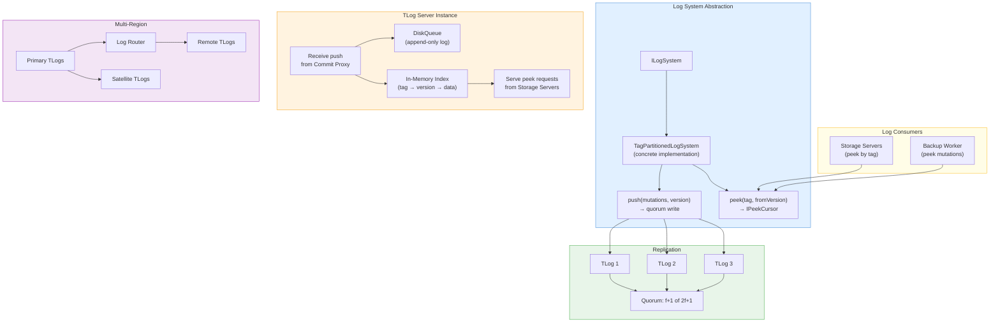
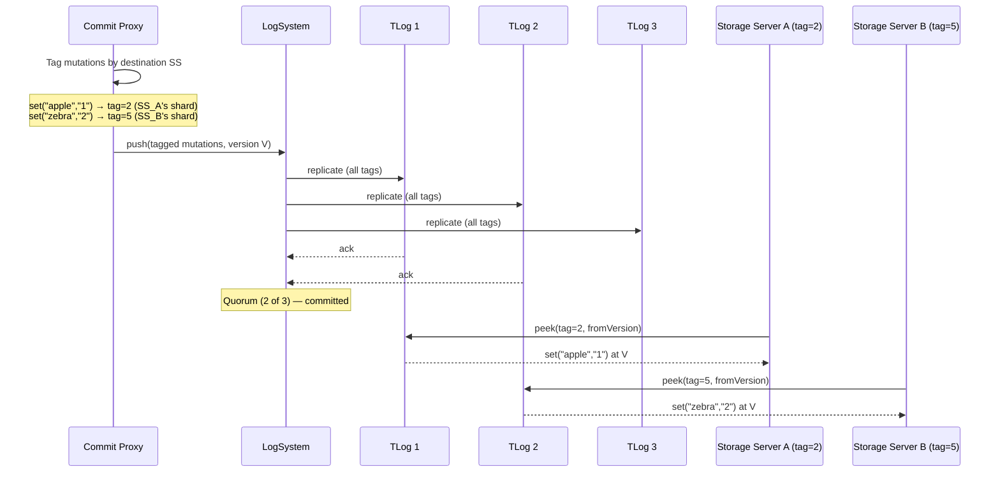
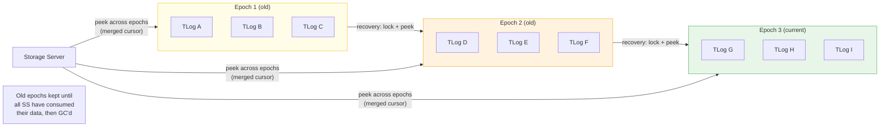
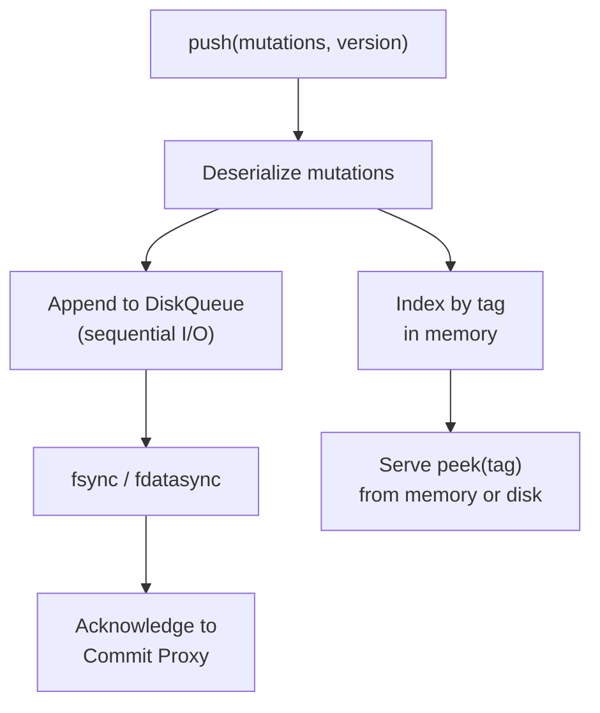

# TLog & Log System — Internal Architecture

```mermaid
graph TB
    subgraph LogSystem["Log System Abstraction"]
        ILogSystem["ILogSystem"]
        Push["push(mutations, version)\n→ quorum write"]
        Peek["peek(tag, fromVersion)\n→ IPeekCursor"]
        TPLS["TagPartitionedLogSystem\n(concrete implementation)"]
    end

    subgraph TLogInstance["TLog Server Instance"]
        Receive["Receive push\nfrom Commit Proxy"]
        DiskQ["DiskQueue\n(append-only log)"]
        MemIdx["In-Memory Index\n(tag → version → data)"]
        PeekServe["Serve peek requests\nfrom Storage Servers"]
    end

    subgraph Replication["Replication"]
        TLog1["TLog 1"]
        TLog2["TLog 2"]
        TLog3["TLog 3"]
        Quorum["Quorum: f+1 of 2f+1"]
    end

    subgraph MultiRegion["Multi-Region"]
        PrimaryTLogs["Primary TLogs"]
        LogRouter["Log Router"]
        RemoteTLogs["Remote TLogs"]
        SatTLogs["Satellite TLogs"]
    end

    subgraph Consumers["Log Consumers"]
        SS["Storage Servers\n(peek by tag)"]
        BW["Backup Worker\n(peek mutations)"]
    end

    ILogSystem --> TPLS
    TPLS --> Push
    TPLS --> Peek

    Push --> TLog1
    Push --> TLog2
    Push --> TLog3
    TLog1 --> Quorum
    TLog2 --> Quorum
    TLog3 --> Quorum

    Receive --> DiskQ
    Receive --> MemIdx
    MemIdx --> PeekServe

    PrimaryTLogs --> LogRouter --> RemoteTLogs
    PrimaryTLogs --> SatTLogs

    SS --> Peek
    BW --> Peek

    style LogSystem fill:#e1f0ff,stroke:#4a90d9
    style TLogInstance fill:#fff3e0,stroke:#f5a623
    style Replication fill:#e8f5e9,stroke:#4caf50
    style MultiRegion fill:#f3e5f5,stroke:#9c27b0
    style Consumers fill:#fffde7,stroke:#fbc02d
```

## Tag-Partitioned Mutation Flow

```mermaid
sequenceDiagram
    participant CP as Commit Proxy
    participant LS as LogSystem
    participant T1 as TLog 1
    participant T2 as TLog 2
    participant T3 as TLog 3
    participant SS_A as Storage Server A (tag=2)
    participant SS_B as Storage Server B (tag=5)

    CP->>CP: Tag mutations by destination SS
    Note over CP: set("apple","1") → tag=2 (SS_A's shard)<br/>set("zebra","2") → tag=5 (SS_B's shard)
    CP->>LS: push(tagged mutations, version V)
    LS->>T1: replicate (all tags)
    LS->>T2: replicate (all tags)
    LS->>T3: replicate (all tags)
    T1-->>LS: ack
    T2-->>LS: ack
    Note over LS: Quorum (2 of 3) — committed

    SS_A->>T1: peek(tag=2, fromVersion)
    T1-->>SS_A: set("apple","1") at V
    SS_B->>T2: peek(tag=5, fromVersion)
    T2-->>SS_B: set("zebra","2") at V
```

## Log Epochs and Recovery

```mermaid
graph LR
    subgraph Epoch1["Epoch 1 (old)"]
        OT1["TLog A"]
        OT2["TLog B"]
        OT3["TLog C"]
    end

    subgraph Epoch2["Epoch 2 (old)"]
        OT4["TLog D"]
        OT5["TLog E"]
        OT6["TLog F"]
    end

    subgraph Epoch3["Epoch 3 (current)"]
        NT1["TLog G"]
        NT2["TLog H"]
        NT3["TLog I"]
    end

    Epoch1 -->|"recovery: lock + peek"| Epoch2
    Epoch2 -->|"recovery: lock + peek"| Epoch3

    SS["Storage Server"] -->|"peek across epochs\n(merged cursor)"| Epoch1
    SS -->|"peek across epochs\n(merged cursor)"| Epoch2
    SS -->|"peek across epochs\n(merged cursor)"| Epoch3

    Note1["Old epochs kept until\nall SS have consumed\ntheir data, then GC'd"]

    style Epoch1 fill:#fffde7,stroke:#fbc02d
    style Epoch2 fill:#fff3e0,stroke:#f5a623
    style Epoch3 fill:#e8f5e9,stroke:#4caf50
```

## TLog Internal Write Path

```mermaid
graph TD
    Push["push(mutations, version)"]
    Push --> Deser["Deserialize mutations"]
    Deser --> TagIndex["Index by tag\nin memory"]
    Deser --> DiskWrite["Append to DiskQueue\n(sequential I/O)"]
    DiskWrite --> Fsync["fsync / fdatasync"]
    Fsync --> Ack["Acknowledge to\nCommit Proxy"]
    TagIndex --> ServePeek["Serve peek(tag)\nfrom memory or disk"]
```
