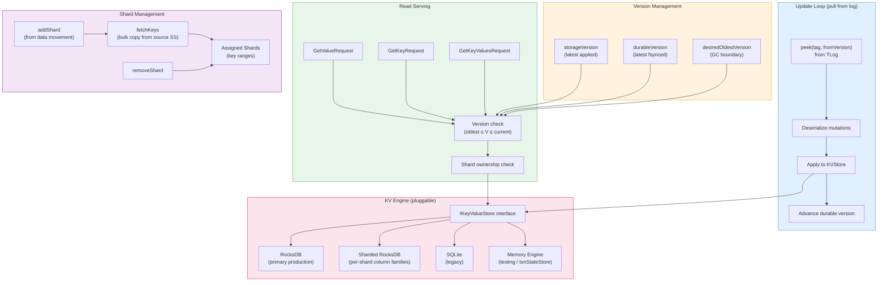
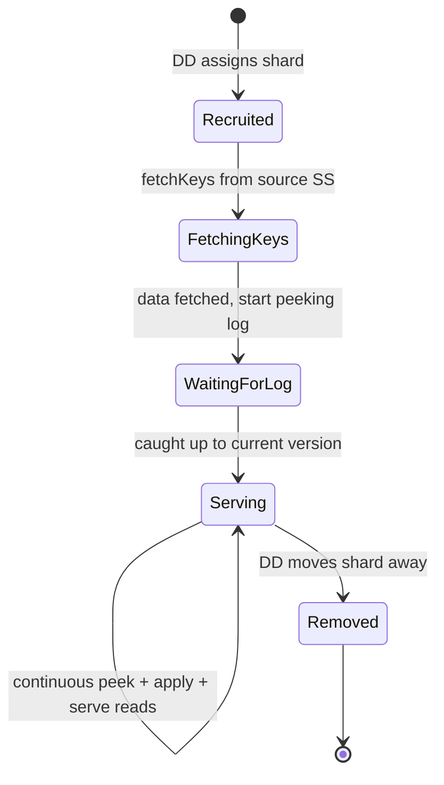
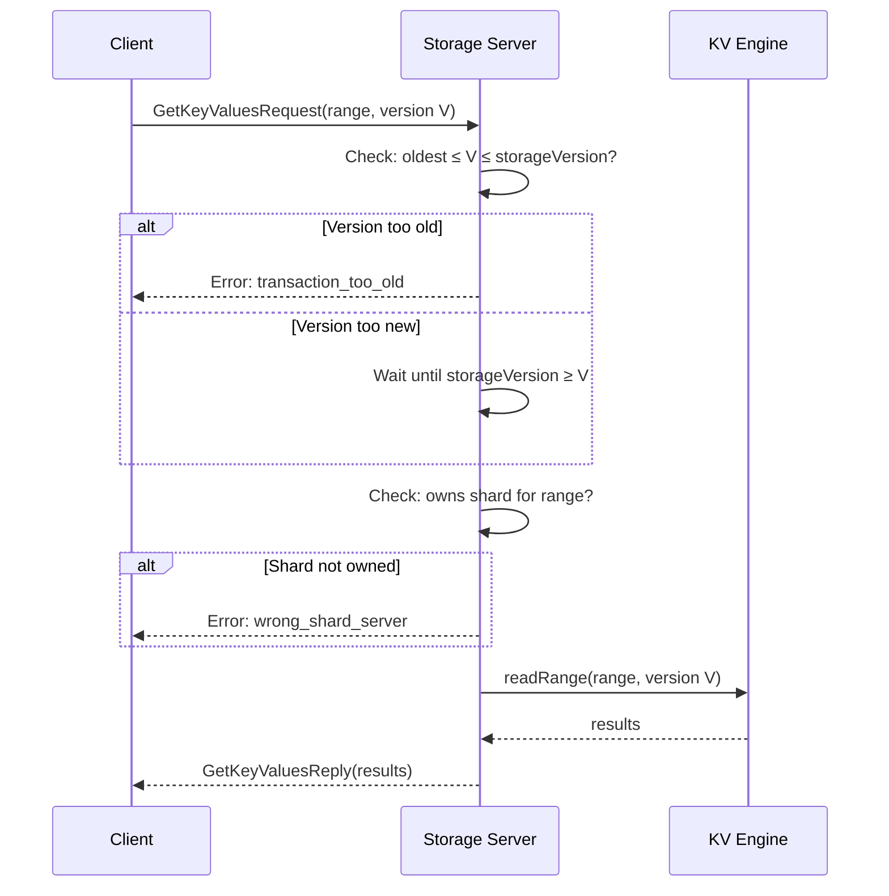
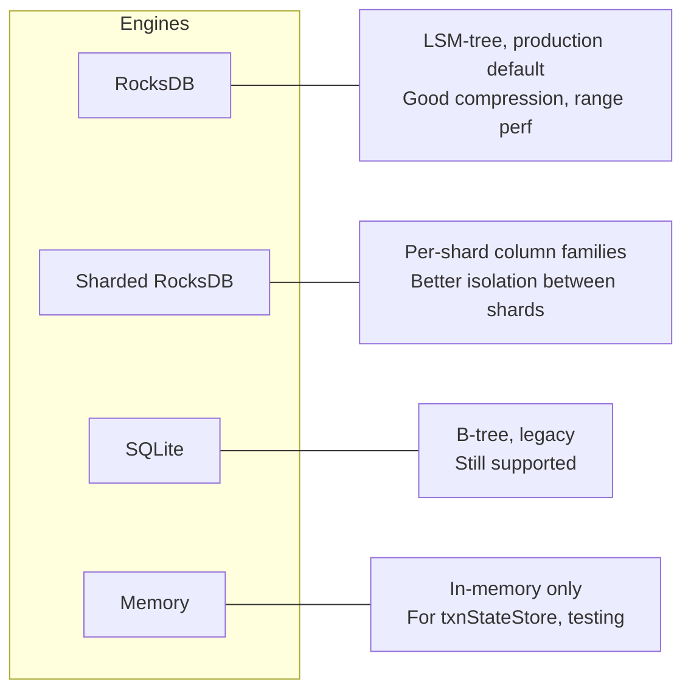

# Storage Server & Engines — Internal Architecture

```mermaid
graph TB
    subgraph UpdateLoop["Update Loop (pull from log)"]
        Peek["peek(tag, fromVersion)\nfrom TLog"]
        Deser["Deserialize mutations"]
        Apply["Apply to KVStore"]
        AdvVer["Advance durable version"]
    end

    subgraph ReadServing["Read Serving"]
        GetVal["GetValueRequest"]
        GetKey["GetKeyRequest"]
        GetRange["GetKeyValuesRequest"]
        VerCheck["Version check\n(oldest ≤ V ≤ current)"]
        ShardCheck["Shard ownership check"]
    end

    subgraph Versions["Version Management"]
        StorageVer["storageVersion\n(latest applied)"]
        DurableVer["durableVersion\n(latest fsynced)"]
        OldestVer["desiredOldestVersion\n(GC boundary)"]
    end

    subgraph Engine["KV Engine (pluggable)"]
        IKV["IKeyValueStore interface"]
        RocksDB["RocksDB\n(primary production)"]
        ShardedRocks["Sharded RocksDB\n(per-shard column families)"]
        SQLite["SQLite\n(legacy)"]
        MemEngine["Memory Engine\n(testing / txnStateStore)"]
    end

    subgraph ShardMgmt["Shard Management"]
        Shards["Assigned Shards\n(key ranges)"]
        AddShard["addShard\n(from data movement)"]
        RemShard["removeShard"]
        FetchKeys["fetchKeys\n(bulk copy from source SS)"]
    end

    Peek --> Deser --> Apply --> AdvVer
    Apply --> IKV

    GetVal --> VerCheck
    GetKey --> VerCheck
    GetRange --> VerCheck
    VerCheck --> ShardCheck --> IKV
    IKV --> RocksDB
    IKV --> ShardedRocks
    IKV --> SQLite
    IKV --> MemEngine

    StorageVer --> VerCheck
    DurableVer --> VerCheck
    OldestVer --> VerCheck

    AddShard --> FetchKeys --> Shards
    RemShard --> Shards

    style UpdateLoop fill:#e1f0ff,stroke:#4a90d9
    style ReadServing fill:#e8f5e9,stroke:#4caf50
    style Versions fill:#fff3e0,stroke:#f5a623
    style Engine fill:#fce4ec,stroke:#e91e63
    style ShardMgmt fill:#f3e5f5,stroke:#9c27b0
```

## Storage Server Lifecycle

```mermaid
stateDiagram-v2
    [*] --> Recruited: DD assigns shard
    Recruited --> FetchingKeys: fetchKeys from source SS
    FetchingKeys --> WaitingForLog: data fetched, start peeking log
    WaitingForLog --> Serving: caught up to current version
    Serving --> Serving: continuous peek + apply + serve reads
    Serving --> Removed: DD moves shard away
    Removed --> [*]
```

## Read Request Processing

```mermaid
sequenceDiagram
    participant Client as Client
    participant SS as Storage Server
    participant KV as KV Engine

    Client->>SS: GetKeyValuesRequest(range, version V)
    SS->>SS: Check: oldest ≤ V ≤ storageVersion?
    alt Version too old
        SS-->>Client: Error: transaction_too_old
    else Version too new
        SS->>SS: Wait until storageVersion ≥ V
    end
    SS->>SS: Check: owns shard for range?
    alt Shard not owned
        SS-->>Client: Error: wrong_shard_server
    end
    SS->>KV: readRange(range, version V)
    KV-->>SS: results
    SS-->>Client: GetKeyValuesReply(results)
```

## Storage Engine Comparison

```mermaid
graph LR
    subgraph Engines
        R["RocksDB"]
        SR["Sharded RocksDB"]
        SQ["SQLite"]
        M["Memory"]
    end

    R --- R_desc["LSM-tree, production default\nGood compression, range perf"]
    SR --- SR_desc["Per-shard column families\nBetter isolation between shards"]
    SQ --- SQ_desc["B-tree, legacy\nStill supported"]
    M --- M_desc["In-memory only\nFor txnStateStore, testing"]
```
