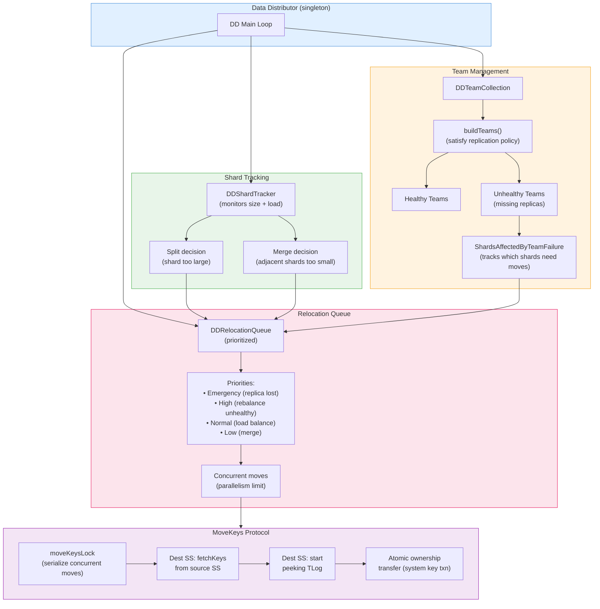
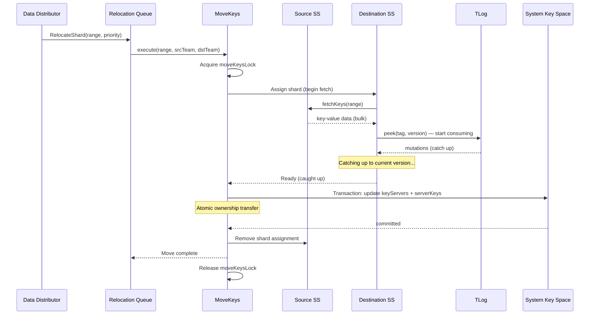
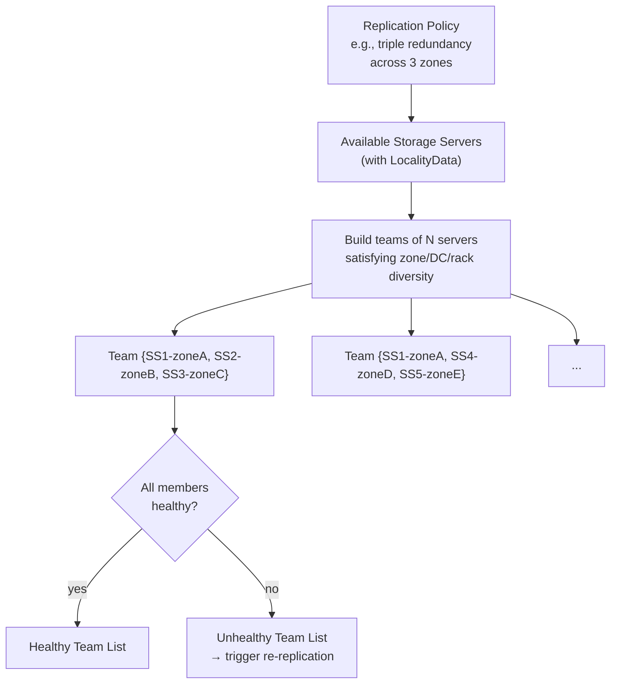
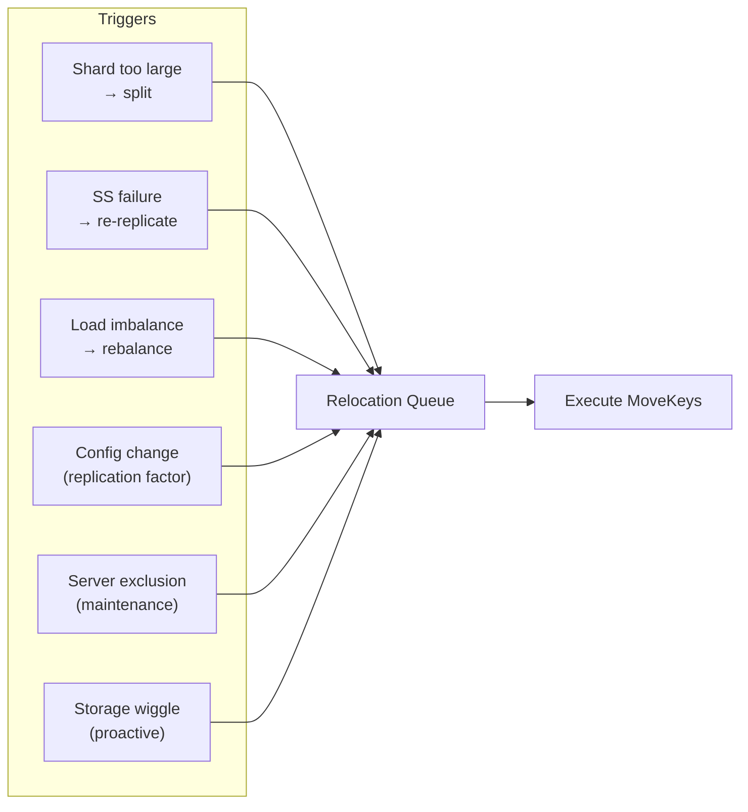

# Data Distribution — Internal Architecture

```mermaid
graph TB
    subgraph DD["Data Distributor (singleton)"]
        DDMain["DD Main Loop"]
    end

    subgraph Tracking["Shard Tracking"]
        ShardTracker["DDShardTracker\n(monitors size + load)"]
        Split["Split decision\n(shard too large)"]
        Merge["Merge decision\n(adjacent shards too small)"]
    end

    subgraph Teams["Team Management"]
        TeamColl["DDTeamCollection"]
        BuildTeams["buildTeams()\n(satisfy replication policy)"]
        HealthyTeams["Healthy Teams"]
        UnhealthyTeams["Unhealthy Teams\n(missing replicas)"]
        SATF["ShardsAffectedByTeamFailure\n(tracks which shards need moves)"]
    end

    subgraph Relocation["Relocation Queue"]
        RelocQ["DDRelocationQueue\n(prioritized)"]
        Priority["Priorities:\n• Emergency (replica lost)\n• High (rebalance unhealthy)\n• Normal (load balance)\n• Low (merge)"]
        Parallel["Concurrent moves\n(parallelism limit)"]
    end

    subgraph MoveKeys["MoveKeys Protocol"]
        Lock["moveKeysLock\n(serialize concurrent moves)"]
        Fetch["Dest SS: fetchKeys\nfrom source SS"]
        LogPeek["Dest SS: start\npeeking TLog"]
        AtomicXfer["Atomic ownership\ntransfer (system key txn)"]
    end

    DDMain --> ShardTracker
    DDMain --> TeamColl
    DDMain --> RelocQ

    ShardTracker --> Split
    ShardTracker --> Merge
    Split --> RelocQ
    Merge --> RelocQ
    TeamColl --> BuildTeams --> HealthyTeams
    BuildTeams --> UnhealthyTeams
    UnhealthyTeams --> SATF --> RelocQ

    RelocQ --> Priority --> Parallel --> MoveKeys
    Lock --> Fetch --> LogPeek --> AtomicXfer

    style DD fill:#e1f0ff,stroke:#4a90d9
    style Tracking fill:#e8f5e9,stroke:#4caf50
    style Teams fill:#fff3e0,stroke:#f5a623
    style Relocation fill:#fce4ec,stroke:#e91e63
    style MoveKeys fill:#f3e5f5,stroke:#9c27b0
```

## Shard Move Sequence

```mermaid
sequenceDiagram
    participant DD as Data Distributor
    participant RQ as Relocation Queue
    participant MK as MoveKeys
    participant Src as Source SS
    participant Dst as Destination SS
    participant TLog as TLog
    participant SysKey as System Key Space

    DD->>RQ: RelocateShard(range, priority)
    RQ->>MK: execute(range, srcTeam, dstTeam)
    MK->>MK: Acquire moveKeysLock

    MK->>Dst: Assign shard (begin fetch)
    Dst->>Src: fetchKeys(range)
    Src-->>Dst: key-value data (bulk)

    Dst->>TLog: peek(tag, version) — start consuming
    TLog-->>Dst: mutations (catch up)
    Note over Dst: Catching up to current version...

    Dst-->>MK: Ready (caught up)

    MK->>SysKey: Transaction: update keyServers + serverKeys
    Note over MK: Atomic ownership transfer
    SysKey-->>MK: committed

    MK->>Src: Remove shard assignment
    MK-->>RQ: Move complete
    MK->>MK: Release moveKeysLock
```

## Team Building

```mermaid
graph TD
    Policy["Replication Policy\ne.g., triple redundancy\nacross 3 zones"]
    Policy --> Candidates["Available Storage Servers\n(with LocalityData)"]
    Candidates --> Build["Build teams of N servers\nsatisfying zone/DC/rack diversity"]
    Build --> Team1["Team {SS1-zoneA, SS2-zoneB, SS3-zoneC}"]
    Build --> Team2["Team {SS1-zoneA, SS4-zoneD, SS5-zoneE}"]
    Build --> TeamN["..."]

    Team1 --> Health{"All members\nhealthy?"}
    Health -->|yes| Healthy["Healthy Team List"]
    Health -->|no| Unhealthy["Unhealthy Team List\n→ trigger re-replication"]
```

## Reasons for Data Movement

```mermaid
graph LR
    subgraph Triggers
        T1["Shard too large\n→ split"]
        T2["SS failure\n→ re-replicate"]
        T3["Load imbalance\n→ rebalance"]
        T4["Config change\n(replication factor)"]
        T5["Server exclusion\n(maintenance)"]
        T6["Storage wiggle\n(proactive)"]
    end

    T1 --> RQ["Relocation Queue"]
    T2 --> RQ
    T3 --> RQ
    T4 --> RQ
    T5 --> RQ
    T6 --> RQ
    RQ --> Move["Execute MoveKeys"]
```
