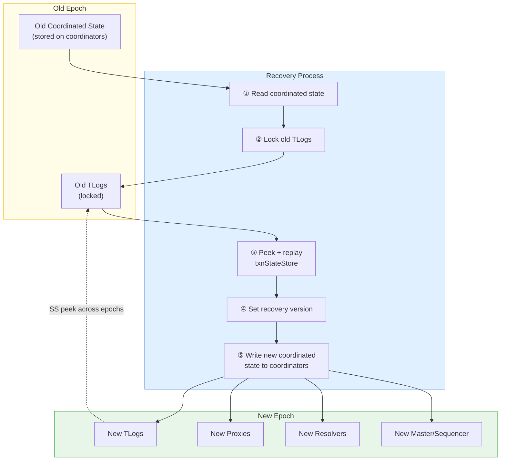
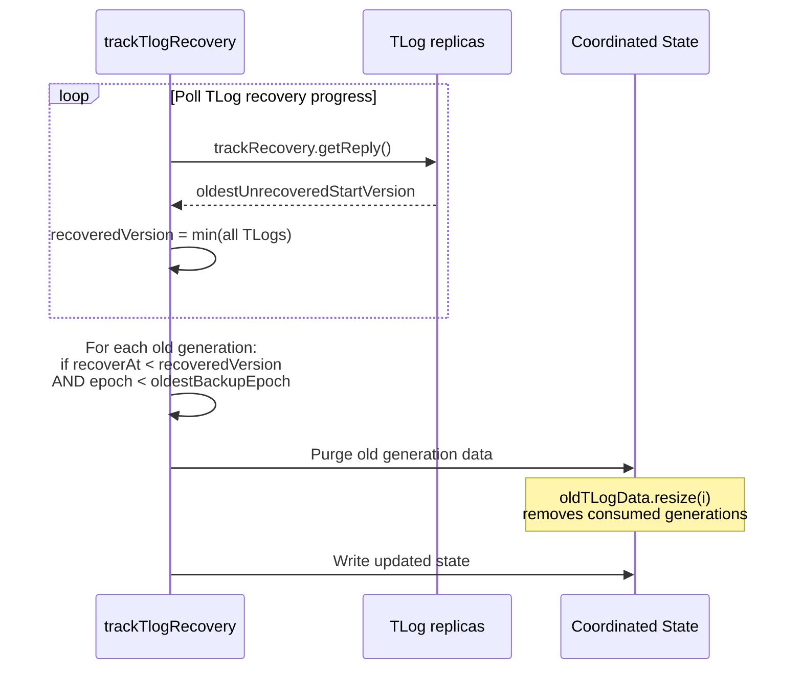
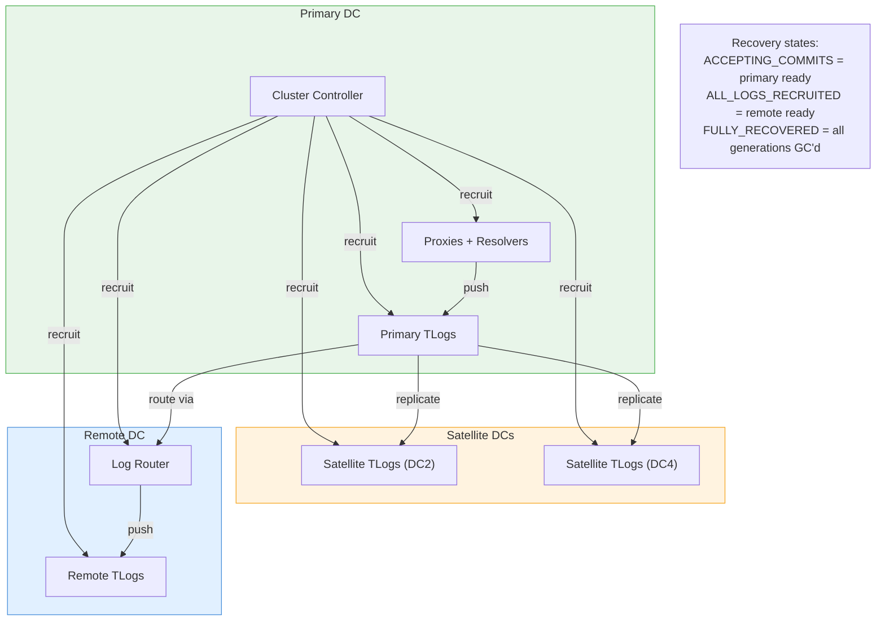

# Cluster Recovery — Internal Architecture

```mermaid
stateDiagram-v2
    [*] --> READING_CSTATE: Master failure detected

    state READING_CSTATE {
        [*] --> ReadCoord: Read from coordinators
        ReadCoord --> ParseDBState: Parse DBCoreState
        ParseDBState --> LearnOldEpoch: Learn previous epoch's TLogs
    }

    READING_CSTATE --> LOCKING_CSTATE

    state LOCKING_CSTATE {
        [*] --> LockOldTLogs: Prevent split-brain
        LockOldTLogs --> EndOldEpoch: Old TLogs stop accepting writes
    }

    LOCKING_CSTATE --> RECRUITING

    state RECRUITING {
        [*] --> RecruitTLogs: New TLog set
        RecruitTLogs --> RecruitProxies: CommitProxies + GrvProxies
        RecruitProxies --> RecruitResolvers: Resolvers
    }

    RECRUITING --> RECOVERY_TRANSACTION

    state RECOVERY_TRANSACTION {
        [*] --> PeekOldLogs: Read uncommitted mutations
        PeekOldLogs --> ReplayTxnState: Reconstruct txnStateStore
        ReplayTxnState --> SetRecoveryVer: Establish recovery version
    }

    RECOVERY_TRANSACTION --> WRITING_CSTATE

    state WRITING_CSTATE {
        [*] --> WriteCoord: Write new epoch to coordinators
        WriteCoord --> [*]: New epoch official
    }

    WRITING_CSTATE --> ACCEPTING_COMMITS: Cluster is live

    ACCEPTING_COMMITS --> ALL_LOGS_RECRUITED: Remote TLogs recruited

    ALL_LOGS_RECRUITED --> FULLY_RECOVERED: Old generations consumed + GC'd
```

## Recovery Data Flow

```mermaid
graph TB
    subgraph OldEpoch["Old Epoch"]
        OldTLogs["Old TLogs\n(locked)"]
        OldCState["Old Coordinated State\n(stored on coordinators)"]
    end

    subgraph Recovery["Recovery Process"]
        ReadCState["① Read coordinated state"]
        LockTLogs["② Lock old TLogs"]
        PeekReplay["③ Peek + replay\ntxnStateStore"]
        RecVer["④ Set recovery version"]
        WriteCState["⑤ Write new coordinated\nstate to coordinators"]
    end

    subgraph NewEpoch["New Epoch"]
        NewTLogs["New TLogs"]
        NewProxies["New Proxies"]
        NewResolvers["New Resolvers"]
        NewMaster["New Master/Sequencer"]
    end

    OldCState --> ReadCState
    ReadCState --> LockTLogs --> OldTLogs
    OldTLogs --> PeekReplay
    PeekReplay --> RecVer
    RecVer --> WriteCState

    WriteCState --> NewTLogs
    WriteCState --> NewProxies
    WriteCState --> NewResolvers
    WriteCState --> NewMaster

    NewTLogs -.->|"SS peek across epochs"| OldTLogs

    style OldEpoch fill:#fffde7,stroke:#fbc02d
    style Recovery fill:#e1f0ff,stroke:#4a90d9
    style NewEpoch fill:#e8f5e9,stroke:#4caf50
```

## Generation GC (trackTlogRecovery)

```mermaid
sequenceDiagram
    participant TR as trackTlogRecovery
    participant TLogs as TLog replicas
    participant CState as Coordinated State

    loop Poll TLog recovery progress
        TR->>TLogs: trackRecovery.getReply()
        TLogs-->>TR: oldestUnrecoveredStartVersion
        TR->>TR: recoveredVersion = min(all TLogs)
    end

    TR->>TR: For each old generation:<br/>if recoverAt < recoveredVersion<br/>AND epoch < oldestBackupEpoch
    TR->>CState: Purge old generation data
    Note over CState: oldTLogData.resize(i)<br/>removes consumed generations
    TR->>CState: Write updated state
```

## Multi-Region Recovery

```mermaid
graph TB
    subgraph Primary["Primary DC"]
        PCC["Cluster Controller"]
        PTLogs["Primary TLogs"]
        PProxies["Proxies + Resolvers"]
    end

    subgraph Satellite["Satellite DCs"]
        STLogs1["Satellite TLogs (DC2)"]
        STLogs2["Satellite TLogs (DC4)"]
    end

    subgraph Remote["Remote DC"]
        RTLogs["Remote TLogs"]
        RLogRouter["Log Router"]
    end

    PCC -->|recruit| PTLogs
    PCC -->|recruit| PProxies
    PCC -->|recruit| STLogs1
    PCC -->|recruit| STLogs2
    PCC -->|recruit| RTLogs
    PCC -->|recruit| RLogRouter

    PProxies -->|push| PTLogs
    PTLogs -->|replicate| STLogs1
    PTLogs -->|replicate| STLogs2
    PTLogs -->|route via| RLogRouter -->|push| RTLogs

    Note1["Recovery states:\nACCEPTING_COMMITS = primary ready\nALL_LOGS_RECRUITED = remote ready\nFULLY_RECOVERED = all generations GC'd"]

    style Primary fill:#e8f5e9,stroke:#4caf50
    style Satellite fill:#fff3e0,stroke:#f5a623
    style Remote fill:#e1f0ff,stroke:#4a90d9
```
