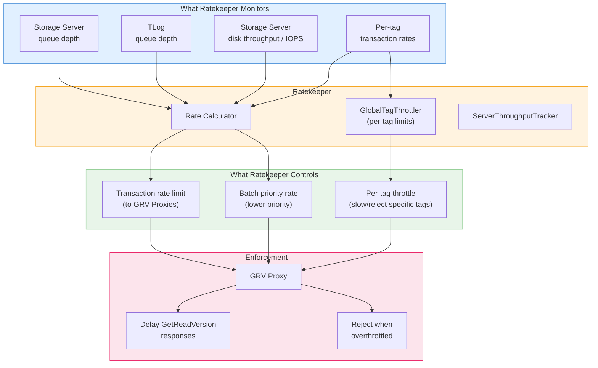
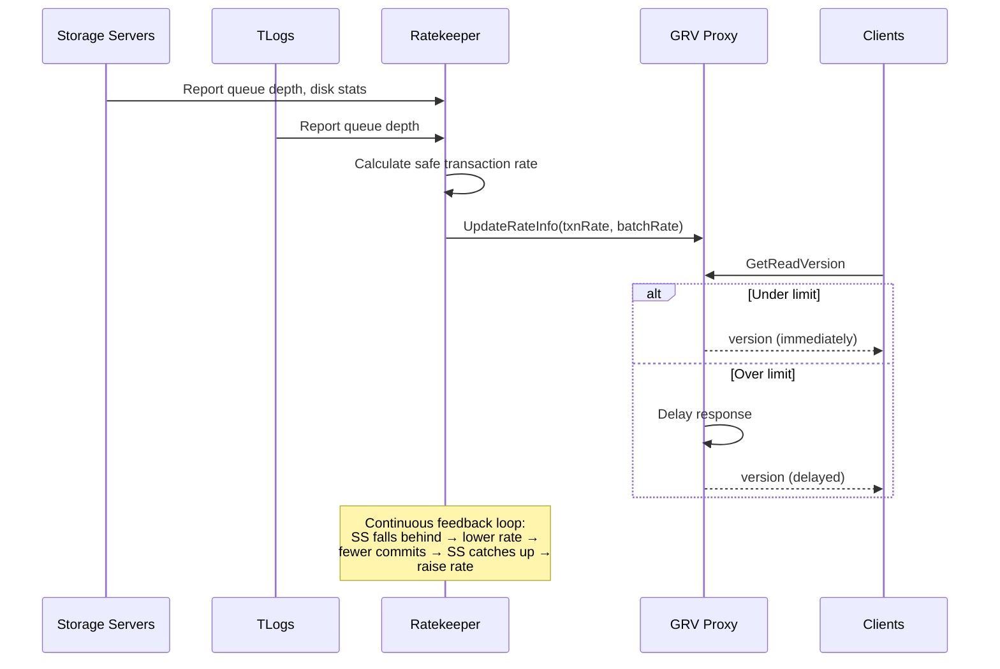
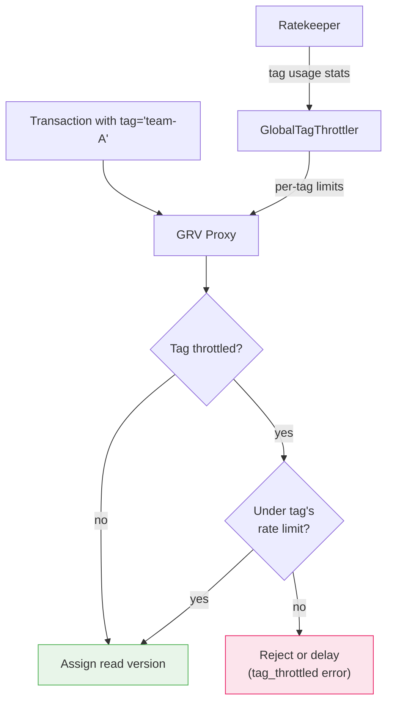

# Rate Keeping & Throttling — Internal Architecture

```mermaid
graph TB
    subgraph Monitoring["What Ratekeeper Monitors"]
        SSQueue["Storage Server\nqueue depth"]
        TLogQueue["TLog\nqueue depth"]
        DiskIO["Storage Server\ndisk throughput / IOPS"]
        TagRates["Per-tag\ntransaction rates"]
    end

    subgraph RK["Ratekeeper"]
        Calc["Rate Calculator"]
        GTT["GlobalTagThrottler\n(per-tag limits)"]
        ThroughputTracker["ServerThroughputTracker"]
    end

    subgraph Control["What Ratekeeper Controls"]
        TxnRate["Transaction rate limit\n(to GRV Proxies)"]
        BatchRate["Batch priority rate\n(lower priority)"]
        TagThrottle["Per-tag throttle\n(slow/reject specific tags)"]
    end

    subgraph Enforcement["Enforcement"]
        GRVProxy["GRV Proxy"]
        Delay["Delay GetReadVersion\nresponses"]
        Reject["Reject when\noverthrottled"]
    end

    SSQueue --> Calc
    TLogQueue --> Calc
    DiskIO --> Calc
    TagRates --> Calc
    Calc --> TxnRate
    Calc --> BatchRate
    TagRates --> GTT --> TagThrottle

    TxnRate --> GRVProxy
    BatchRate --> GRVProxy
    TagThrottle --> GRVProxy
    GRVProxy --> Delay
    GRVProxy --> Reject

    style Monitoring fill:#e1f0ff,stroke:#4a90d9
    style RK fill:#fff3e0,stroke:#f5a623
    style Control fill:#e8f5e9,stroke:#4caf50
    style Enforcement fill:#fce4ec,stroke:#e91e63
```

## Back-Pressure Feedback Loop

```mermaid
sequenceDiagram
    participant SS as Storage Servers
    participant TLog as TLogs
    participant RK as Ratekeeper
    participant GRV as GRV Proxy
    participant Client as Clients

    SS->>RK: Report queue depth, disk stats
    TLog->>RK: Report queue depth
    RK->>RK: Calculate safe transaction rate
    RK->>GRV: UpdateRateInfo(txnRate, batchRate)

    Client->>GRV: GetReadVersion
    alt Under limit
        GRV-->>Client: version (immediately)
    else Over limit
        GRV->>GRV: Delay response
        GRV-->>Client: version (delayed)
    end
    Note over RK: Continuous feedback loop:<br/>SS falls behind → lower rate →<br/>fewer commits → SS catches up →<br/>raise rate
```

## Tag-Based Throttling

```mermaid
graph TD
    Txn["Transaction with tag='team-A'"]
    Txn --> GRV["GRV Proxy"]
    GRV --> CheckTag{"Tag throttled?"}
    CheckTag -->|no| Proceed["Assign read version"]
    CheckTag -->|yes| CheckRate{"Under tag's\nrate limit?"}
    CheckRate -->|yes| Proceed
    CheckRate -->|no| ThrottleResp["Reject or delay\n(tag_throttled error)"]

    GTT["GlobalTagThrottler"] -->|"per-tag limits"| GRV
    RK["Ratekeeper"] -->|"tag usage stats"| GTT

    style ThrottleResp fill:#fce4ec,stroke:#e91e63
    style Proceed fill:#e8f5e9,stroke:#4caf50
```
