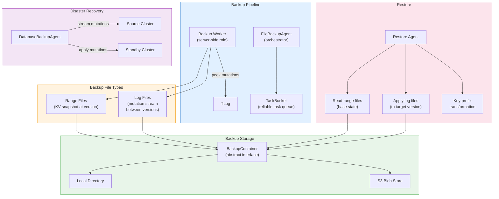
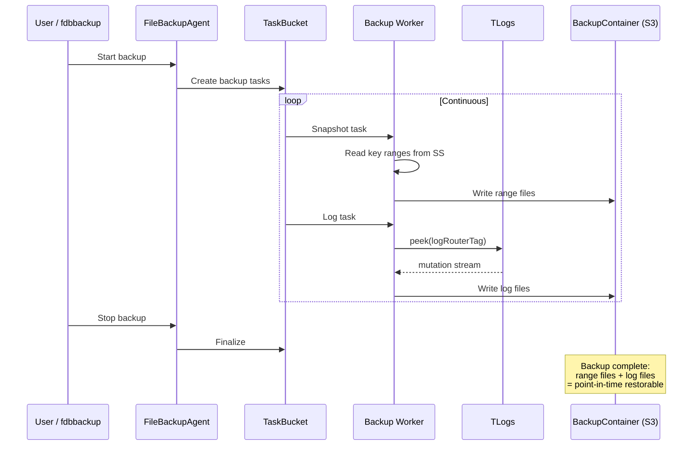
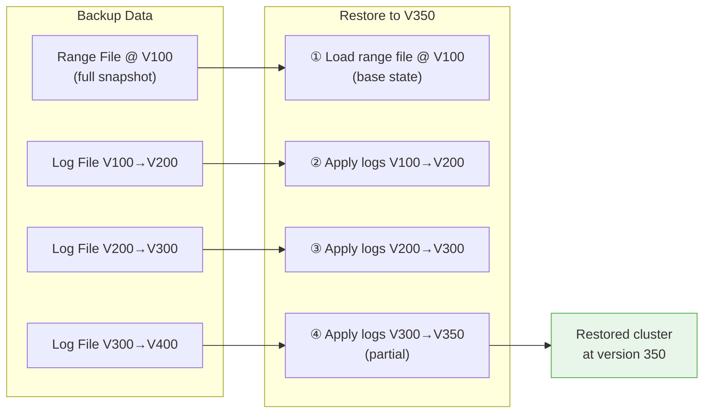

# Backup, Restore & DR — Internal Architecture

```mermaid
graph TB
    subgraph BackupPipeline["Backup Pipeline"]
        BW["Backup Worker\n(server-side role)"]
        TLog["TLog"]
        FBA["FileBackupAgent\n(orchestrator)"]
        TaskBucket["TaskBucket\n(reliable task queue)"]
    end

    subgraph FileTypes["Backup File Types"]
        RangeFile["Range Files\n(KV snapshot at version)"]
        LogFile["Log Files\n(mutation stream\nbetween versions)"]
    end

    subgraph Storage["Backup Storage"]
        BC["BackupContainer\n(abstract interface)"]
        LocalDir["Local Directory"]
        S3["S3 Blob Store"]
    end

    subgraph Restore["Restore"]
        RA["Restore Agent"]
        ReadRange["Read range files\n(base state)"]
        ApplyLog["Apply log files\n(to target version)"]
        PrefixXform["Key prefix\ntransformation"]
    end

    subgraph DR["Disaster Recovery"]
        DBA["DatabaseBackupAgent"]
        SrcCluster["Source Cluster"]
        DstCluster["Standby Cluster"]
    end

    BW -->|"peek mutations"| TLog
    FBA --> TaskBucket
    BW --> RangeFile
    BW --> LogFile
    RangeFile --> BC
    LogFile --> BC
    BC --> LocalDir
    BC --> S3

    RA --> ReadRange --> BC
    RA --> ApplyLog --> BC
    RA --> PrefixXform

    DBA -->|"stream mutations"| SrcCluster
    DBA -->|"apply mutations"| DstCluster

    style BackupPipeline fill:#e1f0ff,stroke:#4a90d9
    style FileTypes fill:#fff3e0,stroke:#f5a623
    style Storage fill:#e8f5e9,stroke:#4caf50
    style Restore fill:#fce4ec,stroke:#e91e63
    style DR fill:#f3e5f5,stroke:#9c27b0
```

## Backup Lifecycle

```mermaid
sequenceDiagram
    participant User as User / fdbbackup
    participant FBA as FileBackupAgent
    participant TB as TaskBucket
    participant BW as Backup Worker
    participant TLog as TLogs
    participant BC as BackupContainer (S3)

    User->>FBA: Start backup
    FBA->>TB: Create backup tasks

    loop Continuous
        TB->>BW: Snapshot task
        BW->>BW: Read key ranges from SS
        BW->>BC: Write range files

        TB->>BW: Log task
        BW->>TLog: peek(logRouterTag)
        TLog-->>BW: mutation stream
        BW->>BC: Write log files
    end

    User->>FBA: Stop backup
    FBA->>TB: Finalize
    Note over BC: Backup complete:<br/>range files + log files<br/>= point-in-time restorable
```

## Point-in-Time Restore

```mermaid
graph LR
    subgraph BackupData["Backup Data"]
        R1["Range File @ V100\n(full snapshot)"]
        L1["Log File V100→V200"]
        L2["Log File V200→V300"]
        L3["Log File V300→V400"]
    end

    subgraph Restore["Restore to V350"]
        Step1["① Load range file @ V100\n(base state)"]
        Step2["② Apply logs V100→V200"]
        Step3["③ Apply logs V200→V300"]
        Step4["④ Apply logs V300→V350\n(partial)"]
    end

    R1 --> Step1
    L1 --> Step2
    L2 --> Step3
    L3 --> Step4
    Step4 --> Result["Restored cluster\nat version 350"]

    style Result fill:#e8f5e9,stroke:#4caf50
```
