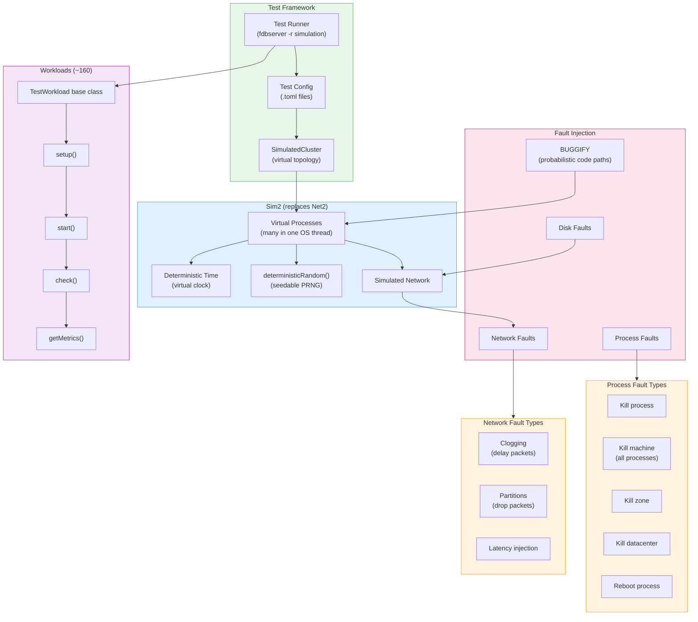
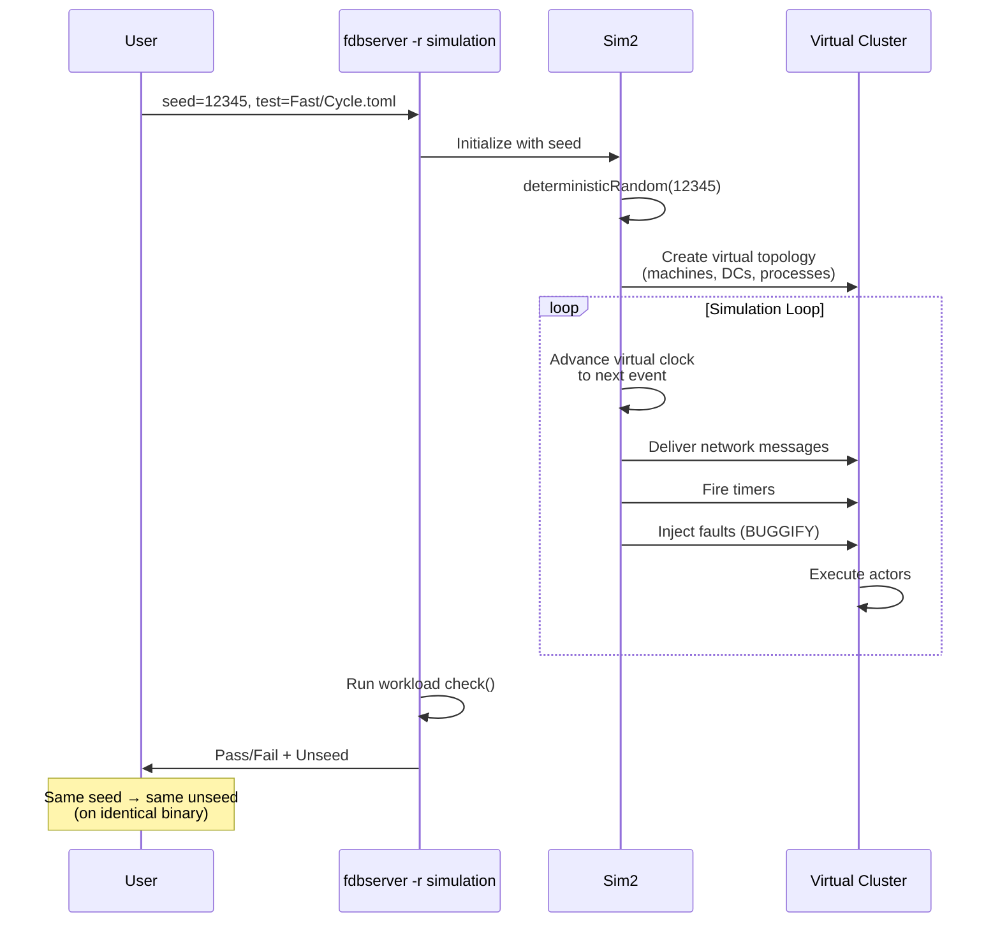
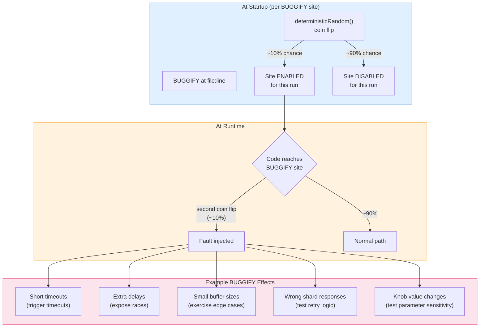
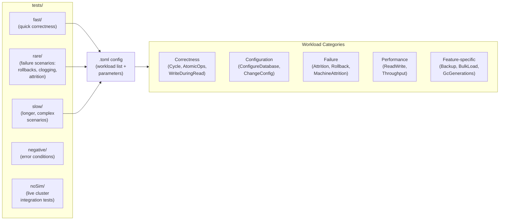

# Simulation & Testing — Internal Architecture

```mermaid
graph TB
    subgraph Sim2["Sim2 (replaces Net2)"]
        VirtProcs["Virtual Processes\n(many in one OS thread)"]
        DetTime["Deterministic Time\n(virtual clock)"]
        DetRand["deterministicRandom()\n(seedable PRNG)"]
        SimNet["Simulated Network"]
    end

    subgraph FaultInjection["Fault Injection"]
        Buggify["BUGGIFY\n(probabilistic code paths)"]
        NetFaults["Network Faults"]
        ProcFaults["Process Faults"]
        DiskFaults["Disk Faults"]
    end

    subgraph NetFaultTypes["Network Fault Types"]
        Clog["Clogging\n(delay packets)"]
        Partition["Partitions\n(drop packets)"]
        Latency["Latency injection"]
    end

    subgraph ProcFaultTypes["Process Fault Types"]
        KillProc["Kill process"]
        KillMachine["Kill machine\n(all processes)"]
        KillZone["Kill zone"]
        KillDC["Kill datacenter"]
        Reboot["Reboot process"]
    end

    subgraph TestFramework["Test Framework"]
        TOML["Test Config\n(.toml files)"]
        SimCluster["SimulatedCluster\n(virtual topology)"]
        Tester["Test Runner\n(fdbserver -r simulation)"]
    end

    subgraph Workloads["Workloads (~160)"]
        WBase["TestWorkload base class"]
        Setup["setup()"]
        Start["start()"]
        Check["check()"]
        Metrics["getMetrics()"]
    end

    Tester --> TOML --> SimCluster --> VirtProcs
    VirtProcs --> DetTime
    VirtProcs --> DetRand
    VirtProcs --> SimNet
    SimNet --> NetFaults --> NetFaultTypes
    ProcFaults --> ProcFaultTypes
    DiskFaults --> SimNet

    Buggify --> VirtProcs

    Tester --> WBase
    WBase --> Setup --> Start --> Check --> Metrics

    style Sim2 fill:#e1f0ff,stroke:#4a90d9
    style FaultInjection fill:#fce4ec,stroke:#e91e63
    style NetFaultTypes fill:#fff3e0,stroke:#f5a623
    style ProcFaultTypes fill:#fff3e0,stroke:#f5a623
    style TestFramework fill:#e8f5e9,stroke:#4caf50
    style Workloads fill:#f3e5f5,stroke:#9c27b0
```

## Deterministic Simulation Flow

```mermaid
sequenceDiagram
    participant User as User
    participant Tester as fdbserver -r simulation
    participant Sim as Sim2
    participant Cluster as Virtual Cluster

    User->>Tester: seed=12345, test=Fast/Cycle.toml
    Tester->>Sim: Initialize with seed
    Sim->>Sim: deterministicRandom(12345)
    Sim->>Cluster: Create virtual topology<br/>(machines, DCs, processes)

    loop Simulation Loop
        Sim->>Sim: Advance virtual clock<br/>to next event
        Sim->>Cluster: Deliver network messages
        Sim->>Cluster: Fire timers
        Sim->>Cluster: Inject faults (BUGGIFY)
        Cluster->>Cluster: Execute actors
    end

    Tester->>Tester: Run workload check()
    Tester->>User: Pass/Fail + Unseed
    Note over User: Same seed → same unseed<br/>(on identical binary)
```

## BUGGIFY System

```mermaid
graph TD
    subgraph BuggifyDecision["At Startup (per BUGGIFY site)"]
        Site["BUGGIFY at file:line"]
        Coin["deterministicRandom()\ncoin flip"]
        Coin -->|"~10% chance"| Enabled["Site ENABLED\nfor this run"]
        Coin -->|"~90% chance"| Disabled["Site DISABLED\nfor this run"]
    end

    subgraph Runtime["At Runtime"]
        Enabled --> Hit{"Code reaches\nBUGGIFY site"}
        Hit -->|"second coin flip\n(~10%)"| Fire["Fault injected"]
        Hit -->|"~90%"| Skip["Normal path"]
    end

    subgraph Examples["Example BUGGIFY Effects"]
        E1["Short timeouts\n(trigger timeouts)"]
        E2["Extra delays\n(expose races)"]
        E3["Small buffer sizes\n(exercise edge cases)"]
        E4["Wrong shard responses\n(test retry logic)"]
        E5["Knob value changes\n(test parameter sensitivity)"]
    end

    Fire --> E1
    Fire --> E2
    Fire --> E3
    Fire --> E4
    Fire --> E5

    style BuggifyDecision fill:#e1f0ff,stroke:#4a90d9
    style Runtime fill:#fff3e0,stroke:#f5a623
    style Examples fill:#fce4ec,stroke:#e91e63
```

## Test Organization

```mermaid
graph LR
    subgraph Tests["tests/"]
        Fast["fast/\n(quick correctness)"]
        Rare["rare/\n(failure scenarios:\nrollbacks, clogging,\nattrition)"]
        Slow["slow/\n(longer, complex\nscenarios)"]
        Negative["negative/\n(error conditions)"]
        NoSim["noSim/\n(live cluster\nintegration tests)"]
    end

    subgraph WorkloadTypes["Workload Categories"]
        Correctness["Correctness\n(Cycle, AtomicOps,\nWriteDuringRead)"]
        Config["Configuration\n(ConfigureDatabase,\nChangeConfig)"]
        Failure["Failure\n(Attrition, Rollback,\nMachineAttrition)"]
        Perf["Performance\n(ReadWrite,\nThroughput)"]
        Feature["Feature-specific\n(Backup, BulkLoad,\nGcGenerations)"]
    end

    Fast --> TOML[".toml config\n(workload list +\nparameters)"]
    Rare --> TOML
    Slow --> TOML
    TOML --> WorkloadTypes
```
