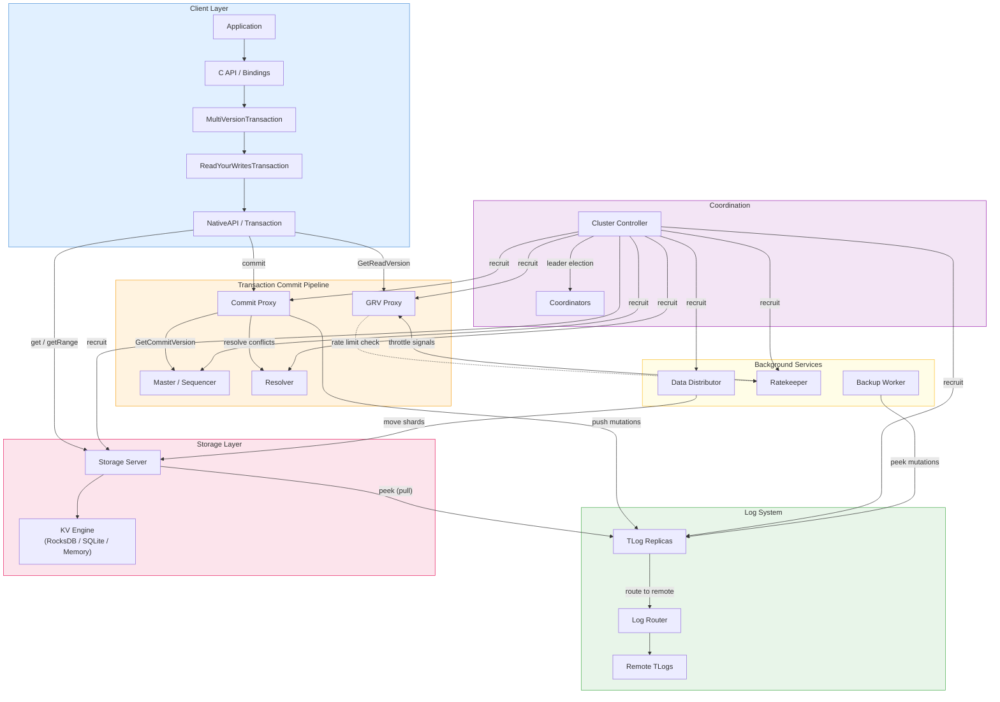
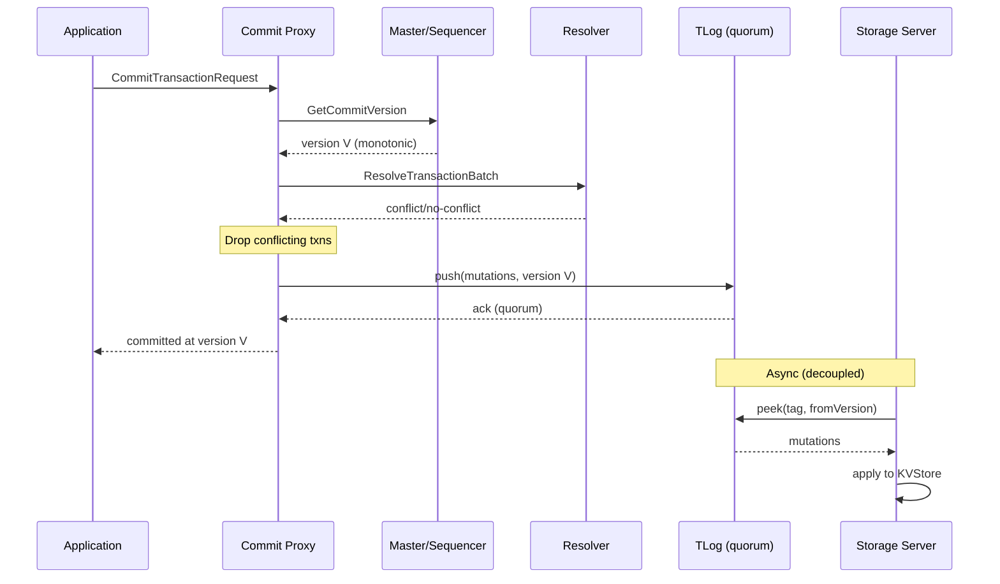
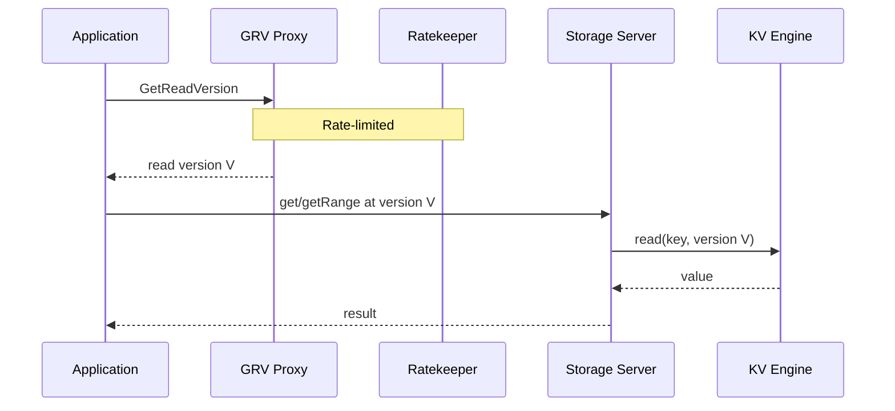
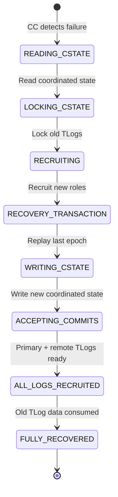
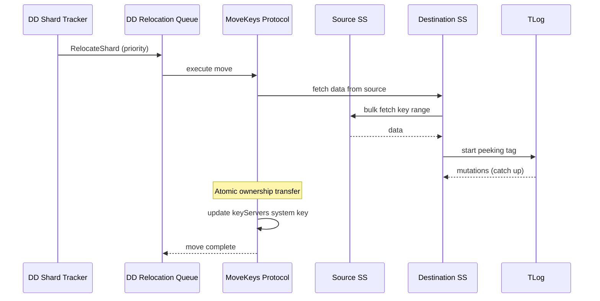

# FoundationDB Architecture Overview

## System-Level Architecture

```mermaid
graph TB
    subgraph Client["Client Layer"]
        App["Application"]
        CAPI["C API / Bindings"]
        MV["MultiVersionTransaction"]
        RYW["ReadYourWritesTransaction"]
        Native["NativeAPI / Transaction"]
    end

    subgraph Coordination["Coordination"]
        Coord["Coordinators"]
        CC["Cluster Controller"]
    end

    subgraph CommitPipeline["Transaction Commit Pipeline"]
        GRV["GRV Proxy"]
        CP["Commit Proxy"]
        Seq["Master / Sequencer"]
        Res["Resolver"]
    end

    subgraph LogSystem["Log System"]
        TLog["TLog Replicas"]
        LR["Log Router"]
        TLogRemote["Remote TLogs"]
    end

    subgraph Storage["Storage Layer"]
        SS["Storage Server"]
        KV["KV Engine\n(RocksDB / SQLite / Memory)"]
    end

    subgraph Background["Background Services"]
        DD["Data Distributor"]
        RK["Ratekeeper"]
        BW["Backup Worker"]
    end

    App --> CAPI --> MV --> RYW --> Native

    Native -->|GetReadVersion| GRV
    Native -->|"get / getRange"| SS
    Native -->|commit| CP

    GRV -.->|rate limit check| RK
    CP -->|GetCommitVersion| Seq
    CP -->|resolve conflicts| Res
    CP -->|push mutations| TLog

    SS -->|"peek (pull)"| TLog
    SS --> KV

    TLog -->|route to remote| LR --> TLogRemote

    CC -->|recruit| CP
    CC -->|recruit| GRV
    CC -->|recruit| Res
    CC -->|recruit| Seq
    CC -->|recruit| TLog
    CC -->|recruit| SS
    CC -->|recruit| DD
    CC -->|recruit| RK
    CC -->|leader election| Coord

    DD -->|move shards| SS
    RK -->|throttle signals| GRV
    BW -->|peek mutations| TLog

    style Client fill:#e1f0ff,stroke:#4a90d9
    style CommitPipeline fill:#fff3e0,stroke:#f5a623
    style LogSystem fill:#e8f5e9,stroke:#4caf50
    style Storage fill:#fce4ec,stroke:#e91e63
    style Coordination fill:#f3e5f5,stroke:#9c27b0
    style Background fill:#fffde7,stroke:#fbc02d
```

## Write Path

```mermaid
sequenceDiagram
    participant App as Application
    participant CP as Commit Proxy
    participant Seq as Master/Sequencer
    participant Res as Resolver
    participant TLog as TLog (quorum)
    participant SS as Storage Server

    App->>CP: CommitTransactionRequest
    CP->>Seq: GetCommitVersion
    Seq-->>CP: version V (monotonic)
    CP->>Res: ResolveTransactionBatch
    Res-->>CP: conflict/no-conflict
    Note over CP: Drop conflicting txns
    CP->>TLog: push(mutations, version V)
    TLog-->>CP: ack (quorum)
    CP-->>App: committed at version V
    Note over TLog,SS: Async (decoupled)
    SS->>TLog: peek(tag, fromVersion)
    TLog-->>SS: mutations
    SS->>SS: apply to KVStore
```

## Read Path

```mermaid
sequenceDiagram
    participant App as Application
    participant GRV as GRV Proxy
    participant RK as Ratekeeper
    participant SS as Storage Server
    participant KV as KV Engine

    App->>GRV: GetReadVersion
    Note over GRV,RK: Rate-limited
    GRV-->>App: read version V
    App->>SS: get/getRange at version V
    SS->>KV: read(key, version V)
    KV-->>SS: value
    SS-->>App: result
```

## Recovery Path

```mermaid
stateDiagram-v2
    [*] --> READING_CSTATE: CC detects failure
    READING_CSTATE --> LOCKING_CSTATE: Read coordinated state
    LOCKING_CSTATE --> RECRUITING: Lock old TLogs
    RECRUITING --> RECOVERY_TRANSACTION: Recruit new roles
    RECOVERY_TRANSACTION --> WRITING_CSTATE: Replay last epoch
    WRITING_CSTATE --> ACCEPTING_COMMITS: Write new coordinated state
    ACCEPTING_COMMITS --> ALL_LOGS_RECRUITED: Primary + remote TLogs ready
    ALL_LOGS_RECRUITED --> FULLY_RECOVERED: Old TLog data consumed
    FULLY_RECOVERED --> [*]
```

## Data Movement Path

```mermaid
sequenceDiagram
    participant DDT as DD Shard Tracker
    participant DDQ as DD Relocation Queue
    participant MK as MoveKeys Protocol
    participant Src as Source SS
    participant Dst as Destination SS
    participant TLog as TLog

    DDT->>DDQ: RelocateShard (priority)
    DDQ->>MK: execute move
    MK->>Dst: fetch data from source
    Dst->>Src: bulk fetch key range
    Src-->>Dst: data
    Dst->>TLog: start peeking tag
    TLog-->>Dst: mutations (catch up)
    Note over MK: Atomic ownership transfer
    MK->>MK: update keyServers system key
    MK-->>DDQ: move complete
```
