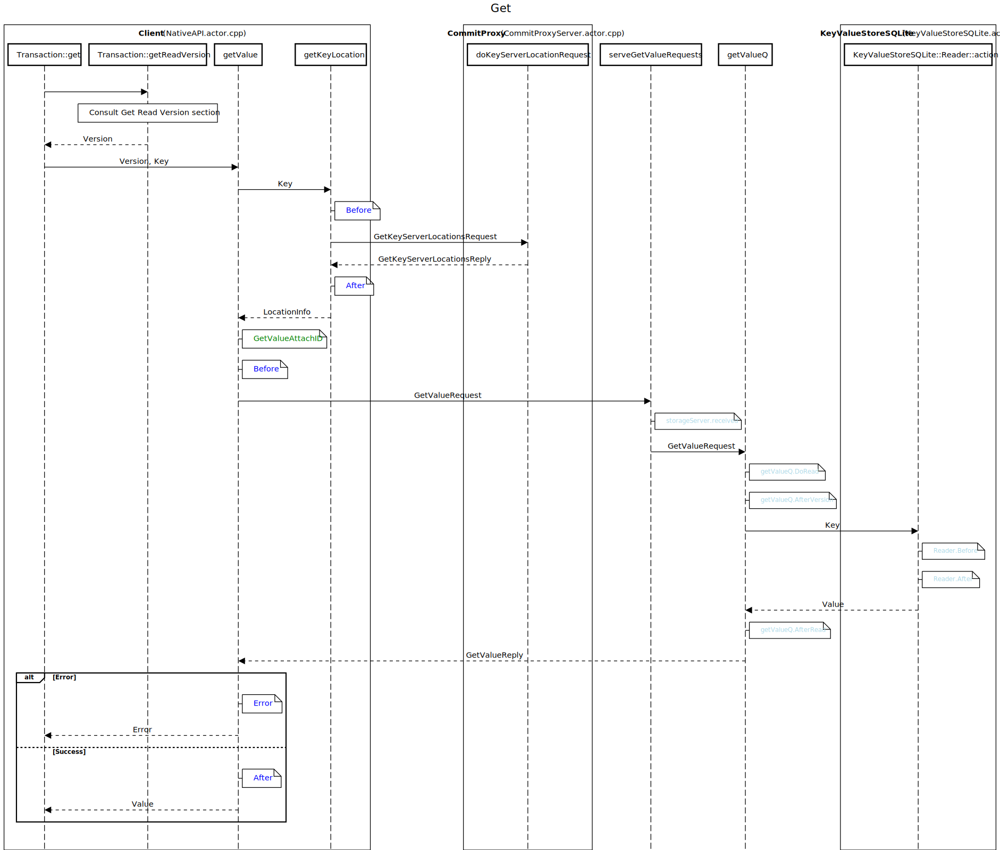

# How a commit is done in FDB

This doc describes how commit is done in FDB 6.3+.
The commit path in FDB 6.3 and before is documented in [documentation/sphinx/source/read-write-path.rst](https://github.com/apple/foundationdb/pull/4099).

## Overall description

Legend:

* `alt` means alternative paths
  * The texts in `[]` are conditions
  * The texts above the arrow are messages. 

The diagrams are generated using https://sequencediagram.org. The source code of the diagrams are the `*.sequence` files.


## Description of each sections

Before all RPCs mentioned below, the client would first verify if the commit proxies and GRV proxies are changed, by comparing the client information ID it holds to the ID the cluster coordinator holds. If they are different, the proxies are changed and the client will refresh the proxies list.

### GetReadVersion Section

* The GRV Proxy sends a request to master to retrieve the current commit version. This version is the read version of the request.

### Preresolution Section

* The commit proxy sends a request for commit version, with a request number.

  - The request number is a monotonically increasing number per commit proxy.
  - This ensures for each proxy, the master will process the requests in order.

* The master server waits until the request number is current.

  When the current request number is larger than the incoming request number

  * If a commit version is already assigned to the incoming request number, return the commit version and the previous commit version. (i.e. `prevVersion`)

  * Otherwise return `Never`

  * Increase current commit version, return it back to the commit proxy.

    * Only one process serves as master. Thus the commit version is unique for each cluster.

    * The monotonically increasing commit version will ensure that each transaction is processed in a strict serial order.

### Resolution section

* The commit proxy sends the transaction to the resolver.
* Resolver waits until its version reaches `prevVersion`
  * Ensures all transactions having version smaller than this transaction are resolved.
  * Detects conflicts for the given transaction:
    * If there is no conflict, return `TransactionCommitted` as the status
    * Any conflict, return `TransactionConflict` status
    * If the read snapshot is not in MVCC, return `TransactionTooOld` status

### Post Resolution section

* The proxy waits until the local batch number is current
* The proxy updates the metadata keys and attaches corresponding storage servers' tags to all mutations.
* The proxy then waits until the commit version is current, i.e. the proxy's committed version is catching up with the commit version of the batch and these two versions are within the MVCC window.
* The proxy pushes the commit data to TLogs.
* TLog waits the commit version to be current, then persists the commit.
* Wait until *all* TLogs return the transaction result.

### Reply section

* The proxy updates the master with the committed version for next GRV request at the master.
* Reply the result to the client, base on the result from the resolver.

## Tracking the process using `g_traceBatch`

`g_traceBatch` can be used for querying the transactions and commits. A typical query in the trace logs is:

```
Type=type Location=location
```

The format of `location` is, in general, `<source_file_name>.<function/actor name>.<log information>`, e.g.

```
NativeAPI.getConsistentReadVersion.Before
```

means the `location` is at `NativeAPI.actor.cpp`, `ACTOR` `getConsistentReadVersion`, `Before` requesting the read version from GRV Proxy.

Some example queries are:

```
Type=TransactionDebug Location=NativeAPI*
```

```
LogGroup=loggroup Type=CommitDebug Location=Resolver.resolveBatch.*
```


In the following sections, <span style="color:green">green</span> tag indicates an attach; <span style="color:blue">blue</span> tag indicates an event that the location follows the format mentioned above, where only the `<log information>` is included; <span style="color:lightblue">light-blue</span> tag indicates an event that the location is not following the format, where the full location is included. All the `g_traceBatch` events are tabularized after the diagram.

`contrib/commit_debug.py` can be used to visualize the commit process.

### Get Read Version


| **Role**     | **File name**  | **Function/Actor**          | **Trace**                         | **Type**                                                     | **Location**                                                 |
| ------------ | -------------- | --------------------------- | --------------------------------- | ------------------------------------------------------------ | ------------------------------------------------------------ |
| **Client**   | NativeAPI      | Transaction::getReadVersion |                                   |                                                              |                                                              |
|              |                | readVersionBatcher          |                                   | [*TransactionAttachID*](https://github.com/apple/foundationdb/blob/ffb8e27f4325db3dc8465e145bc308f6854500eb/fdbclient/NativeAPI.actor.cpp#L4639) |                                                              |
|              |                | getConsistentReadVersion    | Before                            | TransactionDebug                                             | [NativeAPI.getConsistentReadVersion.Before](https://github.com/apple/foundationdb/blob/ffb8e27f4325db3dc8465e145bc308f6854500eb/fdbclient/NativeAPI.actor.cpp#L4564) |
| **GRVProxy** | GrvProxyServer | queueGetReadVersionRequests | Before                            | TransactionDebug                                             | [GrvProxyServer.queueTransactionStartRequests.Before](https://github.com/apple/foundationdb/blob/ffb8e27f4325db3dc8465e145bc308f6854500eb/fdbserver/GrvProxyServer.actor.cpp#L373-L375) |
|              |                | transactionStarter          |                                   | [*TransactionAttachID*](https://github.com/apple/foundationdb/blob/ffb8e27f4325db3dc8465e145bc308f6854500eb/fdbserver/GrvProxyServer.actor.cpp#L734-L735) |                                                              |
|              |                |                             | AskLiveCommittedVersionFromMaster | TransactionDebug                                             | [GrvProxyServer.transactionStarter.AskLiveCommittedVersionFromMaster](https://github.com/apple/foundationdb/blob/ffb8e27f4325db3dc8465e145bc308f6854500eb/fdbserver/GrvProxyServer.actor.cpp#L787-L789) |
|              |                | getLiveCommittedVersion     | confirmEpochLive                  | TransactionDebug                                             | [GrvProxyServer.getLiveCommittedVersion.confirmEpochLive](https://github.com/apple/foundationdb/blob/ffb8e27f4325db3dc8465e145bc308f6854500eb/fdbserver/GrvProxyServer.actor.cpp#L479-L480) |
| **Master**   | MasterServer   | serveLiveCommittedVersion   | GetRawCommittedVersion            | TransactionDebug                                             | [MasterServer.serveLiveCommittedVersion.GetRawCommittedVersion](https://github.com/apple/foundationdb/blob/ffb8e27f4325db3dc8465e145bc308f6854500eb/fdbserver/masterserver.actor.cpp#L1187-L1189) |
| **GRVProxy** | GrvProxyServer | getLiveCommittedVersion     | After                             | TransactionDebug                                             | [GrvProxyServer.getLiveCommittedVersion.After](https://github.com/apple/foundationdb/blob/ffb8e27f4325db3dc8465e145bc308f6854500eb/fdbserver/GrvProxyServer.actor.cpp#L500-L501) |
| **Client**   | NativeAPI      | getConsistentReadVersion    | After                             | TransactionDebug                                             | [NativeAPI.getConsistentReadVersion.After](https://github.com/apple/foundationdb/blob/ffb8e27f4325db3dc8465e145bc308f6854500eb/fdbclient/NativeAPI.actor.cpp#L4594-L4595) |

### Get



| **Role**           | **File name**       | **Function/Actor**                  | **Trace**    | **Name**                                                     | **Location**                                                 | **Notes**                                                    |
| ------------------ | ------------------- | ----------------------------------- | ------------ | ------------------------------------------------------------ | ------------------------------------------------------------ | ------------------------------------------------------------ |
| **Client**         | NativeAPI           | Transaction::get                    |              |                                                              |                                                              |                                                              |
|                    |                     | Transaction::getReadVersion         |              |                                                              | *(Refer to GetReadVersion)*                                  |                                                              |
|                    |                     | getKeyLocation                      | Before       | TransactionDebug                                             | [NativeAPI.getKeyLocation.Before](https://github.com/apple/foundationdb/blob/ffb8e27f4325db3dc8465e145bc308f6854500eb/fdbclient/NativeAPI.actor.cpp#L1975-L1976) | getKeyLocation is called by getValue, getKeyLocation actually calls getKeyLocation_internal |
|                    |                     |                                     | After        | TransactionDebug                                             | [NativeAPI.getKeyLocation.After](https://github.com/apple/foundationdb/blob/ffb8e27f4325db3dc8465e145bc308f6854500eb/fdbclient/NativeAPI.actor.cpp#L1988-L1989) |                                                              |
|                    |                     | getValue                            |              | [*GetValueAttachID*](https://github.com/apple/foundationdb/blob/ffb8e27f4325db3dc8465e145bc308f6854500eb/fdbclient/NativeAPI.actor.cpp#L2164) |                                                              |                                                              |
|                    |                     |                                     | Before       | GetValueDebug                                                | [NativeAPI.getValue.Before](https://github.com/apple/foundationdb/blob/ffb8e27f4325db3dc8465e145bc308f6854500eb/fdbclient/NativeAPI.actor.cpp#L2165-L2167) |                                                              |
| **Storage Server** | StorageServer       | serveGetValueRequests               | received     | GetValueDebug                                                | [StorageServer.received](https://github.com/apple/foundationdb/blob/ffb8e27f4325db3dc8465e145bc308f6854500eb/fdbserver/storageserver.actor.cpp#L4325-L4327) |                                                              |
|                    |                     | getValueQ                           | DoRead       | GetValueDebug                                                | [getValueQ.DoRead](https://github.com/apple/foundationdb/blob/ffb8e27f4325db3dc8465e145bc308f6854500eb/fdbserver/storageserver.actor.cpp#L1115-L1117) |                                                              |
|                    |                     |                                     | AfterVersion | GetValueDebug                                                | [getValueQ.AfterVersion](https://github.com/apple/foundationdb/blob/ffb8e27f4325db3dc8465e145bc308f6854500eb/fdbserver/storageserver.actor.cpp#L1122-L1124) |                                                              |
|                    | KeyValueStoreSQLite | KeyValueStoreSQLite::Reader::action | Before       | GetValueDebug                                                | [Reader.Before](https://github.com/apple/foundationdb/blob/ffb8e27f4325db3dc8465e145bc308f6854500eb/fdbserver/KeyValueStoreSQLite.actor.cpp#L1654-L1656) |                                                              |
|                    |                     |                                     | After        | GetValueDebug                                                | [Reader.After](https://github.com/apple/foundationdb/blob/ffb8e27f4325db3dc8465e145bc308f6854500eb/fdbserver/KeyValueStoreSQLite.actor.cpp#L1662-L1664) |                                                              |
|                    | StorageServer       |                                     | AfterRead    | GetValueDebug                                                | [getValueQ.AfterRead](https://github.com/apple/foundationdb/blob/ffb8e27f4325db3dc8465e145bc308f6854500eb/fdbserver/storageserver.actor.cpp#L1185-L1187) |                                                              |
| **Client**         | NativeAPI           | getValue                            | After        | GetValueDebug                                                | [NativeAPI.getValue.After](https://github.com/apple/foundationdb/blob/ffb8e27f4325db3dc8465e145bc308f6854500eb/fdbclient/NativeAPI.actor.cpp#L2216-L2218) | (When successful)                                            |
|                    |                     |                                     | Error        | GetValueDebug                                                | [NativeAPI.getValue.Error](https://github.com/apple/foundationdb/blob/ffb8e27f4325db3dc8465e145bc308f6854500eb/fdbclient/NativeAPI.actor.cpp#L2232-L2234) | (Wehn failure)                                               |


### Get Range


| **Role**           | **File name** | **Function/Actor**          | **Trace**      | **Name**         | **Location**                                                 | **Notes**                            |
| ------------------ | ------------- | --------------------------- | -------------- | ---------------- | ------------------------------------------------------------ | ------------------------------------ |
| **Client**         | NativeAPI     | Transaction::getRange       |                |                  |                                                              |                                      |
|                    |               | Transaction::getReadVersion |                |                  | *(Refer to GetReadVersion)*                                  |                                      |
|                    |               | getKeyLocation              | Before         | TransactionDebug | [NativeAPI.getKeyLocation.Before](https://github.com/apple/foundationdb/blob/ffb8e27f4325db3dc8465e145bc308f6854500eb/fdbclient/NativeAPI.actor.cpp#L1975) | getKeyLocation is called by getRange |
|                    |               |                             | After          | TransactionDebug | [NativeAPI.getKeyLocation.After](https://github.com/apple/foundationdb/blob/ffb8e27f4325db3dc8465e145bc308f6854500eb/fdbclient/NativeAPI.actor.cpp#L1988-L1989) |                                      |
|                    |               | getRange                    | Before         | TransactionDebug | [NativeAPI.getRange.Before](https://github.com/apple/foundationdb/blob/ffb8e27f4325db3dc8465e145bc308f6854500eb/fdbclient/NativeAPI.actor.cpp#L3004) |                                      |
| **Storage Server** | storageserver | getKeyValuesQ               | Before         | TransactionDebug | [storageserver.getKeyValues.Before](https://github.com/apple/foundationdb/blob/ffb8e27f4325db3dc8465e145bc308f6854500eb/fdbserver/storageserver.actor.cpp#L1812) |                                      |
|                    |               |                             | AfterVersion   | TransactionDebug | [storageserver.getKeyValues.AfterVersion](https://github.com/apple/foundationdb/blob/ffb8e27f4325db3dc8465e145bc308f6854500eb/fdbserver/storageserver.actor.cpp#L1821) |                                      |
|                    |               |                             | AfterKeys      | TransactionDebug | [storageserver.getKeyValues.AfterKeys](https://github.com/apple/foundationdb/blob/ffb8e27f4325db3dc8465e145bc308f6854500eb/fdbserver/storageserver.actor.cpp#L1846) |                                      |
|                    |               |                             | Send           | TransactionDebug | [storageserver.getKeyValues.Send](https://github.com/apple/foundationdb/blob/ffb8e27f4325db3dc8465e145bc308f6854500eb/fdbserver/storageserver.actor.cpp#L1866) | (When no keys found)                 |
|                    |               |                             | AfterReadRange | TransactionDebug | [storageserver.getKeyValues.AfterReadRange](https://github.com/apple/foundationdb/blob/ffb8e27f4325db3dc8465e145bc308f6854500eb/fdbserver/storageserver.actor.cpp#L1886) | (When found keys in this SS)         |
| **Client**         | NativeAPI     | getRange                    | After          | TransactionDebug | [NativeAPI.getRange.After](https://github.com/apple/foundationdb/blob/ffb8e27f4325db3dc8465e145bc308f6854500eb/fdbclient/NativeAPI.actor.cpp#L3044-L3046) | (When successful)                    |
|                    |               |                             | Error          | TransactionDebug | [NativeAPI.getRange.Error](https://github.com/apple/foundationdb/blob/ffb8e27f4325db3dc8465e145bc308f6854500eb/fdbclient/NativeAPI.actor.cpp#L3155-L3156) | (Wehn failure)                       |

### GetRange Fallback


| **Role**   | **File name** | **Function/Actor**   | **Trace**    | **Type**         | **Location**                                                 | **Notes**                                       |
| ---------- | ------------- | -------------------- | ------------ | ---------------- | ------------------------------------------------------------ | ----------------------------------------------- |
| **Client** | NativeAPI     | getRangeFallback     |              |                  |                                                              |                                                 |
|            |               | getKey               |              |                  | *GetKeyAttachID*                                             |                                                 |
|            |               |                      | AfterVersion | GetKeyDebug      | [NativeAPI.getKey.AfterVersion](https://github.com/apple/foundationdb/blob/ffb8e27f4325db3dc8465e145bc308f6854500eb/fdbclient/NativeAPI.actor.cpp#L2263-L2266) |                                                 |
|            |               |                      | Before       | GetKeyDebug      | [NativeAPI.getKey.Before](https://github.com/apple/foundationdb/blob/ffb8e27f4325db3dc8465e145bc308f6854500eb/fdbclient/NativeAPI.actor.cpp#L2285-L2288) |                                                 |
|            |               |                      | After        | GetKeyDebug      | [NativeAPI.getKey.After](https://github.com/apple/foundationdb/blob/ffb8e27f4325db3dc8465e145bc308f6854500eb/fdbclient/NativeAPI.actor.cpp#L2316-L2318) | Success                                         |
|            |               |                      | Error        | GetKeyDebug      | [NativeAPI.getKey.Error](https://github.com/apple/foundationdb/blob/ffb8e27f4325db3dc8465e145bc308f6854500eb/fdbclient/NativeAPI.actor.cpp#L2326) | Error                                           |
|            |               | getReadVersion       |              |                  |                                                              | *(Refer to GetReadVersion)*                     |
|            |               | getKeyRangeLocations | Before       | TransactionDebug | [NativeAPI.getKeyLocations.Before](https://github.com/apple/foundationdb/blob/ffb8e27f4325db3dc8465e145bc308f6854500eb/fdbclient/NativeAPI.actor.cpp#L2029) |                                                 |
|            |               |                      | After        | TransactionDebug | [NativeAPI.getKeyLocations.After](https://github.com/apple/foundationdb/blob/ffb8e27f4325db3dc8465e145bc308f6854500eb/fdbclient/NativeAPI.actor.cpp#L2044) |                                                 |
|            |               | getExactRange        | Before       | TransactionDebug | [NativeAPI.getExactRange.Before](https://github.com/apple/foundationdb/blob/ffb8e27f4325db3dc8465e145bc308f6854500eb/fdbclient/NativeAPI.actor.cpp#L2674) | getKeyRangeLocations is called by getExactRange |
|            |               |                      | After        | TransactionDebug | [NativeAPI.getExactRange.After](https://github.com/apple/foundationdb/blob/ffb8e27f4325db3dc8465e145bc308f6854500eb/fdbclient/NativeAPI.actor.cpp#L2707) |                                                 |

### Commit


| **Role**         | **File name**     | **Function/Actor**                          | **Trace**            | **Type**                                                     | **Location**                                                 | **Notes** |
| ---------------- | ----------------- | ------------------------------------------- | -------------------- | ------------------------------------------------------------ | ------------------------------------------------------------ | --------- |
| **Client**       | NativeAPI         | Transaction::commit                         |                      |                                                              |                                                              |           |
|                  |                   | commitAndWatch                              |                      |                                                              |                                                              |           |
|                  |                   | tryCommit                                   |                      | *[commitAttachID](https://github.com/apple/foundationdb/blob/ffb8e27f4325db3dc8465e145bc308f6854500eb/fdbclient/NativeAPI.actor.cpp#L4100)* |                                                              |           |
|                  |                   |                                             | Before               | CommitDebug                                                  | [NativeAPI.commit.Before](https://github.com/apple/foundationdb/blob/ffb8e27f4325db3dc8465e145bc308f6854500eb/fdbclient/NativeAPI.actor.cpp#L4101-L4102) |           |
| **Commit Proxy** | CommitProxyServer | commitBatcher                               | batcher              | CommitDebug                                                  | [CommitProxyServer.batcher](https://github.com/apple/foundationdb/blob/ffb8e27f4325db3dc8465e145bc308f6854500eb/fdbserver/CommitProxyServer.actor.cpp#L244-L245) |           |
|                  |                   | commitBatch                                 |                      |                                                              |                                                              |           |
|                  |                   | CommitBatchContext::setupTraceBatch         |                      | *[CommitAttachID](https://github.com/apple/foundationdb/blob/ffb8e27f4325db3dc8465e145bc308f6854500eb/fdbserver/CommitProxyServer.actor.cpp#L526)* |                                                              |           |
|                  |                   |                                             | Before               | CommitDebug                                                  | [CommitProxyServer.commitBatch.Before](https://github.com/apple/foundationdb/blob/ffb8e27f4325db3dc8465e145bc308f6854500eb/fdbserver/CommitProxyServer.actor.cpp#L532) |           |
|                  |                   | CommitBatchContext::preresolutionProcessing | GettingCommitVersion | CommitDebug                                                  | [CommitProxyServer.commitBatch.GettingCommitVersion](https://github.com/apple/foundationdb/blob/ffb8e27f4325db3dc8465e145bc308f6854500eb/fdbserver/CommitProxyServer.actor.cpp#L616-L617) |           |
|                  |                   |                                             | GotCommitVersion     | CommitDebug                                                  | [CommitProxyServer.commitBatch.GotCommitVersion](https://github.com/apple/foundationdb/blob/ffb8e27f4325db3dc8465e145bc308f6854500eb/fdbserver/CommitProxyServer.actor.cpp#L643) |           |
| **Resolver**     | Resolver          | resolveBatch                                |                      | *[CommitAttachID](https://github.com/apple/foundationdb/blob/ffb8e27f4325db3dc8465e145bc308f6854500eb/fdbserver/Resolver.actor.cpp#L116)* |                                                              |           |
|                  |                   |                                             | Before               | CommitDebug                                                  | [Resolver.resolveBatch.Before](https://github.com/apple/foundationdb/blob/ffb8e27f4325db3dc8465e145bc308f6854500eb/fdbserver/Resolver.actor.cpp#L117) |           |
|                  |                   |                                             | AfterQueueSizeCheck  | CommitDebug                                                  | [Resolver.resolveBatch.AfterQueueSizeCheck](https://github.com/apple/foundationdb/blob/ffb8e27f4325db3dc8465e145bc308f6854500eb/fdbserver/Resolver.actor.cpp#L137) |           |
|                  |                   |                                             | AfterOrderer         | CommitDebug                                                  | [Resolver.resolveBatch.AfterOrderer](https://github.com/apple/foundationdb/blob/ffb8e27f4325db3dc8465e145bc308f6854500eb/fdbserver/Resolver.actor.cpp#L172) |           |
|                  |                   |                                             | After                | CommitDebug                                                  | [Resolver.resolveBatch.After](https://github.com/apple/foundationdb/blob/ffb8e27f4325db3dc8465e145bc308f6854500eb/fdbserver/Resolver.actor.cpp#L296) |           |
| **Commit Proxy** | CommitProxyServer | CommitBatchContext::postResolution          | ProcessingMutations  | CommitDebug                                                  | [CommitProxyServer.CommitBatch.ProcessingMutations](https://github.com/apple/foundationdb/blob/ffb8e27f4325db3dc8465e145bc308f6854500eb/fdbserver/CommitProxyServer.actor.cpp#L1074) |           |
|                  |                   |                                             | AfterStoreCommits    | CommitDebug                                                  | [CommitProxyServer.CommitBatch.AfterStoreCommits](https://github.com/apple/foundationdb/blob/ffb8e27f4325db3dc8465e145bc308f6854500eb/fdbserver/CommitProxyServer.actor.cpp#L1154) |           |
| **TLog**         | TLogServer        | tLogCommit                                  |                      | *[commitAttachID](https://github.com/apple/foundationdb/blob/ffb8e27f4325db3dc8465e145bc308f6854500eb/fdbserver/TLogServer.actor.cpp#L2047)* |                                                              |           |
|                  |                   |                                             | BeforeWaitForVersion | CommitDebug                                                  | [TLogServer.tLogCommit.BeforeWaitForVersion](https://github.com/apple/foundationdb/blob/ffb8e27f4325db3dc8465e145bc308f6854500eb/fdbserver/TLogServer.actor.cpp#L2048) |           |
|                  |                   |                                             | Before               | CommitDebug                                                  | [TLog.tLogCommit.Before](https://github.com/apple/foundationdb/blob/ffb8e27f4325db3dc8465e145bc308f6854500eb/fdbserver/TLogServer.actor.cpp#L2083) |           |
|                  |                   |                                             | AfterTLogCommit      | CommitDebug                                                  | [TLog.tLogCommit.AfterTLogCommit](https://github.com/apple/foundationdb/blob/ffb8e27f4325db3dc8465e145bc308f6854500eb/fdbserver/TLogServer.actor.cpp#L2107) |           |
|                  |                   |                                             | After                | CommitDebug                                                  | [TLog.tLogCommit.After](https://github.com/apple/foundationdb/blob/ffb8e27f4325db3dc8465e145bc308f6854500eb/fdbserver/TLogServer.actor.cpp#L2125) |           |
| **Commit Proxy** | CommitProxyServer | CommitBatchContext::reply                   | AfterLogPush         | CommitDebug                                                  | [CommitProxyServer.CommitBatch.AfterLogPush](https://github.com/apple/foundationdb/blob/ffb8e27f4325db3dc8465e145bc308f6854500eb/fdbserver/CommitProxyServer.actor.cpp#L1263) |           |
| **Client**       | NativeAPI         | tryCommit                                   | After                | CommitDebug                                                  | [NativeAPI.commit.After](https://github.com/apple/foundationdb/blob/ffb8e27f4325db3dc8465e145bc308f6854500eb/fdbclient/NativeAPI.actor.cpp#L4152) |           |
|                  |                   | commitAndWatch                              |                      |                                                              |                                                              |           |
|                  |                   | watchValue                                  |                      | *[WatchValueAttachID](https://github.com/apple/foundationdb/blob/ffb8e27f4325db3dc8465e145bc308f6854500eb/fdbclient/NativeAPI.actor.cpp#L2408)* |                                                              |           |
|                  |                   |                                             | Before               | WatchValueDebug                                              | [NativeAPI.watchValue.Before]()                              |           |
|                  |                   |                                             | After                | WatchValueDebug                                              | [NativeAPI.watchValue.After](https://github.com/apple/foundationdb/blob/ffb8e27f4325db3dc8465e145bc308f6854500eb/fdbclient/NativeAPI.actor.cpp#L2431-L2433) |           |

