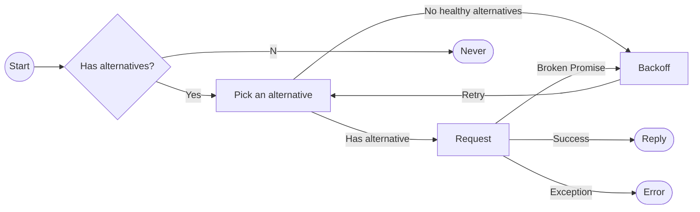
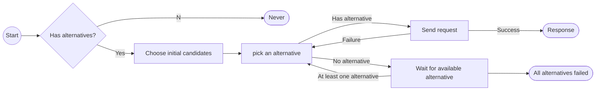
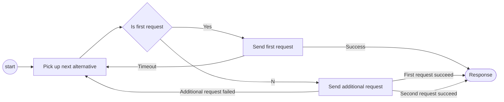

# Load Balancing in FoundationDB

## Introduction

FoundationDB is a distributed key-value database. A FoundationDB cluster is constituted by one or more processes over one or more physical machines, where each process is a *worker* and takes certain *role*s, such as coordinator, proxy, TLog, storage server, etc., in the system.

The interpocess communications (IPC) between the processes are supported by the [`flow`](https://github.com/apple/foundationdb/tree/main/flow) infrastructure. In the `flow` context, each process will expose one or more *interface*(s). Each interface is able to accept given type of *request*s, and *reply* `Void`, requested data or error. The interfaces and the corresponding request/reply pairs forms the IPC protocol of FoundationDB.

In many cases, the same request can be proceed by multiple processes, e.g. all commit proxies can accept commit requests, and multiple storage server processes can provide values for a given key in double/triple redundancy mode. A load balancer (LB) can be used to distribute the requests over the possible interfaces, preventing one or a few processes getting overloaded. The interface candidates are also referred as *alternative*s. The LB is also able to react when one or more interfaces are (temporarily) unavailable by retrying, or re-routing the request to other candidates. The interface candidates are also known as *alternative*s.

Two LBs are provided in FoundationDB: `basicLoadBalance` and `loadBalance`, both defined in [`LoadBalance.actor.h`](https://github.com/apple/foundationdb/blob/main/fdbrpc/include/fdbrpc/LoadBalance.actor.h). The `basicLoadBalance` is a simple load balancer which each interface is equally chosen; while the `loadBalance` accepts a model object, which provides [datacenter](https://apple.github.io/foundationdb/configuration.html#configuring-regions) (DC) awaring balancing algorithms, allowing requests being sent to interfaces in the same DC.

In the following sections, the two LBs will be discussed in details.

## `basicLoadBalance`

`basicLoadBalance` implements a simple load balancing algorithm. It applies to

* Commit proxy interface
* GetReadVersion proxy interface
* ConfigFollower interface

Here, the interfaces are assumed to be always *fresh*, i.e. the list of the servers is fixed.



### Alternative pick algorithm

In `basicLoadBalance`, a *best* alternative is picked and used at the beginning. At this stage, this alternative is randomly picked among all alternatives. If the best alternative does not work, it will iteratively try other interfaces, see [here](#picking-up-an-alternative-in-basic-load-balancing-algorithm).

## `loadBalance`

`loadBalance` provides a more sophisticated implementation of load balancing. In addition of the basic load balancing, it also provides a variety of features:

* Support for Test Storage Server ([TSS](https://github.com/apple/foundationdb/blob/main/documentation/sphinx/source/tss.rst))
* Datacenter-aware alternative election
* Recording the latency and penalty from interfaces, and [prioritize the interfaces based on previously stored data](#with-queuemodel).
* Able to handle timeouts and SS exceptions with retries.

Currently it is used for

* Storage Server interface
* BlobWorker interface




Note:

* The response could be either a reply, or an `Error`, e.g. `process_behind` or `request_maybe_delivered`.

### Choose initial candidates

Two initial candidates will be picked before the requests start. They will be selected as the first two alternatives for the load balancer. If both of them failed, other alternatives are used in a round-robin way.

#### No `QueueModel`

If no `QueueModel` is provided, the initial candidates are picked randomly. The first candidate, or the *best* alternative, will be the one that in the same DC, if possible.

#### With `QueueModel`

`QueueModel` holds information about each candidate related to future version, latency and penalty.

* If the storage server is returning a future version error, it is marked as not available until some certain time.
* Penalty is reported by storage server in each response (see `storageserver.actor.cpp:StorageServer::getPenalty`). It is determined by the write queue length and the durability lagging.

If `QueueModel` exists, the candidates will be picked base on the penalty. Workers with high penalties will be avoided when picking the first two candidates.

### Pick an alternative

The alternatives are chosen in the round-robin way when the first two candidates failed. If all alternatives failed, a flag is set, and if the next request fails with `process_behind`, the caller will receive the `process_behind` error.

### Send requests to workers

Here it is assumed that there are at least one alternative available. If no alternative is available, the LB will wait.



The first request has a timeout option. If the LB is not able to retrieve the response within the timeout, more requests will be sent to secondary and other available interfaces. If the first request failed, it is reset and the next request will be considered as the first request. Certain types of errors can also be returned as response, e.g. `request_may_be_delivered` or `process_behind`, which may not trigger a load-balancer retry.

### Wait for available alternative

When there is no alternatives available, the load balancer may wait until at least one interface is up.


Note that "Wait for alternatives" will only timeout if the alternatives are always not fresh, i.e. this only happens when accessing storage servers. LB will throw `all_alternatives_failed` when timeout in this case.

#### Requests

Original requests in `loadBalancer` are wrapped by `LoadBalance.actor.h:RequestData`. It provides the following additional operations besides the original `flow` request:

* TSS support if `QueueModel` is available
* Translate some errors into `maybe_delivered`, `process_behind` or retries
* Update the `QueueModel` information including latency, penalty, etc.

## Appendix

### Picking an alternative in basic load balancing algorithm

The following script simulates the alternative picking up algorithm. The chosen alternatives will be printed out one-by-one. The `loadBalance` function uses a similar approach, though the interfaces in the same DC are used firstly.

```python
#! /usr/bin/env python3

import random
import time


class Alternatives:

    def __init__(self, num_alternatives):
        self._size = num_alternatives
    
    def size(self):
        return self._size

    def get_best(self):
        return random.randint(0, self._size - 1)


# Entry
NUM_ALTERNATIVES = 10
alts = Alternatives(NUM_ALTERNATIVES)

best_alt = alts.get_best()
next_alt = random.randint(0, alts.size() - 2)
if next_alt >= best_alt:
    next_alt += 1
start_alt = next_alt
start_distance = (best_alt + alts.size() - start_alt) % alts.size()
use_alt = None

print("best_alt = {}".format(best_alt))
print("start_alt = {}".format(start_alt))
print("start_distance = {}".format(start_distance))

while True:
    for alt_num in range(0, alts.size()):
        use_alt = next_alt
        if next_alt == start_alt:
            print("  Going back to the start_alt")
            use_alt = best_alt
        elif (next_alt + alts.size() - start_alt) % alts.size() <= start_distance:
            print("  Entering start_distance")
            use_alt = (next_alt + alts.size() - 1) % alts.size()
        
        print("Attempting alt: {}".format(use_alt))

        # Next loop
        next_alt = (next_alt + 1) % alts.size()
        time.sleep(.2)
```

