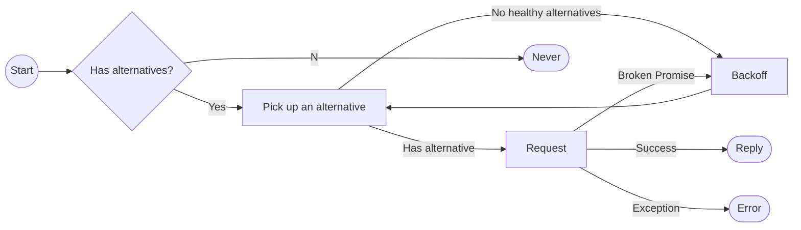
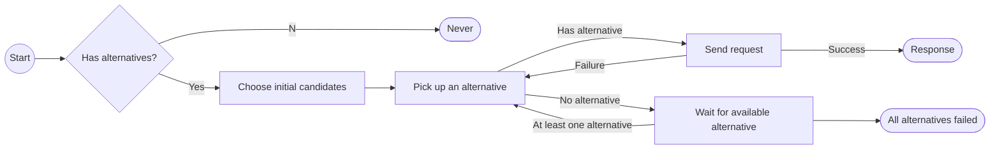
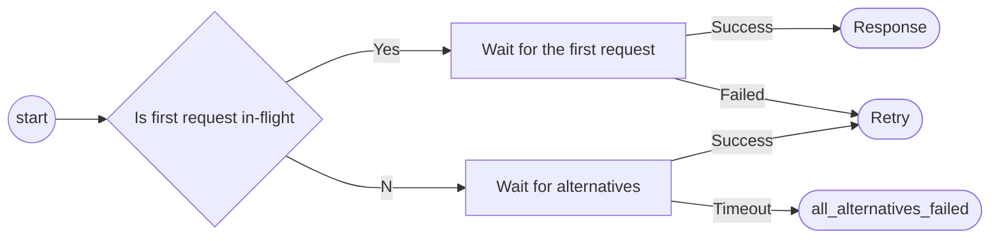

# Load Balancing in FoundationDB

In FoundationDB, often multiple *interface*s are available for the same type of *request*s. A load balancer can be used to distribute the requests to those interfaces, while awaring the possible failures.

Two load balancer are provided: `basicLoadBalance` and `loadBalance`, both defined in `LoadBalance.actor.h`. The `basicLoadBalance` is a simple 

## `basicLoadBalance`

`basicLoadBalance` implements a simple load balancing algorithm. It applies to

* Commit proxy interface
* GetReadVersion proxy interface
* ConfigFollower interface

The interface is assumed to be always *fresh*, i.e. the list of the servers is fixed.



### Alternative pick up algorithm

In `basicLoadBalance`, a *best* alternative is picked up and used at the beginning. At this stage, this alternative is randomly picked up among all alternatives. If the best alternative does not work, it will iteratively try other interfaces, see [here](#picking-up-an-alternative-in-basic-load-balancing-algorithm).

## `loadBalance`

`loadBalance` provides a more sophisticated implementation of load balancing. In addition to the basic load balancing, it also provides a variety of features, such as

* Support for Test Storage Server ([TSS](https://github.com/apple/foundationdb/blob/main/documentation/sphinx/source/tss.rst))
* Distance-based candidate election
* Able to handle timeouts and exceptions with retries
* etc.

Currently it is used for

* Storage Server interface
* BlobWorker interface




Note:

* Response could be an exception, e.g. `process_behind` or `request_maybe_delivered`, and will be delivered as `Error` to the caller.

### Choose initial candidates

Two initial candidates will be picked up before the requests start. They will be selected as the first two alternatives for the load balancer. If both of them failed, other alternatives are used in a round-robin way.

#### No `QueueModel`

If no `QueueModel` is provided, the initial candidates are picked up randomly. The first candidate, or the *best* alternative, will always be one of local workers.

#### With `QueueModel`

`QueueModel` holds information about each candidate related to future version, latency and penalty.

* If the storage server is returning a future version error, it is marked as not available until some certain time.
* Penalty is reported by storage server in each response (see `storageserver.actor.cpp:StorageServer::getPenalty`). It is determined by the write queue length and the version lagging.

If `QueueModel` exists, the candidates will be picked base on the penalty. Workers with high penalties will be avoided when picking up the first two candidates. 

### Pick up an alternative

As mentioned above, the alternatives are chosen in the round-robin way when the first two candidates failed.

If all alternatives failed, a flag is set, so if the next request fails with `process_behind`, the caller will receive the `process_behind` error.

### Send requests to workers

Here it is assumed that there are at least one alternative available.


If the first request failed, it is reset and the next request will be considered as the first request. Certain types of errors can also be returned as response, e.g. `request_may_be_delivered` or `process_behind`, which may not trigger a load-balancer retry.

### Wait for available alternative

When there is no alternatives available, the load balancer may wait until at least one interface is up.



Note that "Wait for alternatives" will only timeout if the alternatives are not always fresh, i.e. this only happens when accessing storage servers.

#### Requests

Original requests in `loadBalancer` are wrapped by `LoadBalance.actor.h:RequestData`. It provides the following additional operations besides the original `flow` request:

* TSS support if `QueueModel` is available
* Translate some errors into `maybe_delivered`, `process_behind` or retries
* Update the `QueueModel` information including latency, penalty, etc.

## Appendix

### Picking up an alternative in load balancing algorithm

The following script simulates the alternative picking up algorithm. The chosen alternatives will be printed out one-by-one.

```python
#! /usr/bin/env python3

import random
import time


class Alternatives:

    def __init__(self, num_alternatives):
        self._size = num_alternatives
    
    def size(self):
        return self._size

    def get_best(self):
        return random.randint(0, self._size - 1)


# Entry
NUM_ALTERNATIVES = 10
alts = Alternatives(NUM_ALTERNATIVES)

best_alt = alts.get_best()
next_alt = random.randint(0, alts.size() - 2)
if next_alt >= best_alt:
    next_alt += 1
start_alt = next_alt
start_distance = (best_alt + alts.size() - start_alt) % alts.size()
use_alt = None

print("best_alt = {}".format(best_alt))
print("start_alt = {}".format(start_alt))
print("start_distance = {}".format(start_distance))

while True:
    for alt_num in range(0, alts.size()):
        use_alt = next_alt
        if next_alt == start_alt:
            print("  Going back to the start_alt")
            use_alt = best_alt
        elif (next_alt + alts.size() - start_alt) % alts.size() <= start_distance:
            print("  Entering start_distance")
            use_alt = (next_alt + alts.size() - 1) % alts.size()
        
        print("Attempting alt: {}".format(use_alt))

        # Next loop
        next_alt = (next_alt + 1) % alts.size()
        time.sleep(.2)
```

