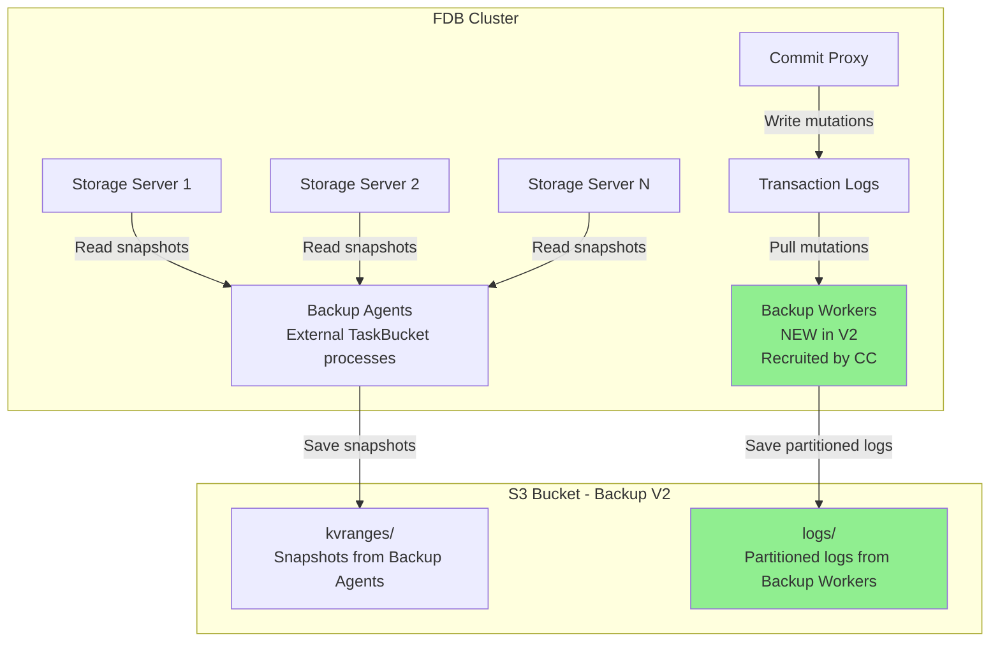
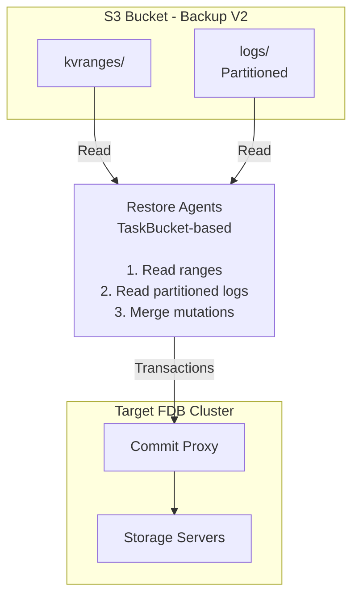
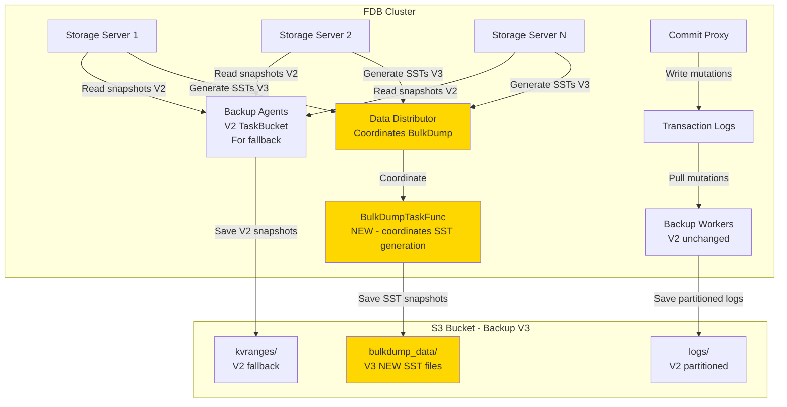
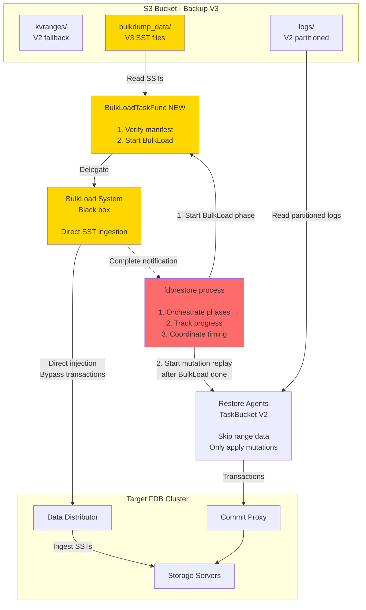

# Design for Integrating BulkDump/BulkLoad into Backup/Restore

## Table of Contents

1. [Objective](#objective)
2. [Background](#background)
3. [Requirements](#requirements)
4. [Design Overview](#design-overview)
5. [Detailed Design](#detailed-design)
6. [Alternatives Considered](#alternatives-considered)
7. [Testing Considerations](#testing-considerations)
8. [Observability/Supportability Considerations](#observabilitysupportability-considerations)
9. [Rollout/Migration Considerations](#rolloutmigration-considerations)
10. [References and Documentation](#references-and-documentation)

---

## Objective

Integrate BulkDump and BulkLoad technologies into FoundationDB's backup and restore systems to enable faster snapshot operations and provide the foundation for future capabilities like restore into live clusters. The integration maintains backward compatibility during the transition period while allowing users to opt into the improved performance characteristics of direct Storage Server coordination.

## Background

### Technical Ecosystem and Business Context

FoundationDB's current backup and restore system consists of mature, production-proven mechanisms:

**[Backup V2](https://github.com/apple/foundationdb/blob/main/design/backup_v2_partitioned_logs.md):** Creates backups by generating range files (snapshots) and continuously capturing mutation logs. Both are uploaded to S3 for durable storage.

**Restore:** Recovers data by reading range files and mutation logs from S3, then applying them to a target cluster via the transaction system.

**New Technologies:**
**[BulkDump](https://github.com/apple/foundationdb/blob/main/documentation/sphinx/source/bulkdump.rst)** and **[BulkLoad](https://github.com/apple/foundationdb/blob/main/documentation/sphinx/source/bulkload.rst)** (introduced in FDB 7.4) provide experimental alternatives that coordinate directly with Storage Servers via the Data Distributor, bypassing transaction system overhead.

### Strategic Initiative Context

Using BulkDump and BulkLoad will help speed up backup and restore. BulkDump and BulkLoad bypass the transaction system and run in parallel enabling faster snapshot and restore. They also facilitate our later objective of being able to load into a live cluster.

### Current Limitations and Scope

Currently, the BulkDump/BulkLoad system supports range-only data handling. Extending it to support range + mutation log restores will require significant additional work and is considered a long-term goal. The additional work includes:

- Completing range-partitioned backup (ongoing)
- Implementing bulkload of mutation logs
- Evaluating bulkload performance with range-partitioned backup datasets

In the near term, this project focuses on integrating BulkDump into the backup pipeline for snapshot generation and BulkLoad into the restore pipeline for range data consumption. This design doc is scoped specifically to that integration effort.

## Requirements

When integrating BulkDump and BulkLoad into the backup and restore snapshot system, two key problems must be addressed in addition to the integration itself:

1. **Preserve simplicity**: As outlined earlier, BulkDump, BulkLoad, and Backup/Restore are independent systems. To keep the integration clean, Backup/Restore should treat BulkDump/BulkLoad as black boxes, avoiding unnecessary coupling or complexity.
2. **Enable fallback**: BulkDump and BulkLoad are still experimental, whereas Backup and Restore are mature and trusted systems. To ensure reliability, the integration must provide a fallback path — if BulkDump/BulkLoad fails, the system should seamlessly revert to the existing backup/restore mechanisms.

Given these problems, we establish the following 4 requirements:

### Functional Requirements

1. **Single-Command Integration**: When running backup or restore operations, users can choose to enable the new snapshot system (BulkDump/BulkLoad) with existing commands.
   - *Rationale*: Without this, users would need to invoke BulkDump, BulkLoad, and traditional backup/restore separately, which is error-prone and complex to manage.

2. **Backward Compatibility**: Backup data generated with BulkDump can be restored using traditional range file restore methods, and traditional backup data can be restored normally.
   - *Rationale*: Since BulkDump uses a completely different manifest and data file format (SSTs) compared to traditional range files, this requirement enables fallback scenarios and addresses failure conditions.

3. **Performance Requirement**: Backup and restore times must be no longer than current implementations when using BulkDump/BulkLoad.
   - *Rationale*: Avoids performance regressions when enabling the new snapshot system.

4. **Encryption Compatibility**: BulkDump and BulkLoad perform encryption when backup/restore encryption is configured.
   - *Rationale*: Required for production security compliance per File Level Encryption in FDB Backups specification. The design and timeline for this phase are still pending.

Requirements 1 and 2 will be inherently satisfied once the design points outlined in the next section are implemented. Requirement 3 also appears feasible, as initial measurements show BulkDump/BulkLoad delivering performance benefits over the transaction-based approach currently used in backup and restore.

## Design Overview

### Architecture Evolution

This integration represents one half of the evolution of Backup V2 to V3, specifically improving the snapshot system (the other part of V3 is range-partitioned backup mutation logs -- a separate effort). The key innovation here is the replacement of transaction-based snapshot handling with direct Storage Server coordination via BulkDump and BulkLoad (while maintaining backward compatibility during the transition).

#### Current Backup Architecture (V2)



**V2 Key Features:**
- **Backup Workers** (NEW in V2): Pull mutations from TLogs, save partitioned mutation logs to S3
- **Backup Agents** (same as [V1](https://github.com/apple/foundationdb/blob/main/design/backup.md)): Read snapshots from Storage Servers, save range files to S3
- **Mutation logs are partitioned** by log router tags (V2 innovation)
- **No backup mutations written to database** ([V1](https://github.com/apple/foundationdb/blob/main/design/backup.md) wrote them, V2 eliminated this)

#### Current Restore Architecture (V2)



**V2 Restore Process:**
- **Restore Agents** read range files and mutation logs from S3
- **Transaction-based ingestion**: All data written through Commit Proxy using standard transaction system
- **Sequential processing**: Range data loaded first, then mutation logs applied
- **Performance bottleneck**: Transaction system creates overhead for large-scale data ingestion

#### Backup Architecture (V3) with BulkDump



**V3 Key Changes:**
- **BulkDumpTaskFunc** (NEW): Coordinates BulkDump (introduced in 7.4) via Data Distributor
- **Data Distributor** coordinates Storage Servers to generate SST files using existing BulkDump implementation
- **Backup Agents** still (optionally) generate kvranges/ (V2 format, for fallback compatibility)
- **Backup Workers** still generate partitioned mutation logs in logs/ (V2, unchanged)
- **Short-term dual snapshot mode**: Both snapshot mechanisms run in parallel temporarily to enable direct comparison and validation

### Terminology and Component Definitions

- **`backup_agent`** = Long-running executable process that executes backup-related TaskBucket tasks only
- **`Backup Agents`** = Instances of `backup_agent` processes executing backup TaskBucket tasks
- **`fdbbackup`** = Command-line tool that submits backup jobs to TaskBucket (does not execute the backup itself)
- **`fdbrestore`** = Command-line tool that both submits and executes restore jobs (different from backup_agent)

**Flow:**
1. User runs `fdbbackup start` → Submits backup job to TaskBucket
2. Running `backup_agent` processes pick up and execute the backup tasks
3. User runs `fdbrestore start` → Submits and executes restore job (not via backup_agent)

## Detailed Design

### Command-Line Interface

#### Backup Command with Snapshot Mode
```bash
fdbbackup start --snapshot-mode <mode> \
  -d <backup_url> \
  -t <target_version> \
  [--timeout <seconds>]
```

**New Parameter:**
- `--snapshot-mode <mode>`: Controls which snapshot mechanism(s) to use
  - `rangefile` (default): Generate only traditional range files (V1/V2 method)
  - `bulkdump`: Generate only BulkDump SST files
  - `both`: Generate both formats for validation/comparison

#### Restore Command with BulkLoad
```bash
fdbrestore start \
  -r <backup_url> \
  -t <target_version> \
  --dest-cluster-file <cluster_file> \
  [--mode <mode>]
```

**New Parameter:**
- `--mode <mode>`: Controls which restore mechanism to use for range data
  - `rangefile` (default): Use traditional range file restore from kvranges/
  - `bulkload`: Use BulkLoad for range data restoration if BulkDump dataset is available

**Default behavior (traditional range files):**
1. Use traditional range file restore from kvranges/
2. Apply mutation logs using traditional method
3. Does not use BulkLoad even if bulkdump_data/ is present

**BulkLoad behavior (with --mode bulkload):**
1. Verify BulkDump dataset completeness
2. If complete: use BulkLoad for range data restoration
3. If incomplete: error (backup does not have bulkdump_data/)
4. After BulkLoad: apply mutation logs using traditional method

### Data Format and Folder Structure

#### Backup V3
```
s3://bucket/backup-2025-01-20-23-17-10.123456/
├── kvranges/                        # V2 snapshot format (fallback compatibility)
│   ├── snapshot.000000000001234567/
│   │   └── 0/
│   │       ├── range,1980422,c5c81efaa67c1b7bb5e17c756f3b2416,1048576
│   │       ├── range,1998818,192536233eafb59e5e854faf1b35d5ca,1048576
│   │       └── ...
│   └── ...
├── snapshots/                       # Snapshot metadata
│   └── snapshot,1980422,2025711,570
├── logs/                            # V2: Partitioned logs (unchanged from V2)
│   └── 0000/
│       └── 0000/
│           ├── log,1923285,21923285,392f2edb4fa32c2af5171686a6b7f8bb,1048576
│           └── ...
├── properties/                      # Backup properties
│   ├── log_begin_version
│   ├── log_end_version
│   └── mutation_log_type
└── bulkdump_data/                   # V3 NEW: BulkDump SST format
    ├── job-manifest.txt             # Top-level job manifest
    └── <job-uuid>/                  # Job-specific directory
        ├── 0/                       # Shard/range directory (shard 0)
        │   ├── <version>-manifest.txt   # Shard manifest
        │   └── <version>-data.sst       # Shard SST data file
        ├── 1/                       # Shard/range directory (shard 1)
        │   ├── <version>-manifest.txt
        │   └── <version>-data.sst
        └── ...                      # Additional shards
```

**V3 Design Notes:**
- During initial validation period, V3 backups contain **both** snapshot formats for comparison
- `kvranges/` enables fallback to V2 restore method and side-by-side validation
- `bulkdump_data/` provides faster restore via direct SST ingestion using BulkDump's native layout - no conversion or adaptation needed
- `logs/` format unchanged from V2 (partitioned logs)
- After validation: Only `bulkdump_data/` will be generated; `kvranges/` will be deprecated

### Integration Strategy

To achieve the requirements, we propose the following designs:

#### 1. Snapshot Generation in Backup (BulkDump Integration)

**Details:**
- **Command Interface**: `fdbbackup start --snapshot-mode bulkdump` enables BulkDump-based snapshot generation
- **Implementation**: A new task, `BulkDumpTaskFunc`, coordinates with the Data Distributor to have Storage Servers generate SST files directly
- **Parallel Execution**: BulkDumpTaskFunc runs in parallel with existing backup processes (mutation log capture continues unchanged)
- **Output**: Creates `bulkdump_data/` folder containing SST files alongside traditional `kvranges/` folder for fallback

**Rationale:** This replaces the current inefficient process where backup agents read data through transactions and generate range files, providing direct Storage Server coordination for faster snapshot generation.

#### 2. Snapshot Consumption in Restore (BulkLoad Integration)

**Details:**
- **Command Interface**: `fdbrestore start --mode bulkload` enables BulkLoad-based range data restoration; default behavior uses traditional range files
- **Implementation**: A new task, `BulkLoadTaskFunc`, is inserted before normal restore tasks to handle SST ingestion when --mode bulkload is specified
- **Direct Ingestion**: BulkLoadTaskFunc delegates to BulkLoad system to directly inject SST files into Storage Servers via Data Distributor
- **Phased Approach**: BulkLoad completes all range data loading, then traditional mutation log replay begins

**Rationale:** This provides an opt-in path to replace the current transaction-based range file consumption with direct SST ingestion for faster range data loading.

#### 3. Dual Dataset Approach for Compatibility

**Details:**
- **Backup V3 Structure**: Contains both `kvranges/` (traditional) and `bulkdump_data/` (SST-based) folders
- **Automatic Detection**: Restore automatically detects available dataset types and chooses appropriate method
- **Fallback Support**: Traditional restore method remains available even for BulkDump-enabled backups
- **Validation Period**: Both formats generated initially to enable comparison and validation

**Rationale:**
- Ensures existing backup file format compatibility during transition
- Eliminates need for format converters between incompatible range files and SST files
- Provides reliable fallback path addressing the experimental nature of BulkDump/BulkLoad

#### 4. Black Box Integration Approach

**Details:**

**Backup Integration:**
- `BulkDumpTaskFunc` treats BulkDump system as black box, delegating coordination to Data Distributor
- Runs in parallel with existing backup DAG without modifying core backup logic
- Monitors execution time and implements timeout policies to prevent backup deadline violations

**Restore Integration:**
- `BulkLoadTaskFunc` treats BulkLoad system as black box, delegating SST ingestion to Data Distributor
- Integrates into existing restore task sequence without modifying core restore logic
- Provides clear handoff to traditional mutation log replay after SST loading completes

**Rationale:** This approach preserves simplicity, reduces coupling between systems, and enables independent evolution of BulkDump/BulkLoad vs Backup/Restore systems.

### Restore Data Flow (V3) with BulkLoad



**V3 Restore Flow:**
1. **fdbrestore process** orchestrates the restore phases (always the coordinator)
2. **Phase 1 - Range Data:** fdbrestore determines method based on `--mode` flag:
   - If `--mode bulkload`: triggers BulkLoadTaskFunc to verify manifest and start BulkLoad
   - If default: uses traditional range file restore from kvranges/
3. **BulkLoad system** (when used) directly injects SST files into Storage Servers via DD
4. **Phase 2 - Mutation Replay:** After range data loading completes, fdbrestore triggers Restore Agents to apply partitioned mutation logs using V2 method (transaction-based)
5. fdbrestore ensures proper sequencing: range data first (via chosen method), then mutation logs via traditional method

#### 4. BulkDump Resilience and Continuous Operation

**Details:**
- BulkDump follows the "retry forever" philosophy like traditional backup operations
- BulkDump continuously retries on transient failures (network issues, temporary S3 problems, etc.) with exponential backoff
- BulkDump runs until successful completion or explicit operator cancellation
- If backup period ends before BulkDump completes, it continues in the next backup period
- When Restore runs with BulkLoad enabled, the mechanism verifies whether a complete BulkDump dataset is available. If not, it returns an error to the user. In this case, the user may still rerun Restore without BulkLoad to recover the data

**Rationale:** This resilient approach ensures BulkDump completes successfully under normal operational conditions while maintaining the proven reliability patterns of traditional backup systems.

#### 5. BulkDump Dataset Verification

**Details:**
- When `--mode bulkload` is specified, fdbrestore first verifies that a complete BulkDump dataset exists in `bulkdump_data/`
- Verification checks job manifest completeness and shard manifest integrity
- If complete dataset found: restore proceeds with BulkLoad-based range data loading
- If incomplete or missing dataset: restore returns error with clear message directing user to retry with `--mode rangefile`

**Rationale:** This provides early detection of incomplete BulkDump datasets and clear guidance for fallback, fulfilling the backward compatibility requirement.

### Configuration Requirements

#### Cluster Prerequisites for BulkLoad Integration

BulkLoad operations require specific cluster configuration to function correctly. **BulkLoad automatically validates these prerequisites** and provides clear error messages if configuration is invalid.

**Required Server Knobs (ALL Processes):**

For BulkLoad Operations:
```bash
--knob_shard_encode_location_metadata=1   # Enhanced location metadata with shard IDs
--knob_enable_read_lock_on_range=1        # Exclusive range locking for data integrity
```

For BulkDump Operations:
```bash
# No additional knobs required - works with default configuration
```

**Configuration Steps:**
1. **Configure knobs** on all FDB processes (fdbserver command line or config file)
2. **Restart cluster** (rolling restart recommended in Kubernetes environments)
3. **Trigger database wiggle** to rewrite all shard metadata with enhanced location encoding
4. **Validate configuration** - BulkLoad operations automatically verify prerequisites

**Database Wiggle Requirement:**
The `knob_shard_encode_location_metadata=1` setting changes how shard location metadata is encoded. Existing shards have metadata written in the old format, so a database wiggle is required to force all shards to rewrite their metadata with the new encoding that includes shard IDs required for BulkLoad operations.

```bash
# Trigger database wiggle after cluster restart
fdbcli --exec "configure perpetual_storage_wiggle=1"
# Monitor wiggle completion before using BulkLoad
fdbcli --exec "status details"
```

**Example Process Configuration:**
```bash
fdbserver --knob_shard_encode_location_metadata=1 \
          --knob_enable_read_lock_on_range=1 \
          [other standard options]
```

**Automatic Validation:**
```cpp
// Validation performed during BulkLoad submission
if (!SERVER_KNOBS->SHARD_ENCODE_LOCATION_METADATA) {
    throw bulkload_invalid_configuration(
        "BulkLoad requires --knob_shard_encode_location_metadata=1. "
        "Restart cluster with this knob enabled."
    );
}

if (!SERVER_KNOBS->ENABLE_READ_LOCK_ON_RANGE) {
    throw bulkload_invalid_configuration(
        "BulkLoad requires --knob_enable_read_lock_on_range=1. "
        "Restart cluster with this knob enabled."
    );
}
```

## Alternatives Considered

### Alternative 1: Single Dataset with Converter
**Approach**: Generate only BulkDump SST files and create a converter to traditional range files when needed.

**Pros**: 
- Simpler storage structure
- No duplication of snapshot data

**Cons**:
- Conversion overhead impacts restore performance
- Complex converter logic introduces failure points
- Cannot leverage proven reliability of existing backup format

**Decision**: Rejected in favor of dual dataset approach for reliability and performance.

### Alternative 2: Migration-Based Integration
**Approach**: Deprecate traditional backup immediately and require migration period.

**Pros**: 
- Cleaner long-term architecture
- Forces adoption of new system

**Cons**:
- High migration risk for production systems
- No fallback during transition period
- Requires complex migration tooling

**Decision**: Rejected in favor of gradual transition with fallback support.

### Alternative 3: Tightly Coupled Integration
**Approach**: Integrate BulkLoad directly into existing Backup/Restore task logic.

**Pros**:
- Potentially more efficient coordination
- Single unified control flow

**Cons**:
- Violates black box principle
- Increases coupling between independent systems
- More complex testing and maintenance
- Harder to isolate failures

**Decision**: Rejected in favor of black box approach for maintainability.

## Testing Considerations

### Development Phases and Testing Strategy

The implementation is divided into six phases with specific testing criteria:

#### Phase 1: Simulation Testing for BulkDump/BulkLoad-enabled Backup/Restore
**Implementation**:
- Inject BulkDump failures in BackupWithBulkDump simulations to verify Backup handles failures correctly
- Inject BulkLoad failures in BackupWithBulkDump simulations to verify Restore handles failures correctly
- Test dual dataset scenarios and fallback mechanisms

**Completion Criteria**: High confidence in correctness under failure conditions for both backup and restore operations.

#### Phase 2: CTest for BulkDump/BulkLoad-enabled Backup/Restore (runs in parallel with Step 1)
**Implementation**:
- Run CTests with BulkDump-enabled Backup/BulkLoad-enabled Restore

**Completion Criteria**: Confidence that the new snapshot system runs correctly with S3.

#### Phase 3: K8s Testing for BulkDump/BulkLoad-enabled Backup/Restore (runs in parallel with Step 1)
**Implementation**:
- Current Backup/Restore K8s tests (maintained by Johannes Scheuermann) run with SeaweedFS. For BulkDump/BulkLoad, we aim to test against real S3
- Add a K8s test suite for the new snapshot system

**Completion Criteria**: Confidence that Backup/Restore with the new snapshot system works at large scale in cluster environments.

#### Phase 4: Production-like Cluster validation (TBD)
**Implementation**: Production environment validation (timeline to be determined).

### Representative Test Cases
1. **Happy Path**: Backup with `--snapshot-mode bulkdump`, restore with `--mode bulkload`
2. **Mixed Scenarios**: Backup with `--snapshot-mode both`, restore testing both `--mode bulkload` and default methods
3. **Timeout Scenario**: BulkDump times out, traditional backup completes
4. **Incomplete Dataset**: Restore with `--mode bulkload` fails gracefully when BulkDump data incomplete
5. **Performance Comparison**: BulkDump backup ≤ traditional backup time, BulkLoad restore ≤ traditional restore time

## Observability/Supportability Considerations

### Metrics and Monitoring

#### Integration-Specific Trace Events

**Backup Integration Trace Events:**
```cpp
TraceEvent("BackupBulkDumpIntegrationStart")
    .detail("BackupURL", url)
    .detail("SnapshotMode", mode);  // bulkdump, rangefile, or both

TraceEvent("BackupDualSnapshotComplete")
    .detail("RangeFilesBytes", rangeBytes)
    .detail("BulkDumpBytes", bulkBytes);  // NEW: for validation comparison
```

**Restore Integration Trace Events:**
```cpp
TraceEvent("RestoreSnapshotMethodSelected")
    .detail("Method", method)  // bulkload or rangefile
    .detail("BulkLoadAvailable", available);
```

#### Status Command Enhancements

**Backup Status Enhancements:**
```bash
fdbbackup status -d <backup_url>

# New fields in output:
#   Snapshot Mode: bulkdump|rangefile|both
#   BulkLoad Compatible: yes|no
```

**Restore Status Enhancements:**
```bash
fdbrestore status

# New fields in output:
#   Snapshot Method: bulkload|rangefile
#   Snapshot Phase: complete|in_progress|not_started
#   Mutation Log Phase: complete|in_progress|not_started
```

### Key Metrics to Monitor
- **BulkDump completion rate** during backup operations
- **BulkLoad success rate** during restore operations
- **Fallback usage frequency** (indicates BulkDump/BulkLoad reliability)
- **Backup performance comparison** (BulkDump vs traditional range file generation)
- **Restore performance comparison** (BulkLoad vs traditional range file consumption)
- **Dual dataset size overhead** during transition period

## Rollout/Migration Considerations

### Rollout Strategy

#### Phase 1: Opt-in Integration (8.0 Release)
- BulkDump/BulkLoad integration available via `--snapshot-mode both` flag for backup and `--mode bulkload` flag for restore
- Traditional range file backup/restore remains default and as fall back if bulkdump fails.
- **Duration**: 6 months minimum for production validation

#### Phase 2: Default Transition (8.1+ Release)
- BulkDump becomes default snapshot generation mechanism for new backups
- Range file generation maintained for compatibility
- Performance and reliability validation complete
- **Duration**: 12 months for ecosystem adoption

#### Phase 3: Deprecation (Future Release)
- Range file generation deprecated (still readable)
- BulkDump/BulkLoad becomes primary snapshot system
- **Duration**: TBD based on adoption metrics

### Migration Requirements

#### Backward Compatibility
- **FDB 8.0+** automatically detects and restores pre-8.0 backups using range files
- **No manual migration** required for existing backup datasets
- **Transparent operation** for users upgrading clusters

#### Configuration Migration
No configuration changes beyond those required by BulkLoad -- see above -- are required for basic functionality. Optional performance optimization knobs available for advanced users.

#### Error Handling and Recovery

**General Philosophy:**

BulkDump/BulkLoad integration uses the same error handling as current backup/restore: continuous retries with warnings until succeeds (or intervention). The system is designed to avoid manual intervention - failures are rare and most issues resolve automatically.

**Failure Scenarios & Handling:**

1. **BulkDump Fails During Backup (BulkDump Mode)**
   - When user explicitly uses `--snapshot-mode bulkdump`, backup fails completely (no fallback in bulkdump-only mode)
   - Error logged: `backup_bulkdump_failed`
   - User must retry with `--snapshot-mode rangefile` (default) or `--snapshot-mode both`

2. **Incomplete BulkDump Dataset at Restore**
   - Restore pre-flight check verifies manifest completeness
   - If incomplete: throw `restore_bulkload_dataset_incomplete` error
   - Error message: "BulkDump dataset incomplete. Use --mode rangefile"

3. **BulkLoad Fails During Restore**
   - When user specifies `--mode bulkload`, BulkLoad task fails and logs error
   - Restore fails with error: `restore_bulkload_failed`
   - Recovery options (in order of preference):
     - **Format fallback**: If backup has `kvranges/` (created with `--snapshot-mode both`), retry with `--mode rangefile` using same snapshot
     - **Older snapshot fallback**: Use an older snapshot from the backup dataset (if available) and replay more mutation logs to reach target version
     - **No recovery**: If only current BulkDump snapshot exists and BulkLoad consistently fails, restore cannot proceed

**Error Code Definitions:**
```cpp
// New error codes for BulkLoad integration
error_code_actor restore_bulkload_dataset_incomplete()
error_code_actor restore_bulkload_failed()
error_code_actor backup_bulkdump_timeout()
error_code_actor backup_bulkdump_failed()
error_code_actor bulkload_invalid_configuration()  // NEW: Configuration validation
```

### Rollback Considerations

#### Emergency Rollback
If critical issues are discovered post-deployment:
1. **Disable BulkDump** in new backups (revert to default `--snapshot-mode rangefile`)
2. **Use traditional restore** for all operations (use `--mode rangefile`)
3. **Existing data** remains accessible through range files (for backups created with dual datasets)
4. **No data loss** due to dual dataset approach during transition period

---

## References and Documentation

### Related Documents
- [Backup V2 Design](https://github.com/apple/foundationdb/blob/main/design/backup_v2_partitioned_logs.md)
- [BulkDump Documentation](https://github.com/apple/foundationdb/blob/main/documentation/sphinx/source/bulkdump.rst) 
- [BulkLoad User Guide](https://github.com/apple/foundationdb/blob/main/documentation/sphinx/source/bulkload-user.rst)

### Key Concepts Reference
- **Backup Agents**: External TaskBucket processes executing traditional backup-related tasks (range file generation)
- **BulkDump**: Experimental feature that replaces traditional snapshot generation by having Storage Servers produce SST files via Data Distributor coordination
- **BulkLoad**: Experimental feature that replaces traditional snapshot consumption by directly ingesting SST files into Storage Servers, bypassing transactions
- **TaskBucket**: FoundationDB's distributed task execution framework
- **SST Files**: Sorted String Table files - efficient binary format for storing key-value data, used by BulkDump/BulkLoad
- **Data Distributor (DD)**: FoundationDB component that coordinates Storage Server operations, used by BulkDump/BulkLoad for snapshot system coordination
- **Dual Dataset Approach**: Transition strategy generating both traditional range files and SST files during validation period

### Security Considerations

**Encryption integration is not yet designed.** For production use requiring encryption, use traditional backup/restore without `--snapshot-mode bulkdump` or BulkLoad.

