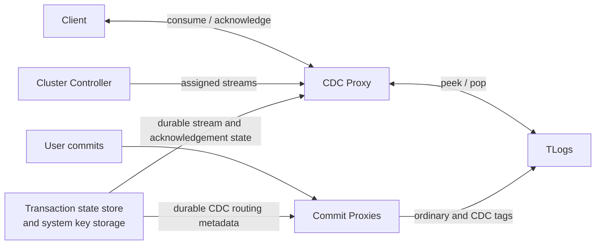

# Native Change Data Capture (CDC)

## Status and scope

Native Change Data Capture (CDC) provides a FoundationDB-native mechanism for
reading committed mutations for a registered key range. A client registers a
named stream, creates a consumer for that name, consumes batches of mutations,
and acknowledges processed versions. The implementation persists enough state
to retain unread TLog data and to resume stream service after CDC proxy failure
or transaction-system recovery.

This design describes the native C++ interface and its server implementation.
The feature is disabled by default behind `ENABLE_NATIVE_CDC`; the native CDC
workloads explicitly enable it, and simulation may randomly enable it. The
initial interface is native-only: it does not expose bindings or an external
protocol compatibility guarantee.

The implementation uses the following terms:

* A **stream** is a durable named registration for a fixed user key range.
* A **cursor** identifies one stream and the version through which a consumer
  has read.
* A **CDC tag** is a TLog tag with locality `tagLocalityCDC`. Commit proxies
  append these tags to mutations covered by registered streams.
* A **CDC proxy** reads tagged TLog mutation streams, filters mutations to a
  registered range, serves consumers, and coordinates acknowledgement-driven
  log popping.

CDC is not implemented as a storage server change feed. It captures mutations
in the transaction logging path, which lets an acknowledged consumer retain
and release its own log history without changing user data storage.

## Requirements

Native CDC is intended to provide:

* Durable, named registrations for single key ranges in normal user key
  space. The initial API intentionally registers exactly one half-open
  `[begin, end)` range per stream; callers that need multiple disjoint ranges
  register multiple streams.
* A consumer API in which a client only needs a stream name after
  registration, rather than repeating its registered range on every read.
* Ordered mutation batches identified by FoundationDB commit versions.
* Durable acknowledgements that determine how much CDC-tagged TLog history may
  be popped.
* Correct retention when several streams share a CDC tag, including streams
  whose ranges overlap or whose consumers advance at different rates.
* Replacement and recovery of CDC proxies without losing active stream
  ownership or prematurely releasing log data.
* Finite cleanup when streams are removed, so an old stream does not require
  CDC infrastructure forever.
* Bounded CDC proxy memory use. A slow or stopped consumer may retain tagged
  TLog history, but it must not require the serving proxy to buffer all unread
  history in memory.
* Isolation from ordinary user data durability. CDC may increase commit-proxy,
  TLog, and CDC-proxy work for covered ranges, but it must not change the
  normal storage-server durability path for committed user mutations.

The initial performance and capacity targets are:

* Average delivery staleness below 100ms when CDC proxies and TLogs have
  enough configured capacity for the registered streams.
* CDC proxy throughput high enough that CDC consumption is not the limiting
  factor for an otherwise healthy transaction subsystem.
* TLog overhead strictly lower than an alternative design that duplicates every
  covered mutation into storage-server-backed data, such as backup V1.
* Routing overhead proportional to the number of matched CDC tags rather than
  to the number of registered streams in the common single-range case.
* Explicit blast-radius control for abandoned consumers: unread CDC-tagged TLog
  data may grow until acknowledgement or stream removal, so production use must
  pair CDC streams with administrative visibility and policy for deleting or
  expiring streams whose consumers have stopped.

The current implementation does not attempt to provide:

* Exactly-once side effects in the consumer. A consumer must make its output
  and its checkpointed cursor consistent if it needs exactly-once processing.
* A single transactional operation that acknowledges a stream and updates
  arbitrary application state. Such an API would be useful for queue-like
  transactional asynchronous processing pipelines, but the initial interface
  leaves that composition to the consumer.
* Dynamic stream range changes. A name is registered for one range; changing a
  range requires removing and registering a stream.
* Throughput-aware assignment of streams across CDC proxies.
* Throughput-aware movement of streams between CDC tags.
* Client bindings beyond the native API.

## Client interface

The client-facing declarations are in `fdbclient/NativeCdc.h`; durable
metadata operations used by server roles are in
the private `fdbclient/NativeCdcInternal.h`; cursor and wire request types are in
`fdbclient/CDCProxyInterface.h`.

```cpp
Future<CDCStreamId> registerNativeCdcStreamClient(Database cx, Key name, KeyRange keys);
Future<Void> removeNativeCdcStreamClient(Database cx, Key name);
Future<std::vector<NativeCdcStreamInfo>> listNativeCdcStreamsClient(Database cx);

Future<Reference<NativeCdcConsumer>> createNativeCdcConsumer(Database cx, Key name);
Reference<NativeCdcConsumer> resumeNativeCdcConsumer(Database cx, CDCCursor position);
```

`registerNativeCdcStreamClient()` accepts exactly one `KeyRange`. The range is
interpreted with FoundationDB's usual half-open `[begin, end)` semantics.
Multi-range registration is not part of the initial API.

A stream registration contains:

```cpp
struct NativeCdcStreamInfo {
	Key name;
	CDCStreamId streamId;
	KeyRange keys;
	Version minVersion;
};
```

The durable identity of a stream is its `CDCStreamId`, not its name. Names are
used to create and manage streams. Creating a consumer resolves the current
stream ID once, so removing a name and later registering the same name does
not silently redirect an existing consumer to a different stream.

`NativeCdcConsumer` is a client-side, reference-counted reader object. It
holds the client's `Database` handle and current delivered position and
exposes consumption and acknowledgement operations:

```cpp
class NativeCdcConsumer : public ReferenceCounted<NativeCdcConsumer> {
public:
	Future<CDCConsumeReply> consume();
	Future<Void> acknowledge();
	const CDCCursor& position() const;
};
```

`CDCCursor` remains a small serializable position token used by CDC proxy
requests and by callers that need to checkpoint or resume a consumer. It does
not contain a `Database` handle or other process-local state:

```cpp
struct CDCCursor {
	CDCStreamId streamId;
	Version lastConsumedVersion;
};
```

`lastConsumedVersion` is initialized to `invalidVersion`. A consume response
returns both mutations and a new `lastConsumedVersion`:

```cpp
struct VersionedMutationsRef {
	Version version;
	VectorRef<MutationRef> mutations;
};

struct CDCConsumeReply {
	VectorRef<VersionedMutationsRef> mutations;
	Version lastConsumedVersion;
};
```

A typical consumer loop is:

```cpp
co_await registerNativeCdcStreamClient(db, "orders"_sr, KeyRangeRef("order/"_sr, "order0"_sr));
state Reference<NativeCdcConsumer> consumer = co_await createNativeCdcConsumer(db, "orders"_sr);

loop {
	CDCConsumeReply reply = co_await consumer->consume();
	for (auto const& versionedMutations : reply.mutations) {
		// Apply all mutations for versionedMutations.version.
	}

	co_await consumer->acknowledge();
}
```

`consume()` advances `consumer->position()` to the returned delivered
position, but does not change durable retention. The acknowledgement means
that the consumer no longer requires CDC mutations through
`consumer->position().lastConsumedVersion`. Internally, acknowledgement
advances the stream's persisted minimum required version to
`lastConsumedVersion + 1`. That persisted watermark is the
`\xff\x02/cdc/minVersion/<streamId>` storage-backed system key described below.
Therefore the consumer must not call
`acknowledge()` before it has durably processed all mutations represented
through the delivered position, and must not issue another `consume()` if it
still needs to retry processing the previous reply from that same in-memory
consumer. A consumer restarted from its last durably checkpointed position
can use `resumeNativeCdcConsumer()`.
Only one `consume()` or `acknowledge()` operation may be outstanding on a
`NativeCdcConsumer`; concurrent operations are rejected because they would
race updates to its delivered position and acknowledgement proof.
The server accepts an acknowledgement beyond its current transaction read
version only when the owning CDC proxy has read through that position from its
tagged log stream. A resumed consumer may reissue an acknowledgement already
represented by the durable watermark, and a replacement proxy reconciles its
in-memory frontier to that watermark. The client commits the durable
acknowledgement before sending the proxy RPC, so the proxy's subsequent
transactional metadata read observes that commit. A fabricated future position
cannot pre-pop mutations that have not reached a proxy or the database read
version.

### Registration and removal semantics

`registerNativeCdcStreamClient()` accepts a non-empty stream name and a
non-empty range entirely within normal user keys. Registration of an existing
name with the same range is idempotent. Registering an existing name with a
different range is rejected.

Registration establishes an initial minimum version using the registration
transaction's commit version. Mutations committed after the registration has
become visible are routed to the stream's CDC tag. The initial minimum version
also supplies the first retention watermark for its TLog history.
When CDC admission is disabled, this gate applies only to creation of a new
name. Repeating an existing same-name/same-range registration remains
idempotent, including repair of a missing durable owner, so an administrator can
still drain state created while the feature was enabled.

`removeNativeCdcStreamClient()` removes the named stream and schedules final
release of tagged log history that was protected by the removed stream.
Removal explicitly relinquishes any unread history for that stream while still
respecting the retention needs of other streams sharing its tags. Stream
removal is terminal for existing consumers. Stale consume or acknowledgement
operations return an error instead of waiting indefinitely for an owner that
will never be assigned again.

### Consumption and expiration

Consumption is ordered by commit version. Mutations from a clear range are
intersected with the stream's registered range before being returned; a
single-key mutation is returned only if its key is within that range.

For an active stream, unacknowledged CDC mutations are retained by its durable
minimum version: TLogs must not pop tagged data that the stream may still
consume. A slow consumer therefore retains its unread history rather than
expiring solely because of age. This is a correctness guarantee, but it is also
the main operational risk of the feature: a consumer that stops acknowledging
can cause CDC-tagged TLog disk usage to grow until the stream is acknowledged,
removed, or eventually governed by a higher-level administrative expiration
policy. The design bounds proxy memory for such a stream; it does not bound
TLog retention for an active unacknowledged stream by age.

This makes slow-consumer observability part of the production requirement, not
just an optimization. Operators need visibility into per-stream acknowledgement
lag, oldest required version, CDC tag safe-pop distance, proxy buffer pressure,
filtered bytes, and TLog retention attributable to CDC tags. The immediate
mitigations are to fix the consumer, advance the acknowledgement if the
application can safely discard history, or remove the stream. Until a
higher-level expiration policy exists, an unmanaged abandoned stream can retain
TLog data indefinitely and eventually exhaust the TLog capacity allocated to
its CDC tags.

Each CDC proxy emits a periodic `CDCProxyMetrics` event containing its oldest
required stream and version, acknowledgement lag, minimum safe-pop version and
distance from the log end, retained and cumulative filtered bytes, buffer
permits and waiters, active consume demand, and acknowledgement-pop progress.
The oldest stream ID identifies the first consumer to investigate when the
aggregate lag grows.

Consumption returns `transaction_too_old` when a consumer supplies a cursor
older than the stream's already acknowledged durable watermark. The proxy also
treats discovery that an active stream's required tagged data has nevertheless
already been popped as `transaction_too_old`; that condition indicates a
retention invariant violation rather than a supported expiration policy.

The native client methods retry transient endpoint and routing failures such as
a CDC proxy replacement. Invalid stream operations, already-acknowledged
cursor positions, and retention invariant violations are terminal errors for
that request.

## Architecture

The data path is:



Commit proxies keep a routing table derived from durable CDC metadata. For
each committed user mutation, the commit proxy determines which registered CDC
ranges include that mutation and appends the corresponding CDC tags to the
mutation sent to TLogs. A transaction continues to follow its ordinary
replication tags as well; CDC tags are additional log destinations used by CDC
consumers.

CDC proxies do not participate in committing user transactions. They consume
the extra tagged log streams, buffer readable results, filter shared tagged
data back to each stream's registered range, and pop data after durable
acknowledgement permits it.

The cluster controller recruits CDC proxies, publishes their interfaces, and
keeps durable stream-to-proxy ownership consistent with current endpoints.

## Durable state

CDC uses two categories of system data. Routing and recovery-critical metadata
is stored in the transaction state store, where commit proxies and recovery
can reconstruct it in transaction order. Acknowledgement and final-pop
watermarks are stored as regular storage-server-backed system keys, because
they are durable progress values rather than commit routing configuration.

### Transaction state metadata

These keys are in the metadata portion of system key space and are represented
in transaction state:

| Key | Value | Purpose |
| --- | --- | --- |
| `\xff/cdc/name/<name>` | `CDCStreamId` | Resolves a user-visible name to its durable stream identity. |
| `\xff/cdc/maxStreamId` | `CDCStreamId` | Allocates monotonic stream identifiers. |
| `\xff/cdc/keys/<streamId>` | `KeyRange` | Stores the immutable registered range for an active stream. |
| `\xff/cdc/tagHistory/<streamId>/<version>/<tag>` | empty | Records the CDC tag assignment history used for routing and historical reads. |
| `\xff/cdc/proxies/<streamId>/<proxyId>` | empty | Stores the CDC proxy assigned to an active stream. |
| `\xff/cdc/proxyAssignmentChange` | version/change signal | Wakes ownership monitoring when durable assignments change. |
| `\xff/cdc/retiredTagPop/<tag>` | empty | Retains recovery-visible pending final-pop work after removal. |

Tag history is versioned so the data model can support a stream moving between
tags without forgetting which old log streams may still contain unread
mutations. The initial implementation writes the initial assignment and reads
the history; dynamic throughput-driven reassignment is future work. The initial
history entry uses the registration transaction's read version as a
conservative inclusive lower bound. The versionstamped `minVersion` uses the
commit version, and the proxy starts at the maximum of those two values, so the
earlier history boundary cannot expose pre-registration mutations.

### Storage-backed system data

These keys are in the storage-server-backed `\xff\x02` system key range rather
than transaction state:

| Key | Value | Purpose |
| --- | --- | --- |
| `\xff\x02/cdc/minVersion/<streamId>` | `Version` | Earliest version that an active stream may still require. |
| `\xff\x02/cdc/retiredTagPopVersion/<tag>` | `Version` | Final pop watermark required after a stream using a tag is removed. |

The initial `minVersion` is written with a versionstamp at stream
registration. When a consumer acknowledges processing through version `V`, the
stored value advances monotonically to `V + 1`. A CDC proxy may pop tagged
mutations before this watermark only when doing so is safe for every live
stream sharing that tag.

The retired-tag marker and watermark are deliberately split between transaction
state and regular system storage. The marker tells recovery that a CDC proxy
must still be recruited to finish durable cleanup; the watermark bounds the
actual final pop to perform.

## Stream creation and assignment

Registration runs as a durable metadata transaction:

1. It validates the stream name and registered normal key range.
2. It checks whether the name is already registered and applies the idempotent
   same-name/same-range rule, even when admission is disabled.
3. For a new name, it validates the feature knob.
4. It allocates a new monotonically increasing `CDCStreamId`.
5. It selects a CDC tag using current active stream counts. The allocator uses
   the least populated tag among `NATIVE_CDC_TAG_COUNT` tags, choosing the
   lowest tag ID on a tie.
6. It records the stream name, range, initial tag history entry, and
   versionstamped initial minimum version.
7. It records an available CDC proxy owner and signals assignment monitoring.

The tag allocator bounds the number of distinct CDC log streams while allowing
many user streams. Several streams may therefore share one tag intentionally.
This makes filtering and acknowledgement coordination required correctness
properties rather than exceptional cases.

The current proxy assignment at registration uses an available CDC proxy; it
does not yet balance by stream traffic, memory use, or consumer lag.

### Metadata lifecycle example

Assume a client registers stream name `orders` for range
`["order/", "order0")`, the registration reads at version `995`, commits at
version `1000`, allocates stream ID `7`, selects CDC tag `tagLocalityCDC:3`, and
assigns proxy `P1`.
Registration writes:

* Transaction state `\xff/cdc/name/orders -> 7`.
* Transaction state `\xff/cdc/keys/7 -> ["order/", "order0")`.
* Transaction state `\xff/cdc/tagHistory/7/995/tagLocalityCDC:3 -> empty`.
* Transaction state `\xff/cdc/proxies/7/P1 -> empty` and the assignment-change
  signal.
* Storage-backed system key `\xff\x02/cdc/minVersion/7 -> 1000`.

If the consumer later acknowledges mutations through version `1200`,
`\xff\x02/cdc/minVersion/7` advances to `1201`. If the stream is then removed
at version `1500`, removal deletes the active name, range, proxy, tag-history,
and `minVersion` rows, and writes retired final-pop work for
`tagLocalityCDC:3`: a transaction-state `\xff/cdc/retiredTagPop/<tag>` marker
and a storage-backed `\xff\x02/cdc/retiredTagPopVersion/<tag>` watermark for
the removal version. CDC proxies finish that retired work only after it is safe
with respect to any other live stream that also used the tag, then clear both
retired rows.

## Commit routing

Each commit proxy has a `CDCRoutingTable`, reconstructed from active stream
ranges and tag history in transaction state. Changes to CDC stream metadata
are applied in commit order along with other transaction state mutations, so
the routing decision for later mutations observes committed registration and
removal changes.

For a single-key mutation, the routing table returns CDC tags for all active
stream ranges containing that key. For a clear-range mutation, it returns tags
for all active stream ranges intersecting the cleared interval. These CDC tags
are appended in both the tag-determination and log-writing portions of commit
proxy processing.

The cost of a broad clear range is proportional to the number of CDC stream
ranges and tags it intersects, not to the number of keys in the cleared range.
The logged CDC payload remains a clear-range mutation on each relevant tag, and
the CDC proxy later clips that clear to the consumer's registered range. A
clear that spans many CDC ranges can therefore add many CDC tag destinations
and later produce many per-stream clipped clears. Commit-proxy and CDC-proxy
metrics should make this visible by reporting CDC routing matches, CDC tag
fanout, filtered bytes, and consumer lag.

A shared CDC tag is a multiplexed log stream. A mutation routed because of
stream A may be read by the proxy serving stream B if both share the tag.
Consequently, the CDC proxy filters every read mutation against B's registered
range before returning it to B's consumer. Filtering also clips clear ranges
to the stream range.

Shared-tag false positives are expected, especially when
`NATIVE_CDC_TAG_COUNT` is small or active streams are unevenly distributed. The
performance impact shows up as extra TLog bytes read by CDC proxies, extra
filtering work, and buffer pressure before discarded mutations are released.
This is part of the capacity model rather than a correctness exception.

Routing at commit time has two important implications:

* CDC observes mutations once their commits enter the transaction logging
  path, without scanning storage server data.
* Registering CDC does not change normal durability for the user mutation; it
  adds tagged log data whose retention is controlled separately by consumers.

For remote-region replication, a log router uses `tagLocalityRemoteLog` only to
index its local forwarding queue. The forwarded payload remains the complete
serialized source message, so the remote TLog reparses and indexes the original
CDC tag. CDC acknowledgement pops therefore apply to the remote TLog copy as
well as the primary and satellite copies.

Satellite epochs precompute a finite table of replication-policy teams. A CDC
tag ID within the epoch's configured pool uses its corresponding table entry;
a larger valid durable tag ID is folded into the available CDC entries. This
keeps routing safe if process-local tag-count knobs differ or a later process
encounters a tag allocated under a larger pool, while preserving the direct
mapping for the normally configured IDs.

## CDC proxy read path

A CDC proxy owns a set of active stream IDs. For each owned stream it loads:

* The registered key range.
* The durable minimum required version.
* Its current CDC tag and versioned tag history.

The proxy reads data from TLogs through `LogSystemConsumer::peekSingle()`.
When a stream has historical assignments, the proxy uses the history to select
the tag appropriate for the version interval it is reading. It filters
mutations to the registered range and stores versioned mutation batches in a
per-stream in-memory buffer.

All raw peek windows and stream buffers owned by one CDC proxy share a
`CDC_PROXY_BUFFER_BYTES` budget. A replicated log read may retain one separately
capped reply arena from every candidate TLog it consults. CDC history cursors
therefore disable cross-generation constructor prefetch, report the maximum
number of reply arenas one active generation can retain, and reserve that count
times `MAXIMUM_PEEK_BYTES` before issuing a peek. The proxy marks these delivery
cursors with the same per-reply limit; recovery cursors remain uncapped so that
transaction-system replay is not constrained by a delivery memory knob. The
pass also reserves a bounded materialization window. It retains the aggregate
raw reservation while filtering and copying, then releases it and transfers
only accepted filtered bytes to the stream buffers. Acknowledgement or stream
removal releases those retained permits. The usable retained-batch capacity is
the configured CDC budget minus this topology-dependent raw reservation; a
configuration too small to hold both fails the affected consume with
`server_overloaded`. This applies
backpressure before ordinary peek batches arrive, rather than allowing each
stream, replica reply, received batch, or filtered expansion to independently
overshoot the proxy limit. A slow consumer does not require the proxy to buffer
its entire retained history in memory: durable acknowledgement state and tagged
TLog retention are the source of resumability, while the proxy buffer is a
delivery optimization.

One tagged TLog message can match many overlapping streams. The proxy estimates
that expansion per stream and commit version, materializes only a subset that
fits the current bounded pass, and reopens the tag cursor for the remaining
streams. It never requests raw-plus-retained permits beyond
`CDC_PROXY_BUFFER_BYTES`. If the filtered mutations for one stream at one
commit version exceed the capacity remaining after the raw peek reservation,
that consume fails with `server_overloaded`; operators must configure the
budget to hold both the largest raw peek and the largest supported filtered
transaction for one stream.

A consume operation supplies a cursor. The proxy returns buffered or newly
peeked data after the cursor position and a position through which the
consumer may acknowledge after processing. If a stream is removed while a
consume is blocked, reconciliation wakes the request and it fails rather than
waiting on a data-change trigger for an inactive stream.
The owning proxy accepts a cursor only when the position has already been
delivered by that owner or is covered by the stream's durable acknowledgement
watermark. A fabricated or otherwise unproven cursor is rejected instead of
making the proxy buffer every intervening mutation while trying to reach it;
positions beyond the metadata transaction's read version are explicitly
classified as invalid. A proven delivered cursor remains valid if that read
version briefly lags the tagged-log frontier. After an owner restart, callers
must resume from their last acknowledged checkpoint; an unacknowledged later
position can be replayed from that durable checkpoint. Only one consume RPC may
be active for a stream because all consumers would share the same durable
acknowledgement frontier; overlapping logical consumers are rejected.

When no later version is available, `consume()` is intentionally a client-side
long poll. Each server request has a bounded
`CDC_PROXY_CONSUME_POLL_TIMEOUT` lease; an idle lease returns an unchanged empty
position and the native client transparently renews it. Ownership changes and
stream removal still wake the current request immediately. Canceling the public
future therefore leaves at most one server request, whose read demand is
released when its bounded lease expires. Database-info changes unrelated to the
stream do not abandon or duplicate that request.

## Acknowledgement and tag popping

Acknowledgement is per stream, while TLog popping is per CDC tag. This
distinction is the core retention rule.

For every active stream `S`, `minVersion(S)` is the first version its consumer
may still need. For a tag `T`, the safe pop watermark is:

```text
safePop(T) = min(minVersion(S)) for every live stream S whose history uses T
```

Popping tag `T` through `safePop(T)` discards versions older than the minimum
required by any live stream using that tag. A fast consumer therefore cannot
pop mutations still needed by a slower stream sharing its tag.

The proxy recomputes these minima from durable active stream metadata and
acknowledgement rows. It does not rely solely on its in-memory owned-stream
set, because shared tags and replacement proxies must preserve the same global
retention decision.

Acknowledgement notifications are level-triggered and coalesced for at least
`CDC_PROXY_POP_MIN_INTERVAL`. A notification received during a durable-state
scan schedules one later pass but does not cancel the safe scan already in
flight. Only replacement of the log-system generation cancels an outstanding
pop attempt. This both guarantees progress under continuous acknowledgement
traffic and bounds the frequency of the global metadata scan.

### Removing a stream

Removing a stream eliminates its active name, range, tag history, minimum
version, and ownership rows. Removal must not unconditionally pop each tag in
the removed history: a different live stream may share a tag and still need
older data.

Before deleting active state, removal writes pending final-pop state for each
historical tag:

* A transaction-state retired-tag marker, which survives recovery and makes
  outstanding cleanup discoverable.
* A versionstamped storage-backed retired-tag watermark, which identifies the
  upper bound of tagged history protected by the removed stream.

The CDC proxy processes retired work together with active acknowledgement
watermarks. If a retired tag is also used by a live stream, its attempted pop
is capped at that live stream's `safePop` value. Only when it is possible to
pop through the complete retired watermark is the retired operation eligible
for completion.

### Completing retired work

Retired final-pop state is durable work, not permanent stream state. After
issuing a complete retired pop, a CDC proxy waits for every targeted current
TLog to report that the tag has been popped through the required watermark.
It then transactionally clears both the retired marker and its stored
watermark.

The cleanup transaction rereads the watermark before clearing it. If a newer
stream removal has advanced the retired watermark for the same tag while the
earlier pop was in progress, the newer work is retained rather than erased by
the older completion.

This establishes the lifecycle invariant:

```text
no live streams and no pending retired final pops
    implies no durable CDC proxy requirement
```

Without this completion protocol, removing any stream would leave a retired
marker forever, causing later recoveries to recruit CDC proxies indefinitely
and repeatedly replay already-completed final pops.

## Failure handling and recovery

### CDC proxy failure

CDC proxies are consumers of durable state and tagged logs, not authorities
for committed application data. If a CDC proxy fails, the cluster controller
can recruit a replacement, publish the replacement interface, and durably
reassign affected streams. The replacement reloads stream state and resumes
reading at durable acknowledgement watermarks.

The cluster controller monitors durable proxy assignment rows and repairs
stale owner identifiers when endpoints are replaced or the controller itself
is reconstructed. Clients obtain the currently published owner for their
stream ID and retry transient proxy/routing failures.
If a live stream temporarily has no published owner during repair, its client
operation waits for a new assignment. Removal is terminal and wakes that wait;
callers may cancel or externally bound the operation when they need a local
deadline.

### Transaction-system recovery

During full recovery, active stream ranges, tag history, and pending retired
markers are present in transaction state. Active history tags are added to the
set of log tags that recovery must preserve; otherwise TLog generations could
discard CDC data that an active consumer has not yet acknowledged.

That retention can intentionally keep recovery at `ALL_LOGS_RECRUITED`. New
TLogs consider a recovered tag complete only after its pop advances beyond the
recovery boundary, while an active stream must not pop beyond its durable
acknowledgement. If an active consumer still needs history below that boundary,
the old TLog generation and the less-than-`FULLY_RECOVERED` state remain until
the consumer acknowledges past it or the stream is removed. The cluster can
accept commits in this state, but recovery-state health remains self-healing,
snapshot requests that require full recovery are rejected, and log-router
monitoring that waits for full recovery does not start.

CDC proxy recruitment is required during recovery when either:

* Native CDC is enabled and streams may be served, or
* Durable CDC state remains, including retired final-pop work that must be
  completed even after admission of new CDC activity is disabled.

When the knob is disabled and recovery finds neither active streams nor
retired work, no CDC proxies are published. This makes stream removal and
retired-pop completion observable as a finite drain rather than a permanent
cluster role.

## Feature gating

`ENABLE_NATIVE_CDC` defaults to false. In simulation it may be randomly enabled
under buggification; workloads that depend on CDC set it explicitly.

The feature knob gates new stream registration. Listing, consumer creation and
resume, consumption, acknowledgement, and removal remain available for
streams persisted while native CDC was enabled. Internal cleanup and recovery
paths likewise continue handling durable CDC state. This is necessary because
disabling new use of a feature cannot safely abandon log-retention obligations
for already registered or recently removed streams. An idempotent registration
of an existing name is also allowed while disabled; only allocation of a new
stream is rejected. Admission follows the cluster-controller-published feature
state rather than a serving proxy's process-local knob, so a proxy retained to
drain durable state cannot admit a new stream because its local configuration
differs.

`NATIVE_CDC_TAG_COUNT` controls the bounded tag pool used for new stream
allocation and must be between 1 and 65,536 inclusive. Invalid values reject
new registration and are not used to size recovery routing tables; tags already
present in durable metadata remain recoverable. Normal operation defaults to a
larger tag pool; simulation may reduce it so shared-tag behavior is exercised
frequently.

Native CDC must be enabled only after every process in the cluster supports the
`withNativeCdc` protocol version. Once streams or retired-pop records exist, a
rollback must keep CDC-capable binaries available until those records have been
consumed or removed and retired cleanup has completed. Disabling the knob stops
new allocation but is not a rollback mechanism for already durable CDC state.

## Correctness properties

The implementation is structured around the following properties:

* **Registration identity:** a consumer's cursor binds to a stream ID, so
  reuse of a removed stream name cannot cause an existing consumer to read a
  new stream.
* **Range correctness:** CDC proxies return only mutations within a stream's
  registered range, even when its tag is shared with other streams.
* **Acknowledgement monotonicity:** durable minimum required versions advance
  only forward.
* **Shared-tag retention:** tagged data is popped no farther than the minimum
  durable watermark of all active streams that may require it.
* **Removal safety:** deleting one stream cannot pop unread data required by
  another stream using the same tag.
* **Finite retired cleanup:** removal retains enough state to finish final
  pops through failure and recovery, then removes that state after completion.
* **No age-based expiration:** an active stream's unread tagged mutations
  remain protected until acknowledgement or explicit stream removal.
  `transaction_too_old` for required active history indicates either a stale
  already-acknowledged cursor or a violated retention invariant.
* **Failure visibility:** a removed stream fails consume and acknowledgement
  requests rather than leaving them blocked indefinitely.
* **Recovery retention:** active CDC tag history is included in recovery's
  required log data, and pending cleanup retains CDC proxy availability until
  it has been completed.

## Current limitations and future work

The design records tag history and proxy ownership in forms that support more
complete load balancing, but the first implementation intentionally keeps
policy simple.

* Tag selection is based on active stream counts, not observed byte or mutation
  throughput. Data distribution could make equally counted tags very
  different in cost.
* Registration selects an available CDC proxy without balancing aggregate
  proxy throughput, buffer memory, lag, or number of active readers.
* Assignment mutations use one coalescing change key that wakes a full durable
  ownership rescan. This is appropriate for low-rate control-plane changes but
  should be sharded if registration and removal throughput becomes material.
* Registration metadata discovery, acknowledgement safe-pop calculation,
  ownership publication, and failed-proxy reassignment each scan global CDC
  metadata in one transaction. The scans page their reads but do not split the
  transaction, so stream-count growth is bounded by FoundationDB transaction
  size and lifetime limits until these paths are sharded or incrementally
  maintained.
* There is no background process that changes a live stream's CDC tag in
  response to load. A future implementation can use versioned tag history to
  make such changes without losing the ability to read earlier tagged data.
* The native interface does not yet provide external binding support,
  administrative tooling, or a higher-level consumer checkpoint abstraction.

These improvements must preserve the acknowledgement and retired-pop
invariants above. In particular, moving a stream between tags cannot forget an
old tag until all data protected by that assignment has either been
acknowledged and popped or retained as finite final-pop work.

## Validation

The implementation includes codec and metadata tests for CDC system keys and
simulation workloads for the end-to-end behavior.

The basic native CDC workload covers:

* Registering, listing, consuming, acknowledging, and removing streams.
* Name-based consumer creation, including end-to-end clear-range clipping.
* Rejection of incompatible same-name registrations.
* Targeted CDC proxy termination, durable reassignment, and recovery of stream
  service, including independent publication when two proxies fail together.
* Errors for stale consume and acknowledgement requests after removal.
* Deterministic creation of retired final-pop state, transaction-system
  recovery while that state is durable, and eventual collection afterward.
* Bounded raw-plus-filtered proxy memory, consume-lease cleanup after client
  cancellation and unrelated assignment changes, and rejection of concurrent
  consumers for one stream.
* Oversized raw-peek rejection scoped to consumers blocked at that version, so
  a same-tag stream registered at a later frontier continues to make progress.

Unit coverage checks the CDC recovery-recruitment truth table with the feature
enabled and disabled, both with and without durable CDC state. The process-static
knob transition is covered by a paired restart simulation that creates durable
CDC work while enabled, restarts with registration disabled, and drains the
existing stream and its retired state.

The shared-tag workload forces streams to share routing tags and verifies both
range filtering and acknowledgement coordination. In particular, removing one
stream while another shared-tag stream is behind must not pop the unread
mutations needed by the remaining consumer.

The simulation configurations enable CDC explicitly when testing these
behaviors, while the default-disabled knob and randomized simulation admission
exercise the requirement that clusters without active or pending CDC work do
not carry CDC service overhead.
