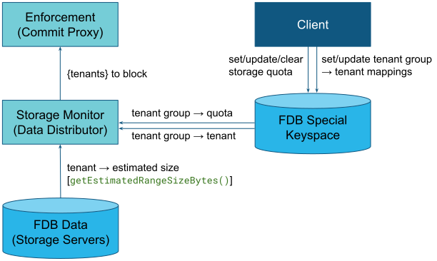

## Storage Quota

When the `STORAGE_QUOTA_ENABLED` knob is turned on, the commit proxy will reject transactions from tenant groups whose current storage usage is greater than its storage quota. This page describes the feature in more detail.

### Overview
The data distributor has monitors that track the mapping from tenant groups to tenants, the storage quotas for the tenant groups, and the current storage bytes used by each tenant. It puts together this information to create a list of tenants that belong to groups that are currently over storage quota. The commit proxy periodically queries for this block list and keeps a local copy. When the commit proxy receives a commit request for a transaction, it rejects the request if the tenant for this transaction is in the block list.

This diagram shows the flow of information:


### Storage Usage
The storage used by tenants is estimated using the `getEstimatedRangeSizeBytes()` function. This function aggregates the storage estimates from the storage servers that own shards for the given range. On a given storage server, the estimate is based on a byte sample, and the probability that a kv pair is sampled is:
`(size(key) + size(value)) / ((size(key) + 100) * 250)`.

### Tuple Layer
TODO: Update after https://github.com/apple/foundationdb/pull/9241

### fdbcli
The easiest way for an external client to interact with tag quotas is through `fdbcli`. To get the quota of a particular tenant group, run the following command:

```
fdbcli> quota get <tenant_group> storage
```

To set the quota, run:

```
fdbcli> quota set <tenant_group> storage <bytes>
```

To clear all quotas (storage as well as reserved and total throughput quotas), run:

```
fdbcli> quota clear <tenant_group>
```

### Bypass Quota Enforcement
The quota enforcement can be bypassed for a given transaction (for example, to allow a transaction that clears data) by using `Transaction::setOption()` to set `FDBTransactionOptions::BYPASS_STORAGE_QUOTA`. In this case, the commit proxy will not reject the transaction even if the tenant group is over its quota.

### Server Knobs

The following knobs control the interval at which various monitors on the data distributor query for information. Adjusting these knobs will affect the overall time between a tenant hitting their storage quota and their transactions being rejected.

* `TENANT_CACHE_LIST_REFRESH_INTERVAL`: How often the list of tenants is refreshed on the data distributor,
* `TENANT_CACHE_STORAGE_USAGE_REFRESH_INTERVAL`: How often the storage bytes used by each tenant is refreshed on the data distributor,
* `TENANT_CACHE_STORAGE_QUOTA_REFRESH_INTERVAL`: How often the storage quota allocated to each tenant is refreshed on the data distributor, and
* `CP_FETCH_TENANTS_OVER_STORAGE_QUOTA_INTERVAL`: How often the commit proxies send requests to the data distributor to fetch the list of tenants over storage quota

### Testing
The `StorageQuotaTest.toml` test provides a simple end-to-end test for this feature. Quotas are set using the internal storage quota API in the `StorageQuota` workload. This is run after the `CreateTenant` workload, which creates the tenants.

In addition to the simulation test, the feature has also been tested on real FDB clusters, using `fdbcli` to set quotas, and a data generator to populate data in the tenant.

### Visibility

The data distributor produces a trace event every `SERVER_KNOBS->TENANT_CACHE_STORAGE_USAGE_TRACE_INTERVAL` seconds for each tenant group. This trace event has the type `StorageUsageUpdated`, and logs the quota as well as the current storage usage (in bytes) for the tenant group.
