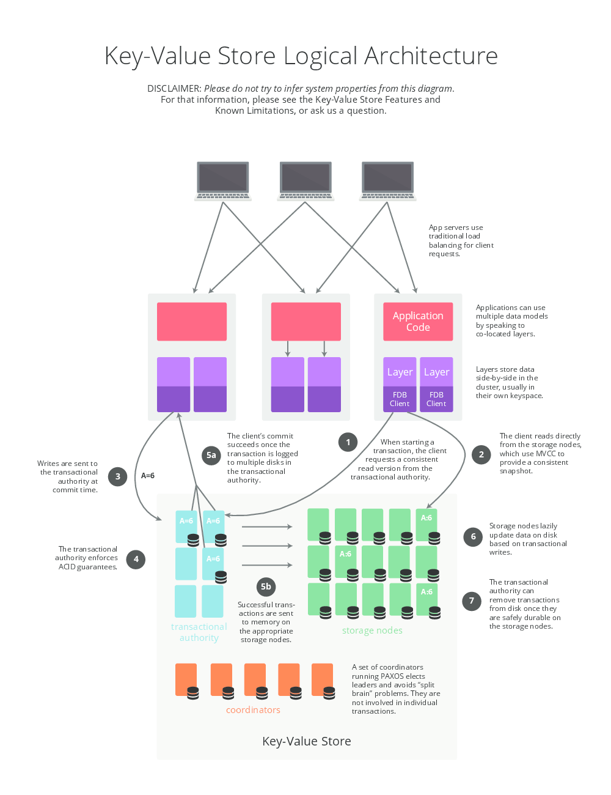
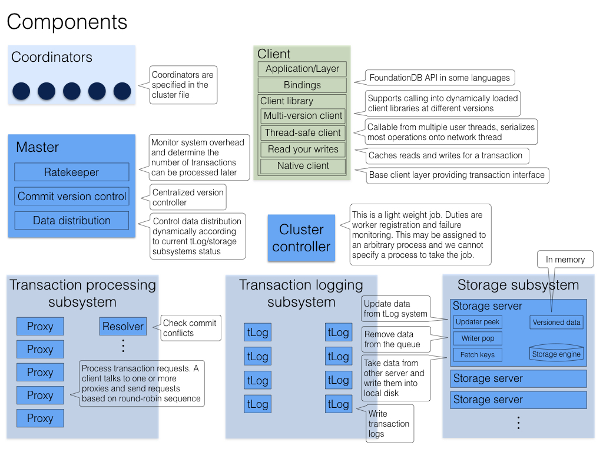
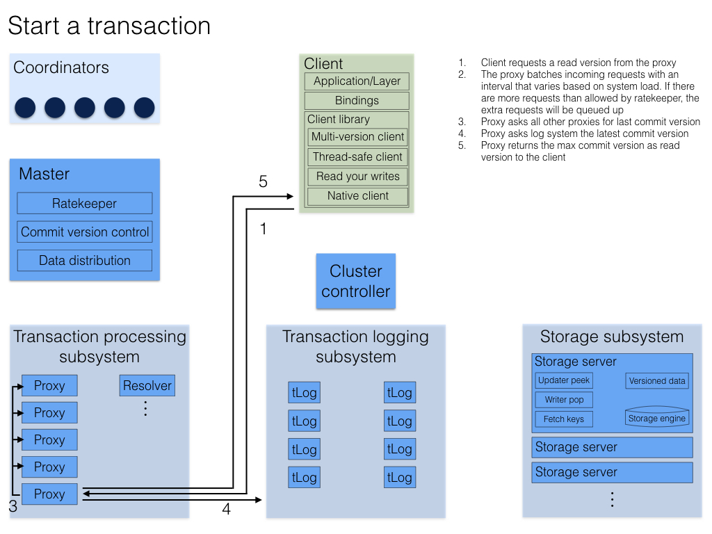
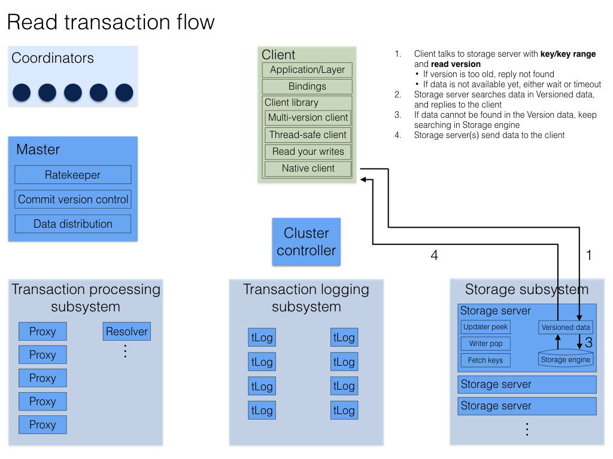
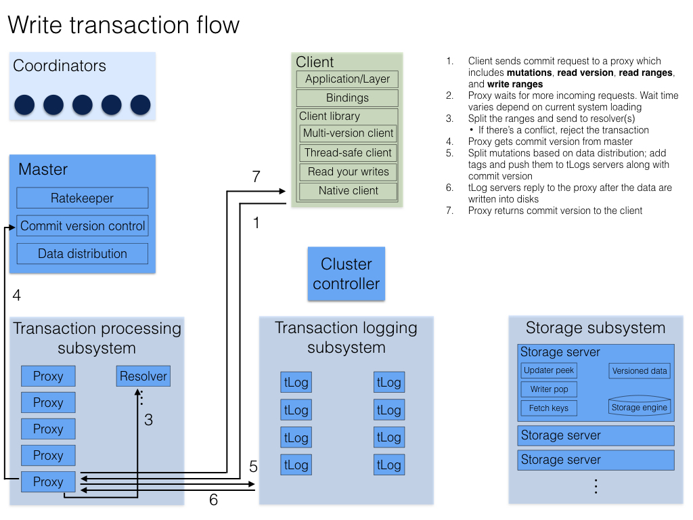
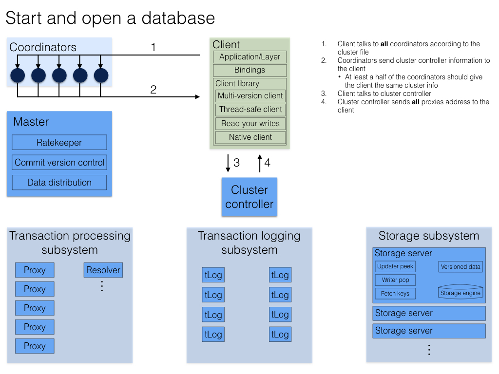
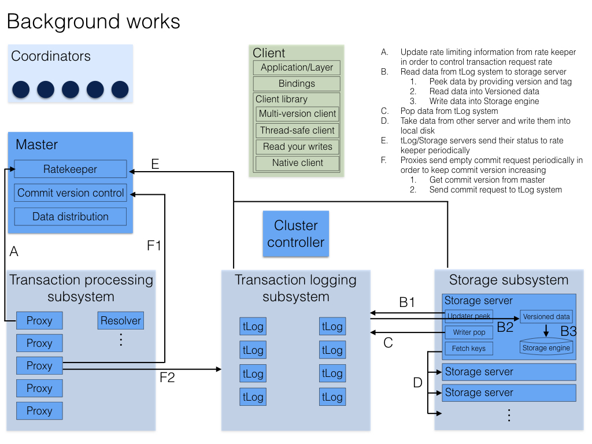

############
Architecture
############

FoundationDB makes your architecture flexible and easy to operate. Your applications can send their data directly to the FoundationDB or to a :doc:`layer<layer-concept>`, a user-written module that can provide a new data model, compatibility with existing systems, or even serve as an entire framework. In both cases, all data is stored in a single place via an ordered, transactional key-value API.

The following diagram details the logical architecture.

|image0|

Detailed FoundationDB Architecture
----------------------------------

The FoundationDB architecture chooses a decoupled design, where
processes are assigned different heterogeneous roles (e.g.,
Coordinators, Storage Servers, Master). Cluster attempts to recruit
different roles as separate processes, however, it is possible that
multiple Stateless roles gets colocated (recruited) on a single
process to meet the cluster recruitment goals. Scaling the database
is achieved by horizontally expanding the number of processes for
separate roles:

Coordinators
~~~~~~~~~~~~

All clients and servers connect to a FoundationDB cluster with a cluster
file, which contains the IP:PORT of the coordinators. Both the clients
and servers use the coordinators to connect with the cluster controller.
The servers will attempt to become the cluster controller if one does
not exist, and register with the cluster controller once one has been
elected. Clients use the cluster controller to keep an up-to-date list
of GRV proxies and commit proxies.

Cluster Controller
~~~~~~~~~~~~~~~~~~

The cluster controller is a singleton elected by a majority of
coordinators. It is the entry point for all processes in the cluster. It
is responsible for determining when a process has failed, telling
processes which roles they should become, and passing system information
between all of the processes.

Master
~~~~~~

The master is responsible for coordinating the transition of the write
sub-system from one generation to the next. The write sub-system
includes the master, GRV proxies, commit proxies, resolvers, and 
transaction logs. The three roles are treated as a unit, and if any of 
them fail, we will recruit a replacement for all three roles. The master 
provides the commit versions for batches of the mutations to the commit 
proxies.

Historically, Ratekeeper and Data Distributor are coupled with Master on
the same process. Since 6.2, both have become a singleton in the
cluster. The life time is no longer tied with Master.

|image1|

GRV Proxies
~~~~~~~~~~~

The GRV proxies are responsible for providing read versions, communicating
with ratekeeper to control the rate providing read versions. To provide a 
read version, a GRV proxy will ask all master to see the largest committed
version at this point in time, while simultaneously checking that the 
transaction logs have not been stopped. Ratekeeper will artificially slow 
down the rate at which the GRV proxy provides read versions.

Commit Proxies
~~~~~~~~~~~~~~

The proxies are responsible for committing transactions, report committed
versions to master and tracking the storage servers responsible for each 
range of keys. 

Commits are accomplished by:

-  Get a commit version from the master.
-  Use the resolvers to determine if the transaction conflicts with
   previously committed transactions.
-  Make the transaction durable on the transaction logs.

The key space starting with the ``\xff`` byte is reserved for system
metadata. All mutations committed into this key space are distributed to
all of the commit proxies through the resolvers. This metadata includes a
mapping between key ranges and the storage servers which have the data
for that range of keys. The commit proxies provides this information to 
clients on-demand. The clients cache this mapping; if they ask a storage
server for a key it does not have, they will clear their cache and get a
more up-to-date list of servers from the commit proxies.

Transaction Logs
~~~~~~~~~~~~~~~~

The transaction logs make mutations durable to disk for fast commit
latencies. The logs receive commits from the commit proxy in version order, 
and only respond to the commit proxy once the data has been written and fsync’ed
to an append only mutation log on disk. Before the data is even written to
disk we forward it to the storage servers responsible for that mutation.
Once the storage servers have made the mutation durable, they pop it
from the log. This generally happens roughly 6 seconds after the
mutation was originally committed to the log. We only read from the
log’s disk when the process has been rebooted. If a storage server has
failed, mutations bound for that storage server will build up on the
logs. Once data distribution makes a different storage server
responsible for all of the missing storage server’s data we will discard
the log data bound for the failed server.

Resolvers
~~~~~~~~~

The resolvers are responsible determining conflicts between
transactions. A transaction conflicts if it reads a key that has been
written between the transaction’s read version and commit version. The
resolver does this by holding the last 5 seconds of committed writes in
memory, and comparing a new transaction’s reads against this set of
commits.

Storage Servers
~~~~~~~~~~~~~~~

The vast majority of processes in a cluster are storage servers. Storage
servers are assigned ranges of key, and are responsible to storing all
of the data for that range. They keep 5 seconds of mutations in memory,
and an on disk copy of the data as of 5 second ago. Clients must read at
a version within the last 5 seconds, or they will get a
``transaction_too_old`` error. The SSD storage engine stores the data in
a B-tree based on SQLite. The memory storage engine store the data in
memory with an append only log that is only read from disk if the
process is rebooted. In the upcoming FoundationDB 7.0 release, the
B-tree storage engine will be replaced with a brand new *Redwood*
engine.

Data Distributor
~~~~~~~~~~~~~~~~

Data distributor manages the lifetime of storage servers, decides which
storage server is responsible for which data range, and ensures data is
evenly distributed across all storage servers (SS). Data distributor as
a singleton in the cluster is recruited and monitored by Cluster
Controller. See `internal
documentation <https://github.com/apple/foundationdb/blob/main/design/data-distributor-internals.md>`__.

Ratekeeper
~~~~~~~~~~

Ratekeeper monitors system load and slows down client transaction rate
when the cluster is close to saturation by lowering the rate at which
the proxy provides read versions. Ratekeeper as a singleton in the
cluster is recruited and monitored by Cluster Controller.

Clients
~~~~~~~

A client links with specific language bindings (i.e., client libraries)
in order to communicate with a FoundationDB cluster. The language
bindings support loading multiple versions of C libraries, allowing the
client communicates with older version of the FoundationDB clusters.
Currently, C, Go, Python, Java, Ruby bindings are officially supported.

Transaction Processing
----------------------

A database transaction in FoundationDB starts by a client contacting one
of the GRV proxies to obtain a read version, which is guaranteed to be
larger than any of commit version that client may know about (even
through side channels outside the FoundationDB cluster). This is needed
so that a client will see the result of previous commits that have
happened.

Then the client may issue multiple reads to storage servers and obtain
values at that specific read version. Client writes are kept in local
memory without contacting the cluster. By default, reading a key that
was written in the same transaction will return the newly written value.

At commit time, the client sends the transaction data (all reads and
writes) to one of the commit proxies and waits for commit or abort response
from the commit proxy. If the transaction conflicts with another one and 
cannot commit, the client may choose to retry the transaction from the
beginning again. If the transaction commits, the commit proxy also returns
the commit version back to the client and to master so that GRV proxies can
get access to the latest committed version. Note this commit version is 
larger than the read version and is chosen by the master.

The FoundationDB architecture separates the scaling of client reads and
writes (i.e., transaction commits). Because clients directly issue reads
to sharded storage servers, reads scale linearly to the number of
storage servers. Similarly, writes are scaled by adding more processes
to Commit Proxies, Resolvers, and Log Servers in the transaction system.

Determine Read Version
~~~~~~~~~~~~~~~~~~~~~~

When a client requests a read version from a GRV proxy, the GRV proxy asks 
master for the latest committed version, and checks a set of transaction 
logs satisfying replication policy are live. Then the GRV proxy returns 
the maximum committed version as the read version to the client.

|image2|

The reason for the GRV proxy to contact master for the latest committed
versions is to because master is a central place to keep the largest of 
all commit proxies' committed version.

The reason for checking a set of transaction logs satisfying replication
policy are live is to ensure the GRV proxy is not replaced with newer
generation of GRV proxies. This is because GRV proxy is a stateless role
recruited in each generation. If a recovery has happened and the old GRV
proxy is still live, this old GRV proxy could still give out read versions.
As a result, a *read-only* transaction may see stale results (a
read-write transaction will be aborted). By checking a set of
transaction logs satisfying replication policy are live, the GRV proxy makes
sure no recovery has happened, thus the *read-only* transaction sees the
latest data.

Note that the client cannot simply ask the master for read versions because
this approach is putting more work towards the master, because the master 
role can’t be scaled. Even though giving out read-versions isn’t very 
expensive, it still requires the master to get a transaction budget from the
Ratekeeper, batches requests, and potentially maintains thousands of network
connections from clients.

|image3|

Transaction Commit
~~~~~~~~~~~~~~~~~~

A client transaction commits in the following steps:

1. A client sends a transaction to a commit proxy.
2. The commit proxy asks the master for a commit version.
3. The master sends back a commit version that is higher than any commit
   version seen before.
4. The commit proxy sends the read and write conflict ranges to the resolver(s)
   with the commit version included.
5. The resolver responds back with whether the transaction has any
   conflicts with previous transactions by sorting transactions
   according to their commit versions and computing if such a serial
   execution order is conflict-free.

   -  If there are conflicts, the commit proxy responds back to the client with
      a not_committed error.
   -  If there are no conflicts, the commit proxy sends the mutations and
      commit version of this transaction to the transaction logs.

6. Once the mutations are durable on the logs, the commit proxy responds back
   success to the user.

Note the commit proxy sends each resolver their respective key ranges, if 
any one of the resolvers detects a conflict then the transaction is not
committed. This has the flaw that if only one of the resolvers detects a
conflict, the other resolver will still think the transaction has
succeeded and may fail future transactions with overlapping write
conflict ranges, even though these future transaction can commit. In
practice, a well designed workload will only have a very small
percentage of conflicts, so this amplification will not affect
performance. Additionally, each transaction has a five seconds window.
After five seconds, resolvers will remove the conflict ranges of old
transactions, which also limits the chance of this type of false
conflict.

|image4|

|image5|

Background Work
~~~~~~~~~~~~~~~

There are a number of background work happening besides the transaction
processing:

-  **Ratekeeper** collects statistic information from GRV proxies, Commit
   proxies, transaction logs, and storage servers and compute the target
   transaction rate for the cluster.

-  **Data distribution** monitors all storage servers and perform load
   balancing operations to evenly distribute data among all storage
   servers.

-  **Storage servers** pull mutations from transaction logs, write them
   into storage engine to persist on disks.

-  **Commit proxies** periodically send empty commits to transaction logs to
   keep commit versions increasing, in case there is no client generated
   transactions.

|image6|

Transaction System Recovery
~~~~~~~~~~~~~~~~~~~~~~~~~~~

The transaction system implements the write pipeline of the FoundationDB
cluster and its performance is critical to the transaction commit
latency. A typical recovery takes about a few hundred milliseconds, but
longer recovery time (usually a few seconds) can happen. Whenever there
is a failure in the transaction system, a recovery process is performed
to restore the transaction system to a new configuration, i.e., a clean
state. Specifically, the Master process monitors the health of GRV Proxies,
Commit Proxies,  Resolvers, and Transaction Logs. If any one of the monitored 
process failed, the Master process terminates. The Cluster Controller will
detect this event, and then recruits a new Master, which coordinates the
recovery and recruits a new transaction system instance. In this way,
the transaction processing is divided into a number of epochs, where
each epoch represents a generation of the transaction system with its
unique Master process.

For each epoch, the Master initiates recovery in several steps. First,
the Master reads the previous transaction system states from
Coordinators and lock the coordinated states to prevent another Master
process from recovering at the same time. Then the Master recovers
previous transaction system states, including all Log Servers’
Information, stops these Log Servers from accepting transactions, and
recruits a new set of GRV Proxies, Commit Proxies, Resolvers, and 
Transaction Logs. After previous Log Servers are stopped and new transaction
system is recruited, the Master writes the coordinated states with current
transaction system information. Finally, the Master accepts new
transaction commits. See details in this
`documentation <https://github.com/apple/foundationdb/blob/main/design/recovery-internals.md>`__.

Because GRV Proxies, Commit Proxies and Resolvers are stateless, their 
recoveries have no extra work. In contrast, Transaction Logs save the 
logs of committed transactions, and we need to ensure all previously 
committed transactions are durable and retrievable by storage servers. 
That is, for any transactions that the Commit Proxies may have sent back
commit response, their logs are persisted in multiple Log Servers (e.g., 
three servers if replication degree is 3).

Finally, a recovery will *fast forward* time by 90 seconds, which would
abort any in-progress client transactions with ``transaction_too_old``
error. During retry, these client transactions will find the new
generation of transaction system and commit.

**``commit_result_unknown`` error:** If a recovery happened while a
transaction is committing (i.e., a commit proxy has sent mutations to
transaction logs). A client would have received
``commit_result_unknown``, and then retried the transaction. It’s
completely permissible for FDB to commit both the first attempt, and the
second retry, as ``commit_result_unknown`` means the transaction may or
may not have committed. This is why it’s strongly recommended that
transactions should be idempotent, so that they handle
``commit_result_unknown`` correctly.

Resources
---------

`Forum
Post <https://forums.foundationdb.org/t/technical-overview-of-the-database/135/26>`__

`Existing Architecture
Documentation <https://github.com/apple/foundationdb/blob/main/documentation/sphinx/source/kv-architecture.rst>`__

`Summit
Presentation <https://www.youtube.com/watch?list=PLbzoR-pLrL6q7uYN-94-p_-Q3hyAmpI7o&v=EMwhsGsxfPU&feature=emb_logo>`__

`Data Distribution
Documentation <https://github.com/apple/foundationdb/blob/main/design/data-distributor-internals.md>`__

`Recovery
Documentation <https://github.com/apple/foundationdb/blob/main/design/recovery-internals.md>`__

