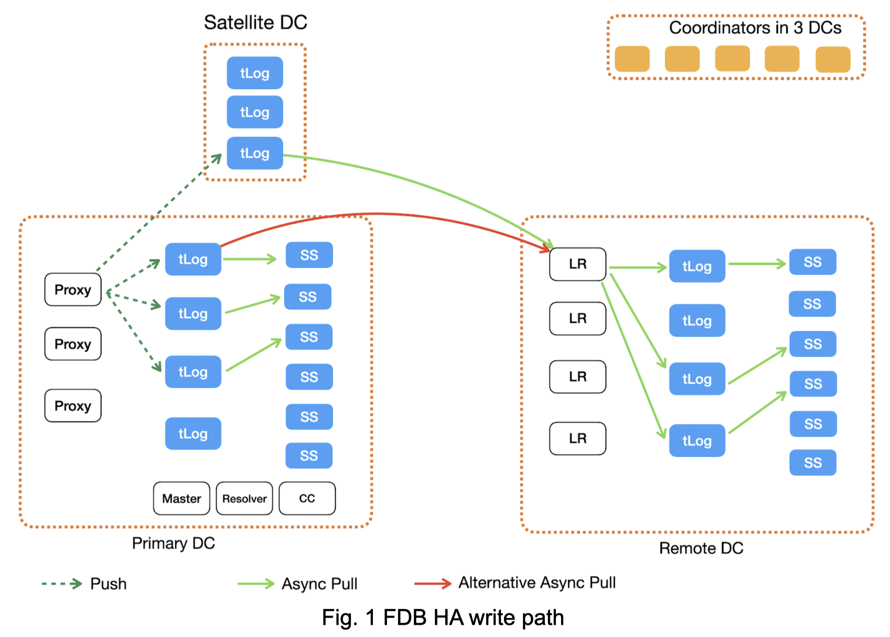
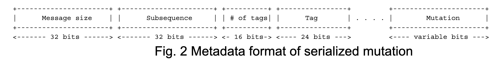

###################################################
FDB HA Write Path: How a mutation travels in FDB HA
###################################################

| Author: Meng Xu
| Reviewer: Alex Miller, Jingyu Zhou, Lukas Joswiak, Trevor Clinkenbeard
| Audience: FDB developers, SREs and expert users.

This document describes how a mutation is replicated and moved from proxy to storage servers (SS) in a FDB High Availability (HA) cluster. Historically, FDB HA is also called Fearless DR or Multi-region configuration.

To simplify the description, we assume the HA cluster has the following configuration:

* Replication factor = 3 for storage servers. It means each mutation is replicated to 3 storage servers in the primary datacenter (DC) and 3 SSes in the secondary DC.

* Replication factor = 3 for transaction logs (tLogs). It means each mutation is synchronously replicated to 3 primary tLogs and 1 satellite tLog. 

* Satellite replication factor = 1 satellite single replication. It means each mutation must be synchronously replicated to 1 satellite tLog before it can be committed. 
  
    * The satellite replication factor can be configured with one or two satellites and single, double or triple replicas as described here. We typically use only 1 satellite single replica config.

* Only 1 satellite is configured in the primary DC.

We describe the background knowledge -- Sharding and Tag structure -- before we discuss how a mutation travels in a FDB HA cluster.

Sharding: Which shard goes to which servers?
============================================

A shard is a continuous key range. FDB divides the entire keyspace to thousands of shards. A mutation’s key decides which shard it belongs to.

Shard-to-SS mapping is determined by the \xff/keyServers/ system keyspace. In the system keyspace, a shard’s begin key is used as the key, the shard’s end key is the next key, and the shard’s SSes are the value. For example, we have the following key-values in the system keyspace: \xff/keyServers/a=(SS1,SS2,SS3) , \xff/keyServers/b=(SS2,SS4,SS7) . It indicates: shard [a,b) will be saved on storage servers whose IDs are SS1, SS2, SS3; and shard [b, \xff\xff) will be saved on storage servers SS2, SS4, SS7.

SS-to-tag mapping is decided by the \xff/serverTag/ system keyspace. A tag is a whole number (i.e., natural number and 0). Each SS is mapped to a tag and vice versa. We use tags to represent SSes in the transaction system to save space and speed up search, because tags are continuous and small numbers (described in Tag structure section) while SS IDs are 64 bit random UID.

Shard-to-tLog mapping is decided by shard-to-SS mapping and tLog’s replication policy. We use an example to explain how it works. Assume a mutation is mapped to SS1, SS2, and SS5, whose tags are respectively 1, 2, 5. The system has four tlogs. We use a function to transfer tag to tLog index: f(tag) = tLogIndex, where f(tag) is a modular function in FDB 6.2 and 6.3 implementation. In the example, the mutation’s assigned tLogs will be 1, 2, 1, which is calculated as the shard’s tag % 4. As you may notice, the three tags produces only two unique tLog indexes, which does not satisfy tLog’s replication policy that requires 3 tLog replicas. The proxy will call the replication policy engine, selectReplicas(), to choose another tLog for the mutation. 

Tag structure
=============

Tag is an overloaded term in FDB. In the early history of FDB, a tag is a number used in SS-to-tag mapping. As FDB evolves, tags are used by different components for different purposes: 

* As FDB evolves to HA, tags are used by not only primary tLogs but also satellite tLogs, log router, and remote tLogs;

* As FDB scales and we work to reduce the recovery time, a special tag for transaction state store (txnStateStore) is introduced;

* FDB also have transaction tags which are used for transaction throttling, not for the tag-partitioned log system mentioned in this article. See :ref:`transaction-tagging`

To distinguish the types of tags used for different purposes at different locations (primary DC or remote DC), we introduce Tag structure, which has two fields:

* locality (int8_t): When it is non-negative value, it decides which DC id the tag is used in. For example, if it is 0, it means the tag is used in primary DC and the tag’s id represents a storage server and is used for primary tLogs to index by storage servers. When it is negative, it decides which types of tags the tag belongs to. For example, if it is -2, it is a log router tag, and its id is used to decide which log router the tagged mutation should be sent to. The definition of all localities are in FDBTypes.h and you can easily find it if you search tagLocalitySpecial in the file.

* id (uint16_t): Once locality decides which FDB components will the tag be applied to, id decides which process in the component type will be used for the tagged mutation.
  
    * FDB components in this context means (i) which DC of tLogs, and (ii) which types of tLogs.

To simplify our discussion in the document, we use “tag.id” to represent a tag’s id, and tag as the Tag structure that has both locality and id. We represent a Tag as (locality, id).

How does a mutation travel in FDB?
==================================

To simplify the description, we ignore the batching mechanisms happening in each component in the data path that are used to improve the system’s performance. 

Figure 1 illustrates how a mutation is routed inside FDB. The solid lines are asynchronous pull operations, while the dotted lines are synchronous push operations.

At Client
---------

When an application creates a transaction and writes mutations, its FDB client sends the set of mutations to a proxy, say proxy 0. Now let’s focus on one of the normal mutations, say m1, whose key is in the normal keyspace.

At Proxy
--------

**Sequencing.** *It first asks the master for the commit version of this transaction batch*. The master acts like a sequencer for FDB transactions to determine the order of transactions to commit by assigning a new commit version and the last assigned commit version as the previous commit version. The transaction log system will use the [previous commit version, commit version] pair to determine its commit order, i.e., only make this transaction durable after the transaction with the previous commit version is made durable.

**Conflict checking.** *Proxy then checks if the transaction has conflicts* with others by sending mutations to resolvers. Resolvers check if there are conflicts among mutations in different transactions from different proxies. Suppose the mutation m1’s transaction passes conflict check and can be committed.

**Commit mutation messages.** *Proxy then commits the mutations to tLogs*. Each proxy has the shard-to-tag mapping. It assigns Tags (which has locality and id) to the mutation m1. In the HA cluster in FDB 6.2, the mutation has the following Tags:

* 3 tags for primary DC. Assume they are (0, 1), (0, 2), and (0,5). The tag ids are decided by which primary SSes will eventually save the mutation;

* 3 tags for remote DC. Assume they are (1, 3), (1, 6), (1, 10). The tag ids are decided by which remote SSes will eventually save the mutation;

* 1 tag for log router. Assume it is (-2, 3), where -2 is the locality value for all log router tags. The tag id is randomly chosen by proxy as well.

* No tag for satellite tLog. The "satellite TLog locality" -5 in the code is used when recruiting a satellite TLog to tell it that it is a satellite TLog. This causes the satellite TLog to only index log router tags (-2) and not bother indexing any of the >0 tags.

Why do we need log routers? Why cannot we let remote tLog directly pull data from primary tLogs?

The main reason is to avoid shipping the mutation across WAN multiple times. If you attach remote SS's tags, the same mutation will cross WAN 3 times. In contrast, the router tag reduces it to only 1 time.

Why do we randomly assign tag id for satellite tLogs and log routers?

Another alternative is to use remote SSes’ tags to decide which satellite tLog and log routers a shard should always go to. We tried that approach before and compared its performance with randomly assigned tags. Evaluation showed that randomly assigning a mutation to satellite tLogs and log routers provide lower latency and higher throughput for these two types of logs. This is somewhat expected: When we randomly assign a mutation to a satellite tlog (and log router), we may assign mutations in the same shard to different satellite tLogs (and log routers). The randomness happens to balance load on the logs. 

Proxy groups mutations with the same tag as messages. Proxy then synchronously pushes these mutation messages to tLogs based on the tags. Proxy cannot acknowledge that the transaction is committed until the message has been durable on all primary and satellite tLogs. 

**Commit empty messages to tLogs.** When a proxy commits a tagged mutation message at version V1 to tLogs, it also has to commit an empty message at the same version V1 to the rest of tLogs. This makes sure every tLog has the same versions of messages, even though some messages are empty. This is a trick used in FDB to let all tLogs march at the same versions. The reason why FDB does the trick is that the master hands out segments of versions as 'from v1 to v2', and the TLogs need to be able to piece all of them back together into one consistent timeline. It may or may not be a good design decision, because a slow tLog can delay other tLogs of the same kind. We may want to revisit the design later.

At primary tLogs and satellite tLogs
------------------------------------

Once it receives mutations pushed by proxies, it builds indexes for each tag’s mutations. Primary TLogs index both log router tags and the primary DC's SS tags. Satellite tLogs only index log router tags.

If tLogs’ mutations cannot be peeked and popped by its consumers (i.e., SSes and log routers) quickly enough, tLogs’ memory usage will increase. When buffered mutations exceed 1.5GB (configurable by knob), their in-memory index will be spilled into a “Tag,version->disk location” B-tree.

tLogs also maintain two properties:
  
* It will not make a mutation at version V1 durable until mutations before V1 has been made durable;

* It will not pop (i.e., delete) mutations at version V2, until mutations before V2 have been popped.

At primary SS
-------------

**Primary tLog of a SS.** Since a SS’s tag is identically mapped to one tLog. The tLog has all mutations for the SS and is the primary tLog for the SS. When the SS peeks data from tLogs, it will prefer to peek data from its primary tLog. If the primary tLog crashes, it will contact the rest of tLogs, ask for mutations with the SS’s tag, and merge them together. This complex merge operation is abstracted in the TagPartitionedLogSystem interface.

**Pulling data from tLogs.** Each SS in the primary DC keeps pulling mutations, whose tag is the SS’s tag, from tLogs. Once mutations before a version V1 are made durable on a SS, the SS pops the tag upto the version V1 from *all* tLogs. The pop operation is an RPC to tLogs through the TagPartitionedLogSystem interface.

Since the mutation m1 has three tags for primary SSes, the mutation will be made durable on three primary SSes. This marks the end of the mutation’s journey in the primary DC. 

Now let’s look at how the mutation m1 is routed to the remote DC.

At log router
-------------

Log routers are consumers of satellite tLogs or primary tLogs, controlled by a knob LOG_ROUTER_PEEK_FROM_SATELLITES_PREFERRED. By default, the knob is configured for log routers to use satellite tLogs. This relationship is similar to primary SSes to primary tLogs. 

Each log router tag is mapped to one log router. Each log router keeps pulling mutations, which have the log router’s tag, from satellite tLogs. The number of log router tags is always the same as the number of log routers, which is always some N multiple of the number of satellite logs. Each log router has a preferred satellite TLog that has all of its mutations, so in the normal steady state, each satellite should have N log routers peeking from it (and only it).

Log router buffers its mutations in memory and waits for the remote tLogs to peek and pop its data. If the buffered data cannot be popped by remote tLog quickly enough, log router’s memory usage will increase. To avoid out of memory (OOM), a log router only buffers 5 seconds of mutations in memory. It pauses peeking data from satellite tLogs until its excessive buffered mutations have been popped by remote tLogs.

At remote tLogs
---------------

Remote tLogs are consumers of log routers. Each remote tLog keeps pulling mutations, which have the remote tLog’s tag, from log routers. Because log router tags are randomly chosen for mutations, a remote tLog’s mutations can spread across all log routers. So each remote tLog must contact all log routers for its data and merge these mutations in increasing order of versions on the remote tLog. 

Once a remote tLog collects and merge mutations from all log routers, it makes them durable on disk, index them based on their tags, and pop the mutations from log routers.

Now the mutation m1 has arrived at the remote tLog, which is similar as when it arrives at the primary tLog.

At remote SSes
--------------

Similar to how primary SSes pull mutations from primary tLogs, each remote SS keeps pulling mutations, which have its tag, from remote tLogs. Once a remote SS makes mutations up to a version V1 durable, the SS pops its tag to the version V1 from all remote tLogs.

Implementation
==============

* proxy assigns tags to a mutation: 

https://github.com/apple/foundationdb/blob/7eabdf784a21bca102f84e7eaf14bafc54605dff/fdbserver/MasterProxyServer.actor.cpp#L1410

Mutation Serialization (WiP)
============================

This section will go into detail on how mutations are serialized as preparation for ingestion into the TagPartitionedLogSystem. This has also been covered at:

https://drive.google.com/file/d/1OaP5bqH2kst1VxD6RWj8h2cdr9rhhBHy/view

The proxy handles splitting transactions into their individual mutations. These mutations are then serialized and synchronously sent to multiple transaction logs.

The process starts in *commitBatch*. Eventually, *assignMutationsToStorageServers* is called to assign mutations to storage servers and serialize them. This function loops over each mutation in each transaction, determining the set of tags for the mutation (which storage servers it will be sent to), and then calling *LogPushData.writeTypedMessage* on the mutation.

The *LogPushData* class is used to hold serialized mutations on a per transaction log basis. It’s *messagesWriter* field holds one *BinaryWriter* per transaction log.

*LogPushData.writeTypedMessage* is the function that serializes each mutation and writes it to the correct binary stream to be sent to the corresponding transaction log. Each serialized mutation contains additional metadata about the message, with the format:

* Message size: size of the message, in bytes, excluding the four bytes used for the message size

* Subsequence: integer value used for message ordering

* # of tags: integer value used to indicate the number of tags following

* Tag: serialized *Tag* object, repeated # of tags times for each location

Metadata takes up (10 + 3 * number_of_tags) bytes of each serialized mutation.

There is an additional metadata message prepended to the list of mutations in certain circumstances. To assist with visibility efforts, transaction logs and storage servers need to be able to associate a mutation with the transaction it was part of. This allows individual transactions to be tracked as they travel throughout FDB. Thus, at the beginning of each transaction, a *SpanProtocolMessage* will be written to the message stream before the first mutation for each location. A *SpanProtocolMessage* is a separate message, similar to the *LogProtocolMessage*, which holds metadata about the transaction itself.

An example may work best to illustrate the serialization process. Assume a client submits a transaction consisting of two mutations, m1 and m2. The proxy determines that m1 should be sent to tlogs 1, 2, and 3, while m2 should be sent to tlogs 2, 3, and 4. When m1 is serialized, a *LogProtocolMessage* will be written to the message stream for tlogs 1, 2, and 3 before the serialized m1 is written. Next, when m2 is serialized, a *LogProtocolMessage* will only be written to tlog 4, because tlogs 2 and 3 have already had a *LogProtocolMessage* written to them *for the transaction*. When all mutations in a transaction have been written, the process starts over for the next transaction.

This allows all transaction logs to receive information about the transaction each mutation is a part of. Storage servers will pull this information when pulling mutations, allowing them to track transaction info as well.
