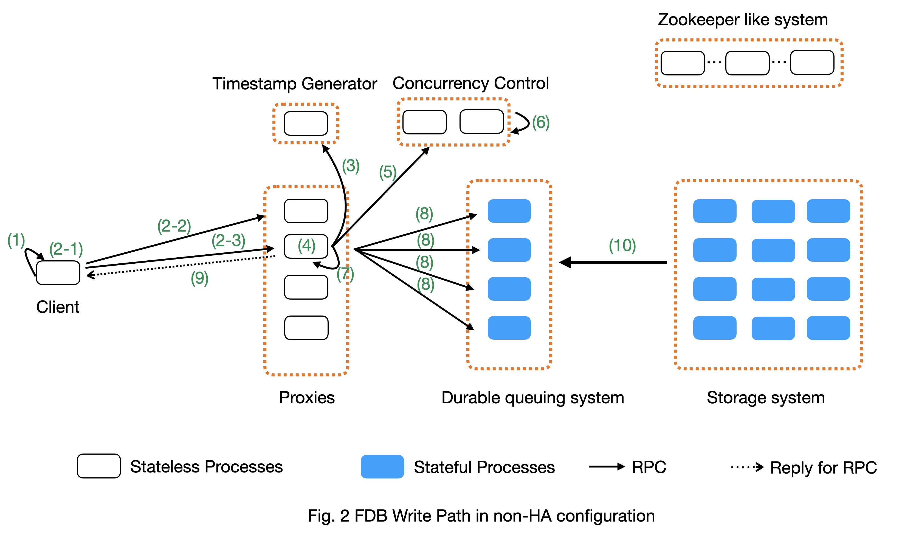
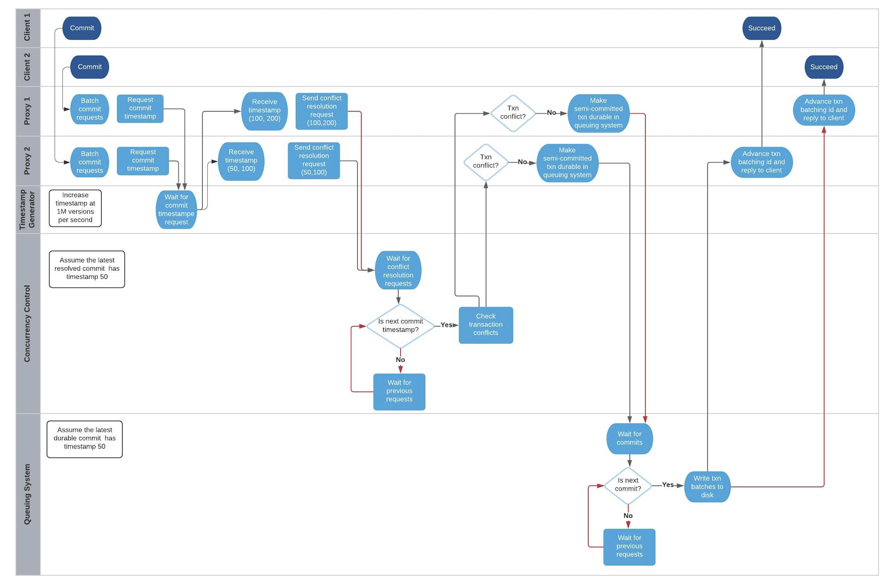

##############################
FDB Read and Write Path
##############################

| Author: Meng Xu
| Reviewer: Evan Tschannen, Jingyu Zhou
| Audience: FDB developers, SREs and expert users.

This document explains how FDB works at high level in database terms without mentioning FDB internal concepts.

We first discuss the read path and the write path separately for a single transaction.
We then describe how the read path and write path work together for a read and write transaction.
In the last section, we illustrate how multiple outstanding write transactions are processed and *ordered* in FDB.
The processing order of multiple transactions is important because it affects the parallelism of transaction processing and the write throughput.

The content is based on FDB 6.2 and is true for FDB 6.3.  A new timestamp proxy role is introduced in post FDB 6.3,
which affects the read path. We will discuss the timestamp proxy role in the future version of this document.

.. image:: images/FDB_read_path.png

Components
=================

FDB is built on top of several key components.
The terms below are common database or distributed system terms, instead of FDB specific terms.

**Timestamp generator.** It serves logical time,  which defines happen-before relation:
An event at t1 happens before another event at t2, if t1 < t2.
The logic time is used to order events in FDB distributed systems and it is used by concurrency control to decide if two transactions have conflicts.
The logical time is the timestamp for a transaction.

* A read-only transaction has only one timestamp which is assigned when the transaction is created;
* A read-write transaction has one timestamp at the transaction’s creation time and one timestamp at its commit time.

**Concurrency Control.** It decides if two transactions can be executed concurrently without violating Strict Serializable Isolation (SSI) property.
It uses the Optimistic Concurrency Control (OCC) mechanism described in [SSI] to achieve that.

**Client.** It is a library, an FDB application uses, to access the database.
It exposes the transaction concept to applications.
Client in FDB is a *fat* client that does multiple complex operations:
(1) It calculates read and write conflict ranges for transactions;
(2) it batches a transaction's operations and send them all together at commit for better throughput;
(3) it automatically retries failed transactions.

**Proxies.** It is a subsystem that acts like reverse proxies to serve clients’ requests. Its main purposes is:

* Serve for read request by (1) serving the logical time to client; and (2) providing which storage server has data for a key;
* Process write transactions on behalf of clients and return the results;

Each proxy has the system’s metadata, called transaction state store (txnStateStore). The metadata decides:
(1) which key should go to which storage servers in the storage system;
(2) which key should go to which processes in the durable queuing system;
(3) is the database locked; etc.

The metadata on all proxies are consistent at any given timestamp.
To achieve that, when a proxy has a metadata mutation that changes the metadata at the timestamp V1,
the mutation is propagated to all proxies (through the concurrency control component), and
its effect is applied on all proxies before any proxy can process transactions after the timestamp V1.

**Durable queuing system.** It is a queuing system for write traffic.
Its producers are proxies that send transaction mutation data for durability purpose.
Its consumers are storage systems that index data and serve read request.
The queuing system is partitioned for the key-space.
A shard (i.e., key-range) is mapped to *k* log processes in the queuing system, where *k* is the replication factor.
The mapping between shard and storage servers decides the mapping between shard and log processes.

**Storage system.** It is a collection of storage servers (SS), each of which is a sqlite database running on a single thread.
It indexes data and serves read requests.
Each SS has an in-memory p-tree data structure that stores the past 5-second mutations and an on-disk sqlite data.
The in-memory data structure can serve multiple versions of key-values in the past 5 seconds.
Due to memory limit, the in-memory data cannot hold more than 5 seconds’ multi-version key-values,
which is the root cause why FDB’s transactions cannot be longer than 5 seconds.
The on-disk sqlite data has only the most-recent key-value.

**Zookeeper like system.** The system solves two main problems:

* Store the configuration of the transaction system, which includes information such as generations of queuing systems and their processes.
  The system used to be zookeeper. FDB later replaced it with its own implementation.

* Service discovery. Processes in the zookeeper-like system serve as well-known endpoints for clients to connect to the cluster.
  These well-known endpoint returns the list of proxies to clients.

Read path of a transaction
==================================

Fig. 1 above shows a high-level view of the read path. An application uses FDB client library to read data.
It creates a transaction and calls its read() function. The read() operation will lead to several steps.

* **Step 1 (Timestamp request)**: The read operation needs a timestamp.
  The client initiates the timestamp request through an RPC to proxy. The request will trigger Step 2 and Step 3;

  * To improve throughput and reduce load on the server side, each client dynamically batches the timestamp requests.
    A client keeps adding requests to the current batch until
    *when* the number of requests in a batch exceeds a configurable threshold or
    *when* the batching times out at a dynamically computed threshold.
    Each batch sends only one timestamp request to proxy and all requests in the same batch share the same timestamp.

* **Step 2 (Get latest commit version)**: When the timestamp request arrives at a proxy,
  the proxy wants to get the largest commit version as the return value.
  So it contacts the rest of (n-1) proxies for their latest commit versions and
  uses the largest one as the return value for Step 1.

    * O(n^2) communication cost: Because each proxy needs to contact the rest of (n-1) proxies to serve clients’ timestamp request,
      the communication cost is n*(n-1), where n is the number of proxies;

    * Batching: To reduce communication cost, each proxy batches clients’ timestamp requests for a configurable time period (say 1ms) and
      return the same timestamp for requests in the same batch.

* **Step 3 (Confirm proxy’s liveness)**: To prevent proxies that are no longer a part of the system (such as due to network partition) from serving requests,
  each proxy contacts the queuing system for each timestamp request to confirm it is still a valid proxy
  (i.e., not replaced by a newer generation proxy process).
  This is based on the FDB property that at most one active queuing system is available at any given time.

    * Why do we need this step? This is to achieve consensus (i.e., external consistency).
      Compared to serializable isolation, Strict Serializable Isolation (SSI) requires external consistency.
      It means the timestamp received by clients cannot decrease. If we do not have step and network partition happens,
      a set of old proxies that are disconnected from the rest of systems can still serve timestamp requests to clients.
      These timestamps can be smaller than the new generation of proxies, which breaks the external consistency in SSI.

    * O(n * m) communication cost: To confirm a proxy’s liveness, the proxy has to contact all members in the queuing system to
      ensure the queuing system is still active. This causes *m* network communication, where *m* is the number of processes in the queuing system.
      A system with n proxies will have O(n * m) network communications at the step 3. In our deployment, n is typically equal to m;

    * Do FDB production clusters have this overhead? No. Our production clusters disable the external consistency by
      configuring the knob ALWAYS_CAUSAL_READ_RISKY.

* **Step 4 (Locality request)**: The client gets which storage servers have its requested keys by sending another RPC to proxy.
  This step returns a set of  *k* storage server interfaces, where k is the replication factor;

    * Client cache mechanism: The key location will be cached in client.
      Future requests will use the cache to directly read from storage servers,
      which saves a trip to proxy. If location is stale, read will return error and client will retry and refresh the cache.

* **Step 5 (Get data request)**: The client uses the location information from step 4 to directly query keys from corresponding storage servers.
    * Direct read from client’s memory: If a key’s value exists in the client’s memory, the client reads it directly from its local memory.
      This happens when a client updates a key’s value and later reads it.
      This optimization reduces the amount of unnecessary requests to storage servers.

    * Load balance: Each data exists on k storage servers, where k is the replication factor.
      To balance the load across the k replicas, client has a load balancing algorithm to balance the number of requests to each replica.

    * Transaction succeed: If the storage server has the data at the read timestamp, the client will receive the data and return succeed.

    * Transaction too old error: If the read request’s timestamp is older than 5 seconds,
      storage server may have already flushed the data from its in-memory multi-version data structure to its on-disk single-version data structure.
      This means storage server does not have the data older than 5 seconds. So client will receive transaction too old error.
      The client will retry with a new timestamp.
      One scenario that can lead to the error is when it takes too long for a client to send the read request after it gets the timestamp.

    * Future transaction error: Each storage server pulls data in increasing order of data’s timestamp from the queuing system.
      Let’s define a storage server’s timestamp as the largest timestamp of data the storage server has.
      If the read request’s timestamp is larger than the storage server’s timestamp,
      the storage server will reply future-transaction-error to the client.
      The client will retry. One scenario that can lead to the error is when the connection between the SS and the queuing system is slow.

    * Wrong shard error: If keys in the request or result depend on data outside this storage server OR
      if a large selector offset prevents all data from being read in one range read.
      Client will invalidate its locality cache for the key and retry the read request at the failed key.

Implementation of FDB read path
------------------------------------------

* **Step 1 (Timestamp request)**: 
    * Each read request tries to get a timestamp if its transaction has not got one:
      https://github.com/apple/foundationdb/blob/4b0fba6ea89b51b82df7868ca24b81f6997db4e4/fdbclient/NativeAPI.actor.cpp#L2104
    * Client batches the get-timestamp requests:
      https://github.com/apple/foundationdb/blob/4b0fba6ea89b51b82df7868ca24b81f6997db4e4/fdbclient/NativeAPI.actor.cpp#L3172
    * Dynamic batching algorithm:
      https://github.com/apple/foundationdb/blob/4b0fba6ea89b51b82df7868ca24b81f6997db4e4/fdbclient/NativeAPI.actor.cpp#L3101-L3104

* **Step 2 (Get latest commit version)**: Contacting (n-1) proxies for commit version:
  https://github.com/apple/foundationdb/blob/4b0fba6ea89b51b82df7868ca24b81f6997db4e4/fdbserver/MasterProxyServer.actor.cpp#L1196

* **Step 3 (Confirm proxy’s liveness)**:
    * We typically set our clusters’ knob ALWAYS_CAUSAL_READ_RISKY to 1 to skip this step
    * Proxy confirm queuing system is alive:
      https://github.com/apple/foundationdb/blob/4b0fba6ea89b51b82df7868ca24b81f6997db4e4/fdbserver/MasterProxyServer.actor.cpp#L1199
    * How is confirmEpochLive(..) implemented for the above item:
      https://github.com/apple/foundationdb/blob/4b0fba6ea89b51b82df7868ca24b81f6997db4e4/fdbserver/TagPartitionedLogSystem.actor.cpp#L1216-L1225

* **Step 4 (Locality request)**:
  https://github.com/apple/foundationdb/blob/4b0fba6ea89b51b82df7868ca24b81f6997db4e4/fdbclient/NativeAPI.actor.cpp#L1312-L1313

* **Step 5 (Get data request)**:
    * Logics of handling get value request:
      https://github.com/apple/foundationdb/blob/4b0fba6ea89b51b82df7868ca24b81f6997db4e4/fdbclient/NativeAPI.actor.cpp#L1306-L1396
    * Load balance algorithm: The loadBalance() at
      https://github.com/apple/foundationdb/blob/4b0fba6ea89b51b82df7868ca24b81f6997db4e4/fdbclient/NativeAPI.actor.cpp#L1342-L1344

Write path of a transaction
================================

Suppose a client has a write-only transaction. Fig. 2 below shows the write path in a non-HA cluster.
We will discuss how a transaction with both read and write works in the next section.

To simplify the explanation, the steps below do not include transaction batching on proxy,
which is a typical database technique to increase transaction throughput.

* **Step 1 (Client buffers write mutations):** Client buffers all writes in a transaction until commit is called on the transaction.
  In the rest of document, a write is also named as a mutation.

    * Client is a fat client that preprocess transactions:
      (a) For atomic operations, if client knows the key value, it will convert atomic operations to set operations;
      (b) For version stamp atomic operations, client adds extra bytes to key or value for the version stamp;
      (c) If a key has multiple operations, client coalesces them to one operation whenever possible.

    * How client buffers mutations:
      https://github.com/apple/foundationdb/blob/07e354c499158630d760283aa845440cbeaaa1ca/fdbclient/NativeAPI.actor.cpp#L2345-L2361

* **Step 2 (Client commits the transaction):** When a client calls commit(), it performs several operations:

    * **Step 2-1**: Add extra conflict ranges that are added by user but cannot be calculated from mutations.

    * **Step 2-2**: Get a timestamp as the transaction’s start time. The timestamp does not need causal consistency because the transaction has no read.
        * This request goes to one of proxies. The proxy will contact all other (n-1) proxies to get the most recent commit version as it does in read path.
          The proxy does not need to contact log systems to confirm its activeness because it does not need causal consistency.

    * **Step 2-3**:  Sends the transaction’s information to a proxy. Load balancer in client decides which proxy will be used to handle a transaction.
      A transaction’s information includes:

        * All of its mutations;
        * Read and write conflict range;
        * Transaction options that control a transaction’s behavior. For example, should the transaction write when the DB is locked?
          Shall the transaction uses the first proxy in the proxy list to commit? 

    * Implementation:
        * Transaction commit function: https://github.com/apple/foundationdb/blob/07e354c499158630d760283aa845440cbeaaa1ca/fdbclient/NativeAPI.actor.cpp#L2895-L2899
        * Major work of commit in client side is done at here: https://github.com/apple/foundationdb/blob/07e354c499158630d760283aa845440cbeaaa1ca/fdbclient/NativeAPI.actor.cpp#L2784-L2868
        * Step 2-1: Add extra conflict ranges: https://github.com/apple/foundationdb/blob/07e354c499158630d760283aa845440cbeaaa1ca/fdbclient/NativeAPI.actor.cpp#L2826-L2828
        * Step 2-2: getReadVersion at commit which does not need external consistency because we do not have read in the transaction: https://github.com/apple/foundationdb/blob/07e354c499158630d760283aa845440cbeaaa1ca/fdbclient/NativeAPI.actor.cpp#L2822-L2823
        * Step 2-3: Send transaction to a proxy via RPC: https://github.com/apple/foundationdb/blob/07e354c499158630d760283aa845440cbeaaa1ca/fdbclient/NativeAPI.actor.cpp#L2691-L2700

* When a proxy receives clients’ transactions, it commits the transaction on behalf of clients with Step 3 - 9.

* **Step 3 (Proxy gets commit timestamp)**: The proxy gets the timestamp of the transaction’s commit time from the time oracle through an RPC call.

    * To improve transaction throughput and reduce network communication overhead,
      each proxy dynamically batch transactions and process transactions in batches.
      A proxy keeps batching transactions until the batch time exceeds a configurable timeout value or
      until the number of transactions exceed a configurable value or
      until the total bytes of the batch exceeds a dynamically calculated desired size.

    * The network overhead is 1 network communication per batch of commit transactions;

    * How is the dynamically calculated batch size calculated: https://github.com/apple/foundationdb/blob/4b0fba6ea89b51b82df7868ca24b81f6997db4e4/fdbserver/MasterProxyServer.actor.cpp#L1770-L1774
    * How commit transactions are batched: https://github.com/apple/foundationdb/blob/4b0fba6ea89b51b82df7868ca24b81f6997db4e4/fdbserver/MasterProxyServer.actor.cpp#L416-L486
    * How each transaction batch is handled: https://github.com/apple/foundationdb/blob/4b0fba6ea89b51b82df7868ca24b81f6997db4e4/fdbserver/MasterProxyServer.actor.cpp#L523-L1174
    * Where does proxy sends commit timestamp request to the timestamp generator:  https://github.com/apple/foundationdb/blob/4b0fba6ea89b51b82df7868ca24b81f6997db4e4/fdbserver/MasterProxyServer.actor.cpp#L586-L587

* **Step 4 (Proxy builds transactions’ conflict ranges)**: Because the concurrency control component may have multiple processes,
  each of which is responsible for resolving conflicts in a key range,
  the proxy needs to build one transaction-conflict-resolution request for each concurrency control process:
  For each transaction, the proxy splits its read and write conflict ranges based on concurrency control process’ responsible ranges.
  The proxy will create k conflict resolution requests for each transaction, where k is the number of processes in the concurrency control component.

    * Implementation: https://github.com/apple/foundationdb/blob/4086e3a2750b776cc8bfb0f0e463fe00ac905595/fdbserver/MasterProxyServer.actor.cpp#L607-L618

* **Step 5 (Proxy sends conflict resolution requests to concurrency control)**:
  Each concurrency control process is responsible for checking conflicts in a key range.
  Each process checks if the transaction has conflicts with other transactions in its  key-range.
  Each process returns the conflict checking result back to the proxy.

    * What is conflict range?
        * A transaction’s write conflict range includes any key and key-ranges that are modified in the transactions.
        * A transaction’s read conflict range includes any key and key-ranges that are read in the transaction.
        * Client can also use transaction options to add explicit read-conflict-range or write-conflict-range.
          Example: https://github.com/apple/foundationdb/blob/4b0fba6ea89b51b82df7868ca24b81f6997db4e4/fdbclient/NativeAPI.actor.cpp#L2634-L2635

    * **Piggy-back metadata change**. If the transaction changes database’s metadata, such as locking the database,
      the change is considered as a special mutation and also checked for conflicts by the concurrency control component.
      The primary difference between metadata mutation and normal mutations is that the metadata change must be propagated to all proxies
      so that all proxies have a consistent view of database’s metadata.
      This is achieved by piggy-backing metadata change in the reply from resolver to proxies.

    * Implementation
        * Create conflict resolution requests for a batch of transactions: https://github.com/apple/foundationdb/blob/07e354c499158630d760283aa845440cbeaaa1ca/fdbserver/MasterProxyServer.actor.cpp#L607-L618
        * Metadata mutations are sent from proxy to concurrency control processes: https://github.com/apple/foundationdb/blob/07e354c499158630d760283aa845440cbeaaa1ca/fdbserver/MasterProxyServer.actor.cpp#L366-L369

* **Step 6 (Resolve conflicts among concurrent transactions)**:
  Each concurrency control process checks conflicts among transactions based on the theory in [1].
  In a nutshell, it checks for read-write conflicts. Suppose two transactions operates on the same key.
  If a write transaction’s time overlaps between another read-write transaction’s start time and commit time,
  only one transaction can commit: the one that arrives first at all concurrency control processes will commit.

    * Implementation
        * Proxy sends conflict checking request: https://github.com/apple/foundationdb/blob/07e354c499158630d760283aa845440cbeaaa1ca/fdbserver/MasterProxyServer.actor.cpp#L626-L629
        * Concurrency control process handles the request: https://github.com/apple/foundationdb/blob/07e354c499158630d760283aa845440cbeaaa1ca/fdbserver/Resolver.actor.cpp#L320-L322

* **Step 7 (Proxy’s post resolution processing)**:
  Once the proxy receives conflict-resolution replies from all concurrency control processes, it performs three steps

    * **Step 7-1 (Apply metadata effect caused by other proxies)**: As mentioned above, when a proxy changes database’s metadata,
      the metadata mutations will be propagated via the concurrency control component to other proxies.
      So the proxy needs to first compute and apply these metadata mutations onto the proxy’s local states.
      Otherwise, the proxy will operate in a different view of database’s metadata.

        * For example, if one proxy locks the database in a committed transaction at time t1, all other proxies should have seen the lock immediately after t1. Since another proxy may have transactions in flight already at t1, the proxy must first apply the “lock“ effect before it can process its in-flight transactions.
        * How metadata effect is applied in implementation:  https://github.com/apple/foundationdb/blob/07e354c499158630d760283aa845440cbeaaa1ca/fdbserver/MasterProxyServer.actor.cpp#L678-L719

    * **Step 7-2 (Determine which transactions are committed)**: Proxy combines results from all concurrency control processes.
      Only if all concurrency control processes say a transaction is committed, will the transaction be considered as committed by the proxy.

        * Implementation: https://github.com/apple/foundationdb/blob/07e354c499158630d760283aa845440cbeaaa1ca/fdbserver/MasterProxyServer.actor.cpp#L721-L757

    * **Step 7-3 (Apply metadata effect caused by this proxy)**: For each committed transaction,
      this proxy applies its metadata mutations to the proxy’s local state.

        * Note: These metadata mutations are also sent to concurrency control processes and propagated to other proxies at Step 5.
          This step is to apply metadata effect on its own proxy’s states.
        * Implementation: https://github.com/apple/foundationdb/blob/07e354c499158630d760283aa845440cbeaaa1ca/fdbserver/MasterProxyServer.actor.cpp#L763-L777

    * **Step 7-4 (Assign mutations to storage servers and serialize them)**:
      In order to let the rest of system (the queuing system and storage system) know which process a mutation should be routed to,
      the proxy needs to add tags to mutations.
      The proxy serializes mutations with the same tag into the same message and sends the serialized message to the queuing system.

        * Implementation of adding tags and serializing mutations into messages: https://github.com/apple/foundationdb/blob/07e354c499158630d760283aa845440cbeaaa1ca/fdbserver/MasterProxyServer.actor.cpp#L800-L910
        * The lines that add tags to a mutation and serialize it: https://github.com/apple/foundationdb/blob/07e354c499158630d760283aa845440cbeaaa1ca/fdbserver/MasterProxyServer.actor.cpp#L846-L847

    * **Step 7-5 (Duplicate and serialize mutations to backup system keyspace)**:
      When backup or disaster recovery (DR) is enabled, each proxy captures mutation streams into a dedicated system keyspace.
      Mutations in a transaction batch are serialized as a single mutation in a dedicated system keyspace.

        * How mutations are duplicated for backup and DR: https://github.com/apple/foundationdb/blob/07e354c499158630d760283aa845440cbeaaa1ca/fdbserver/MasterProxyServer.actor.cpp#L912-L986
        * Note: FDB will have a new backup system that avoids duplicating mutations to the system keyspace.
          Its design is similar to database’s Change Data Capture (CDC) design. The new backup system is not production-ready yet.

* **Step 8 (Make mutation messages durable in the queuing system)**:
  Proxy sends serialized mutation messages to the queuing system.
  The queuing system will append the mutation to an append-only file, fsync it, and send the respnose back.
  Each message has a tag, which decides which process in the queuing system the message should be sent to.
  The queuing system returns to the proxy the minimum known committed version, which is the smallest commit version among all proxies.
  The minimum known commit version is used when the system recovers from fault.

    * Sending messages to the queuing system is abstracted into a push() operation: https://github.com/apple/foundationdb/blob/07e354c499158630d760283aa845440cbeaaa1ca/fdbserver/MasterProxyServer.actor.cpp#L1045
    * The minimum known committed version is called minKnownCommittedVersion. It is updated for each commit: https://github.com/apple/foundationdb/blob/07e354c499158630d760283aa845440cbeaaa1ca/fdbserver/MasterProxyServer.actor.cpp#L1067

* **Step 9 (Reply to client)**: Proxy replies the transaction’s result to client.
  If the transaction fails (say due to transaction conflicts), proxy sends the error message to the client.

    * Reply to clients based on different transaction’s results: https://github.com/apple/foundationdb/blob/07e354c499158630d760283aa845440cbeaaa1ca/fdbserver/MasterProxyServer.actor.cpp#L1117-L1138

* **Step 10 (Storage systems pull data from queuing system)**:
  Storage system asynchronously pulls data from queuing system and indexes data for read path.

    * Each SS has a primary process (called primary tLog) in the queuing system to pull data from the SS’s data from the queuing system.
      Each SS only gets in-ordered streams of mutations that are owned by the SS.

    * In failure scenario when a SS cannot reach the primary tLog, the SS will pull data from different tLogs that have part of the SS’s data.
      The SS will then merge the stream of data from different tLogs.

    * Each SS does not make its pulled data durable to disk until the data becomes
      at least 5 seconds older than the most recent data the SS has pulled.
      This allows each SS to roll back at least 5 seconds of mutations.

    * Why do we need roll back feature for SS? This comes from an optimization used in FDB.
      To make a mutation available in a SS as soon as possible,
      a SS may fetch a mutation from the queuing system that has not been fully replicated.
      The mutation’s transaction may be aborted in rare situations, such as
      when FDB has to recover from faults and decides to throw away the last few non-fully-durable transactions.
      SSes must throw away data in the aborted transactions.

    * Why does SS not make data durable until 5 seconds later?
      This is because today’s SS does not support rolling back data that has already been made durable on disk.
      To support roll back, SS keeps data that might be rolled back in memory.
      When roll-back is needed, SS just throws away the in-memory data. This simplifies the SS implementation.

    * Each storage process pulls data from the queuing system: https://github.com/apple/foundationdb/blob/07e354c499158630d760283aa845440cbeaaa1ca/fdbserver/storageserver.actor.cpp#L3593-L3599

Read write path of a transaction
====================================

This section uses an example transaction to describe how a transaction with both read and write operation works in FDB.

Suppose application creates the following transaction, where *Future<int>* is an object that holds an asynchronous call and
becomes ready when the async call returns, and *wait()* is a synchronous point when the code waits for futures to be ready.
The following code reads key k1 and k2 from database,  increases k1’s value by 1 and write back k1’s new value into database.

**Example Transaction** ::

    Line1: Transaction tr;
    Line2: Future<int> fv1 = tr.get(k1);
    Line3: Future<int> fv2 = tr.get(k2);
    Line4: v1 = wait(fv1);
    Line5: v2 = wait(fv2);
    Line6: tr.set(v1+v2);
    Line7: tr.commit();

The transaction starts with the read path:

* When tr.get() is called, FDB client issues a timestamp request to proxies *if* the transaction has not set its start timestamp.
  The logic is the Step 1 in the read path;

* Batching timestamp requests. When another tr.get() is called, it will try to get a timestamp as well. If we let every get request to follow the Step 1 in the read path, the performance overhead (especially network communication) will be a lot. In addition, this is not necessary because a transaction has only one start timestamp. To solve this problem, client chooses to batch timestamp requests from the same transaction and only issues one timestamp request when the transaction size reaches a preconfigured threshold or when the transaction duration reaches the batching timeout threshold. 
    * Timestamp requests are batched: https://github.com/apple/foundationdb/blob/4086e3a2750b776cc8bfb0f0e463fe00ac905595/fdbclient/NativeAPI.actor.cpp#L3185
    * Thresholds for client to send the timestamp request: https://github.com/apple/foundationdb/blob/4086e3a2750b776cc8bfb0f0e463fe00ac905595/fdbclient/NativeAPI.actor.cpp#L3095-L3098

* Each read request, i.e., tr.get operation in the example, will follow the read path to get data from storage servers, except that they will share the same timestamp;
    * These read requests are sent to FDB cluster in parallel.
      The ordering of which read request will be ready first depends on requests’ network path and storage servers’ load.
    * In the example, tr.get(k2) may return result earlier than tr.get(k1).

* Client will likely block at the synchronization point at Line 4, until the value is returned from the cluster.
    * To maximize clients’ performance, a client can issue multiple transactions concurrently.
      When one transaction is blocked at the synchronization point,
      the client can switch to work on the other transactions concurrently.

* Client may or may not block at the synchronization point at Line 5.
  If tr.get(k2) returns earlier than tr.get(k1), the future fv2 is already ready when the client arrives at Line 5.

* At Line 6, client starts the write path. Because the transaction already has its start timestamp,
  client does not need to request for the transaction’s start time any more and can skip the Step 2-2 in the write path.

* At Line 7, client commits the transaction, which will trigger the operations from Step 2 in the write path.

A transaction can get more complex than the example above.

* A transaction can have more writes operations between Line 6 and Line 7.
  Those writes will be buffered in client’s memory, which is the Step 1 in the write path.
  Only when the client calls commit(), will the rest of steps in the write path will be triggered;

* A transaction can have reads operations between Line 6 and Line 7 as well.

* A transaction may return commit_unknown_result, which indicate the transaction may or may not succeed.
  If application simply retries the transaction, the transaction may get executed twice.
  To solve this problem, the application can adds a transaction id to the transaction and
  check if the transaction id exists on the commit_unknown_result error.

Concurrency and ordering of multiple write transactions
=======================================================================

FDB orders concurrent transactions in increasing order of the transactions’ commit timestamp.
The ordering is enforced in the timestamp generator, the concurrency control component and the durable queuing system.

* When timestamp generator serves the commit timestamp request from a proxy,
  the reply includes not only the commit timestamp but also the latest commit timestamp the generator has sent out.
  For example, the timestamp generator just gave out the commit timestamp 50.
  When the next request arrives, the generator’s timestamp is 100 and the generator replies (50, 100).
  When the second request arrives and the generator’s timestamp is 200, the generator replies (100, 200).

* When a proxy sends conflict resolution requests to concurrency control processes or durable requests to the queuing system,
  each request includes both the current transaction’s commit timestamp and the previous transaction’s commit timestamp.

* Each concurrency control process and each process in the queuing system always process requests in the strict order of the request’s commit version.
  The semantics is do not process a request whose commit timestamp is V2 until the request at its previous commit timestamp V1 has been processed.

We use the following example and draw its swimlane diagram to illustrate how two write transactions are ordered in FDB.
The diagram with notes can be viewed at `here <https://lucid.app/lucidchart/6336dbe3-cff4-4c46-995a-4ca3d9260696/view?page=0_0#?folder_id=home&browser=icon>`_.

Reference
============

[SSI] Serializable Snapshot Isolation in PostgreSQL. https://arxiv.org/pdf/1208.4179.pdf
